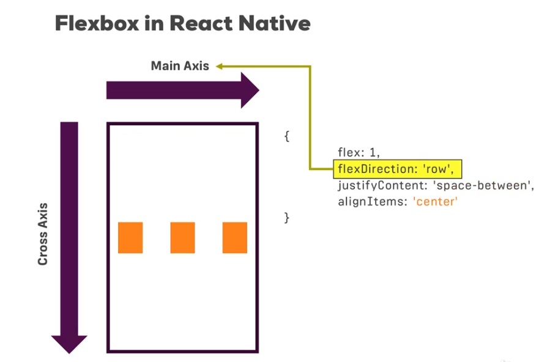

### Creating React App
```
npx create-react-native-app app_name
```
### Using natve cli(Recommended)
```
npm install -g react-native-cli
react-native init app_name
```
### To run app
Add the following to package.json in scripts

```
"ios":"react-native run-ios",
"android":"react-native run-android"
```
And use for both ways of installation

``` 
npm run android/ios
```

---

---

### Components Used
ref: <a> https://reactnative.dev/docs/intro-react-native-components</a>

<table>
<tr>
<th>Component in React
</th>
<th>
Component in React-Native
</th>
<th>
Handler function/Applying Process
</th>

<tr>
<td>div</td>
<td> View</td>
<td></td>
</tr>

<tr>
<td> p, span</td>
<td>Text</td>
<td></td>
</tr>

<tr>
<td> input</td>
<td>TextInput</td>
<td> onChangeText</td>
</tr>

<tr>
<td> button- onClick</td>
<td>Button</td>
<td> onPress</td>
</tr>

</tr>
</table>
---

---

### Flexbox
Default flexDirection is 'column'. Also unspecifying flex:1 value will make it take as much space as child elements need and not all available.





---

---

### Creating Styles

Create styles using StyleSheet
```
const styles= StyleSheet.create({
	container: {
	flex:1,
	backgroundColor:"#fff",
	alignItems:"center",
	justifyContent: "center"
}})
```
Apply them as 
``` 
<View style = {styles.container}>
```

##### Note: React Native does not support css rather emulates. When we want to add a button next to inputtext inline (block-inline for flexbox) would have done the trick but react native does not support it and we can add only flex or none to 'display:flex'. The solution is to add another nexted View with flexbox styling 

---

---

### Touch Events
By default Views, Texts, ListItems are not touchable. So to make them touchable we need to wrap them using <b>Touchable, TouchableWithoutFeedback, TouchableHighlight, TouchabelOpacity, TouchableNativeFeedback</b>.

```
<TouchableWithoutFeedback onPress={function_to_dispatch} >
    <View style ={styles.listItem}>
        <Text> {props.placeName}</Text>
    </View>
</ToucableWithoutFeedback>
```


---

---

### Using ScrollView/FlatList
Wrap with ScrollView to add scrollable features to component
```
<ScrollView>
	<Child/> #array using map
</ScrollView>
```
However the use of ScrollView is discouraged as it is inefficient since it renders all elements. Instead use FlatList as it renders only component necessary to be displayed. The ScrollView took mapped array as child but in case of flatlist it can take array directly.

Using FlatList.
Let us consider an example to add a place name on clicking add from textInput.
```
placeAddHandler=placeName=>{
	this.setState(prevState=>{
		return{
			places: prevState.places.concat({
			 	key: Math.random(),
			 	value: placeName
			 	})
			 }
		}
	)}
```

Deleting the place onPress
```
placeDeleteHandler = key=>{
	this.setState(prevState=>{
		return {
			places: prevState.places.filter(place =>{
				return place.key!==key;
				})
			}
			})
			}
```
Creating the FlatList with ListItem
```
<FlatList 
	style={styles.listContainer}
	data={props.places}  #array of object with key and value as given above 
	renderItem={(info)=>(
		<ListItem
			placeName={info.item.value}
			onItemPressed={()=> props.onItemDeleted(info.item.key)} />
		)}
	/>
```
---

---

### Adding static Image
```
import imageSource from 'assets/abc.jpg';
import {Image} from 'react-native';
<Image source ={imageSource} style={styles.imageStyle} />
	const styles=StyleSheet.create({
	imageStyle:{width:30, height:30; padding:5}
	})
```

---

---

### Adding Network Image
To add network image it needs to be supplied as an object. Also width and height are a must since react-native has no way to calculate it which its does on its own for static images.

```
import imageSource from 'assets/abc.jpg';
import {Image} from 'react-native';
<Image source ={{uri:"https:google.com/hello.jpg"}} style={styles.imageStyle} />
	const styles=StyleSheet.create({
	imageStyle:{width:30, height:30; padding:5}
	})
```
---

---

### Supported Javascript features

ref: https://reactnative.dev/docs/0.5/javascript-environment

* arrow functions
* let, const
* spreading 
* classes 
* for 
* async functions 
* jsx 
* console.log
* xmlhttprequest, fetch so also axios
* set, clear timeout, 
---

---

### Modals 
onRequestClose is required on android in case on tap on back button

```
<Modal onRequestClose={closeModalFunction} visible={state.showModal c} animationType="slide">
	<Children>
</Modal>
```

---

---

### Reducer
```
npm install --save redux react-redux
```


The general trend is to create the folder structure as:
* store
&nbsp; &nbsp;  * reducers
&nbsp; &nbsp;  * actions

Typical example of reducer:
```
import {ADD_PLACE, DELETE_PLACE, ...} from './actionTypes';
const initialState = {
  places: [],
  selectedPlace: null };
 
const reducer = (state = initialState, action) => {
  switch (action.type) {
      case ADD_PLACE:
          return {
          ...state,
          places: state.places.concat({
          key: Math.random(),
          name: action.placeName})
          }
      default:
          return state;
      }
    }
export default reducer;
```

actionTypes file:
```
export const ADD_PLACE = 'ADD_PLACE';
export const DELETE_PLACE = 'DELETE_PLACE';
export const SELECT_PLACE = 'DESELECT_PLACE';
```

example of action file places.js
```
import {ADD_PLACE, DELETE_PLACE, SELECT_PLACE}
export const addPlace = (placeName) => {
    return {
         type: ADD_PLACE
         placeName: placeName
         }}
export const deletePlace = (placeName) => {
    return {
         type: DELETE_PLACE
         }}
 ....
```
Create an index.js file in actions to export all actioncreators from there instead of different action creators when using multiple reducers.
```
export { addPlace, deletePlace, selectPlace, deselectPlace } from "./places"
```

Adding redux to the project. Open index.js and add:
```
import { Provider } from 'react-redux';
import React from 'react';
import configureStore from './src/store/configureStore';
const store = configureStore();
const RNRedux =()=> (
<Provider store = {store})>
       <App/>
</Provider>
AppRegistry.registerComponent('rncourse', ()=>RNRedux);
```
Similarly create a configureStore in store dir:
```
import {createStore, combineReducers} from 'redux';
import placesReducer from './reducers/places';
const rootReducer = combineReducers({
    places: placesReducer});
const configureStore = () => {
     return creteStore(rootReducer);
    };
export default configureStore;
```

Connecting React Native to Redux
```
import {addPlace, deletePlace} from './src/store/actions/index';
const mapStateToProps = state => [
     return {
          places: state.places.places,
          selectedPalce: state.places.selectedPlace};};
const mapDispatchToProps = dispatch => {
    return {
        onAddPlace: (name) => dispatch(addPlace(name)),
        onDeletePlace: () => dispatch ( deletePlace()),
        ...}}
        
 export default connect( mapStateToProps, mapDispatchToProps)(App); 
```

---

---


### Debugging

#### Debugging remotely
* Click debug JS remotely and visit localhost:8081 then you can use features like console.log();
* use a react-native-debugger, download it, extract it and add it to your emulator
* Adding redux devTools
```
import {compose} from 'redux';
let composeEnhancers = compose;
if(__DEV__){
	composeEnhancers = window.__REDUX_DEVTOOLS_EXTENSION_COMPOSE__ || compose;
	}

const configureStore=()=>{
    return createStore(rootReducer, composeEnhancers());
    }
```
<b> Note: For all devTools expect first i.e debug JS remotely step two is needed. react-native-debugger has advanced debugging features than normal JS remote debugging.</b>

---

---
### Installing Libraries

```
npm install react-native-vector-Icons --save
```

##### Open Linking Libraries on Android
* Open <b>android/settings.gradle</b> file in root and add
	```
	    include ':react-native-vector-icons'  
	```
```	   
	    project(':react-native-vector-icons').projectDir = new File(rootProject.projectDir, '../node_modules/react-native-vector-icons/android')  
```
    
 * Add the following dependency in <b>android/app/build.gradle</b>
```
     implementation project(':react-native-vector-icons')
  
```
  
  * In the MainApplication java file add the following:
  
```
  import com.oblador.vectoricons.VectoriconsPackage;
  ...  
  @Override  
  protected List<ReactPackage> getPackages() {  
    return Arrays.<ReactPackage>asList(  
      new MainReactPackage(),  
      new VectorIconsPackage()  
    );  
  }
    
```
  
  * In <b>'android/app/build.gradle'</b> add the following dependency for all
  
   ```
   apply from: "../../node_modules/react-native-vector-icons/fonts.gradle"
   ```
   
  *  For only some
```
      project.ext.vectoricons = [  
        iconFontNames: ['Ionicons.ttf'] // Name of the font files you want to copy  
    ]
```
```      
        apply from: "../../node_modules/react-native-vector-icons/fonts.gradle"
          
```  
  
### Using Thunk
  
 On using thunk we can add side effects/sync/asynchronous codes to actions in store and instead of returning json object for actiontype we can return a dispatch function with side effects.
```
 immport {applyMiddlerware} from 'react-redux';
 import thunk from 'redux-thunk';
 
 const configureStore = () =>{
 	return createStore(rootReduces, composeEnhancers(applyMiddleware(thunk));
 	}
 	
```
 Thunk middleware will automatically step in in action createors. Just return a dispatch function 
 
```
 export const addPlace(placeName, location, image) => {
 	return dispatch => {
 		const placeData ={
 		....
 		}
 		fetch(url,mehod: body:....}
 		});
 		
```
 
  