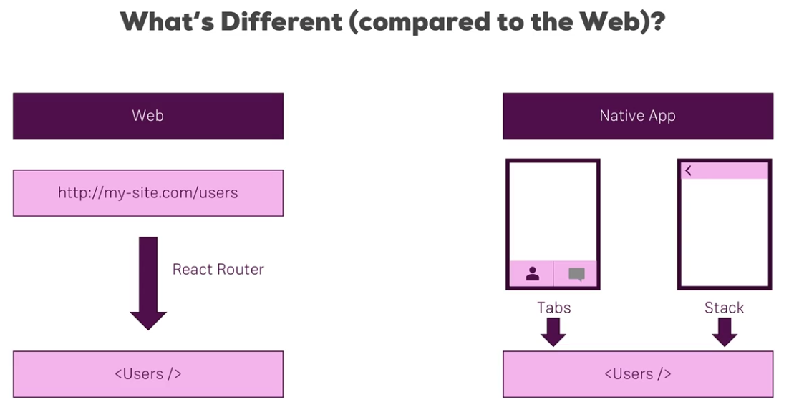

### Navigation


use <b> react-native-navigation </b> which is maintained by wix.
```
npm install --save react-native-navigation@1
```
Perform necessary steps for adding third party library. Refer to the pdf from the course and not official documentation. After adding react-native-navigation for older systems need to add two files <b>index.android.js</b> and <b>index.ios.js</b> with the contents <strike>same as <b> index.js </b>  </strike>&nbsp; only to import App.js.

* Create a screens directory in src
* IN App.js do two things
	* Register screens 
	* Start an application for react native navigation
	
App.js example
<a>https://wix.github.io/react-native-navigation/#/docs/top-level-api-migration?id=startsinglescreenappparams-gt-setrootstack</a>
```
import { Navigation } from 'react-native-navigation';
import AuthScreen from './src/screens/Auth/Auth';

#Register screen
Navigation.registerComponent("awesome-places.AuthScreen",()=>AuthScreen);

#start the app, refer documentation for prams and more details

Navigation.startSingleScreenApp({ 
	screen: {
	    screen: "awesome-places.AuthScreen",
	    title: "Login"
	    }
	    })
	    
``` 
The startSingleScreenApp has been migrated to setRoot in newer versions
```
Navigation.setRoot({
	root:{
	stack:{
	children: [{
            component: {
              name: 'awesome-places.AuthScreen',
              passProps: {
                text: 'This is tab 1'
              }
            }
          }]}}})
```

#### For Tab based App
Create a new component js file eg. startMainTabs.js
```
import {Navigation} from 'react-native-navigation';

const startTabs =() ={ 
Navigation.startTabBasedApp({
	tabs: [
	 	{
	 		screen:"awesome-places.FindPlaceScreen",
	 		label: "Find Place",
	 		title: "Find Place",
	 		icon:
	 		}, 
	 	,{
	 	screen: "awe ........
	 	}]
	 	})
	 }
export default startTabs;

```
Call this function on pressing a button. Also register all the screens
```
import FindPlaceScreen from './screens/FindPlaceScreen'; #importing jsx component
Navigation.registerComponent("awesome-places.FindPlaceScreen", () => FindPlaceScreen);
```
However  for android an icon is a must for tabbased app, but it is not so simple to import icons from vectoredIconPackage:
```
import Icon from 'react-native-vector-icons/Ionicons;:
import {Navigation} from 'react-native-navigation';
const startTabs =() =>{
	Promise.all([
		Icon.getImageSource("md-map",40),
		Icon.getImageSource("ios-share-alt",30)])
		.then (sources=>{
		Navigation.startTab... from above with icon:sources[0] and sources[1] correspondingly		}])}
```

#### Connecting Screens to Redux
In App.js
```
import configureStore from "./src/store/configureStore";
import { Provider } from 'redux';
const store = configureStore();
Navigation.registerComponent("aswesome-places.AuthScreen", ()=> AuthScreen, store, Provider) 
```

#### Pushing pages to screens
React native allows stack of pages in which we can push and pop pages to screen to make the desirable page visible on the screen.
on itemSelectedHandler =key =>
```
	const selPlace=this.props.places.find(place=>{
			return place.key ===key;
			});
	this.props.navigator.push (
		{ screen : "awesome-places.PlaceDetailScreen",
		title: selPlace.name,
			passProps:{
			...
			}})
``` 
---

### Adding Side Drawer
* To add a side drawer create a new normal component with View and width is essential for android:
```
import {Dimensions} from 'react-native';
<View style={{width: Dimenstions.get("window").width*0.8}} >
```
* Register the new component as screen to Navigation in App.js file as above
* In startMainTabs.js file add the Sidedrawer as drawer and also icons(especially for android)
```
	Promise.all(
		[... , ... , Icon.getImageSouce("icon_name",size)])
	.then (sources => {
		Navigation.startTabBasedApp({
			tabs:[{screen: ....., 
		   		navigatorButtons:{ #set it for every screen
		   			leftButtons: []{icon:sources[2],
		   				title: "Menu",
		   				id:"sideDrawerToggle"
		  			 }},...],
			drawer:{
				left: {
					screen:"awesome-places.SideDrawer"
					}
			}})
```
* Create a constructor in the corresponding screen for side drawer
```
	constructor(props){
		super(props);
		this.props.navigator.setOnNavigatorEvent(
		(event)=>{
			if(event.type== "NavBarButtonPress" && event.id ==="sideDrawerToggle")
			{
			this.props.navigator.toggleDrawer((
			side: "left"
			}
		})
```
* StyleSheet for SideDrawer
```
const styles =StyleSheet.create({
	container: {
		paddingTop: 22,
		 backgroundColor: "White",
		 flex:1
		 }
		});
<View style={[styles.container, {width: Dimenstions.get("window").width*0.8}]}
```
### Icons for SideDrawer
```
const OrdersNavigator = createStackNavigator(
  {
    Orders: OrdersScreen
  },
  {
    navigationOptions: {
      drawerIcon: drawerConfig => (
        <Ionicons
          name={Platform.OS === 'android' ? 'md-list' : 'ios-list'}
          size={23}
          color={drawerConfig.tintColor}
        />
      )
    },
    defaultNavigationOptions: defaultNavOptions
  }
);
```
```
const ShopNavigator = createDrawerNavigator(
  {
    Products: ProductsNavigator,
    Orders: OrdersNavigator,
    Admin: AdminNavigator
  },
  {
  ...
```
### Custom Components for SIde Drawer
```

const ShopNavigator = createDrawerNavigator(
  {
    Products: ProductsNavigator,
    Orders: OrdersNavigator,
    Admin: AdminNavigator
  },
  {
    contentOptions: {
      activeTintColor: Colors.primary
    },
    contentComponent: props => { #Custom Component
      const dispatch = useDispatch();
      return (
        <View style={{ flex: 1, paddingTop: 20 }}>
          <SafeAreaView forceInset={{ top: 'always', horizontal: 'never' }}>
            <DrawerItems {...props} />
            <Button
              title="Logout"
              color={Colors.primary}
              onPress={() => {
                dispatch(authActions.logout());
                // props.navigation.navigate('Auth');
              }}
            />
          </SafeAreaView>
        </View>
      );
    }
  }
);
```