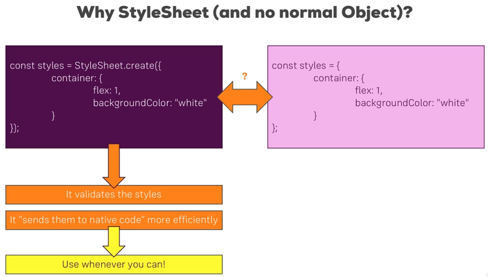

### Why StyleSheet



#### React Native Styling
Ref: https://github.com/vhpoet/react-native-styling-cheat-sheet
Components that can be styled are:

* Image
* ScrollView
* text
* TextInput
* View
Styling uses camel casing and incase you need to see supported styling put incorrect styling and the error will show you what you need.

### Synthetic Cascading of Styles
You can create a custom component with its own styling and on creation add/override/combine more custom styles.
```
<Input styles={[styles.inputStyle,props.styles,{fontSize:4}]} {...props}/>
```

### Platform API for different UI in Android/IOS
```
import {Platform} from 'react-native';

if(Platform.OS == 'android') {
	return (
	 	<TouchableNativeFeedback ...
	 	)
	 	}
	 	return (<TouchableOpacity .../>)
```

### Responsive Styling 
Use techniques like:
```
	flexDirection: Dimensions.get("window").height > 500 ? "column" : "row";
	
	width:Dimensions.get("window").height > 500 ? "100%" : "45%";
```	
But since react native requires a state change to rerender it wont change on screen reorientation so add a new state with style object and set state on Dimension changed handler within constructor:
```
	constructor(props) {
		super(props);
		Dimenstions.addEventListener("change", dims =.{
			this.setState({
				resStyles: {
					pwDire: Dimenstions.get("window").height > 500 ? "column":"row";
					width:Dimensions.get("window").height > 500 ? "100%" : "45%";
					...
				})
```
<b> However, it is not a good practice to set up all in state, so instead use only one state to separate the mode as "portrait" or "landscape" and use conditional to select the styling. You will need to create separate styling for portrait and landscape in this case.</b>

Also adding eventlistener and not destroying it creates memory leak so it needs to be destroyed as:
```
	constructor(props) {
		super(props);
		Dimenstions.addEventListener("change", this.updateStyles);
		}
	componentWillUnmount(){
		Dimenstion.removeEventListerner("change", this.updateStyles);
		}
	
	updateStyles =dims =>{
			this.setState({
				resStyles: {
					pwDire: Dimenstions.get("window").height > 500 ? "column":"row";
					width:Dimensions.get("window").height > 500 ? "100%" : "45%";
					...
			})
		}
```

### Styling Navigation related items
Add to Nav drawer in Navigation.startTabBasedAppz({ tabs: ... :
```
	tabsStyle: { tabBarSelectedButtonColor: "orange"},
	 appStyle : { tabBarSelectedButtonColor: "orange"}
```
Also for navBarButton in its respective screen component:
```
	static navigatorStyle =-{ #this name should be correnct, refer wix documentation
	navBarButtonColor: "orange"
	}
``` 