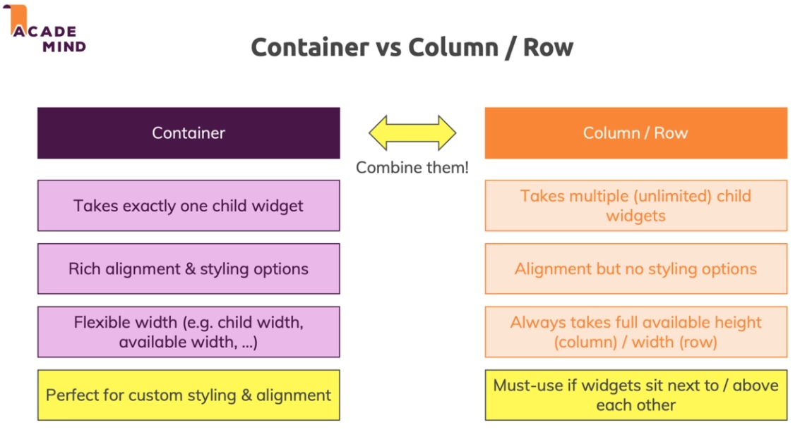
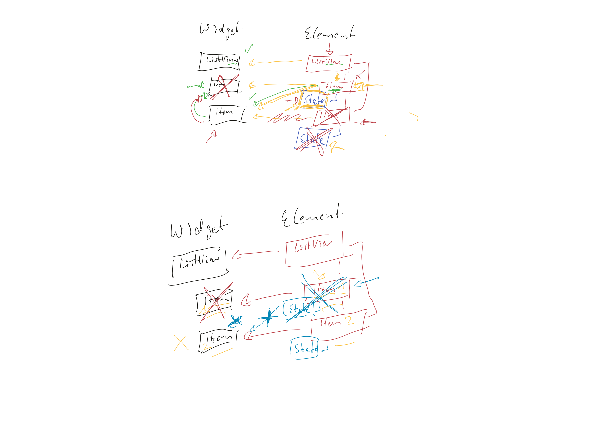

# FLUTTER

## Flutter Architecture
* UI as code : Build a widget tree. 
* NO drag and drop but only code.
* Everything is a widget

## Create Flutter Project 

```
		flutter create project_name
```

## Folder Structure
#### .idea Folder
Holds configuration for android studio.

#### android Folder
flutter compiled code will be injected to this folder for android project.

#### build Folder
Holds output of the flutter application. Automatically done while deployment.

#### ios Folder
flutter compiled code will be injected to this folder for android project.

#### lib Folder
Most important folder where 99% of work is done. Coding

#### test Folder
For writing test codes.

##### Wont be using rest of the files, they are used by flutter for internal config. Need to use pubspec.yaml file for fonts/images, third party packages. pubspec.lock is not used. It is a detailed file for all the dependencies generated automatically based on pubspec.yaml file

### Some VS Code Trick
```
			ctrl+p for quick open
			ctrl+shift+\ to match corresponding paranthesis
			ctrl+shift+m to see errors
			ctrl+shift+o to find symbols in file
			ctrl+. to extract method
```
### Code Structure
* main() function is the entry point for dart application which is first automatically called by flutter.

* Dart is type strict so it needs explicit datatype if not it assumes dynamic datatype.

* Create variable using var(dart considers the value on the right and initializes accordingly) , double


### Rudimentary Example
```
import 'package:flutter/material.dart';

void main (){
  runApp(MyApp());
}

class MyApp extends StatelessWidget{
@override
  Widget build(BuildContext context)
  {
    return MaterialApp(home:Text('Hello'),);
  }
}
```
Here main function is run automatically first by flutter which then looks for the runApp function given by flutter from material.dart which receives MyApp class instance.  MyApp is a child, i.e. it inherits StatelessWidget which must include a build method which can have argument. buildcontext need not be defined but just defined as dart automatically handles it and context generally consist of metadata for the corresponding widget, its position and so on. **Here BuildContext, Material, Text are objects. Flutter looks for build method to render things so, it should return a widget. Here, name:Text('hello') is a named argument.

#### Example of constructor in Dart

```
	class Person{
	int age;
	String name;
	Person({int age, String inputname}){ //Person({@required int age ...
	this.age=age;
	name= inputname;
	}
	
	var p1= Person(inputName:'sdfd",age:34)
```
@required if is used flutter shouts that arguments are necessary.


Alternative shortcut
```
Person(this.age,this.name)
```
Need to rename the named argument to name:'sdfd'

#### Scaffold 
It is used to create base page. It consists body, appbar, drawer, floating actionbutton and so on.

### NOTE USE CTRL+SPACE TO KNOW AVAILABLE ARGUMENTS WITHIN EACH WIDGET/OBJECT

```
Ctrl+Shift+i 
```
Use this to format document in vs code.

#### The properties can be made private by using '_' in front of each property whether it be class, method or variables.
```
	_MyApp(){
		var _value;
		}
```

#### SetState
setState calls the build method again which rebuilds the widget tree but does not rerender the entire tree but only the changed ones.


 **Note:It is generally a good practice to use only one widget file per**
 	
 **In case of stateless widget the build is not rerendered as it does not expect any change to variables so generally all variables are defined final but it can be rerendered on changing input value. But in stateful widget even state change can rerender.** 
 
#### Creating multiple constructors in dart
 Use '.' to create multiple constructors
 ```
 	const EdgeInsets.all():
 	const EdgeInsets.only()
 ```
 
 
#### Passing functions to Widgets
```
	 Answer(_answerQuestion);
	 
	 
	 class Answer extends StatelessWidget {
  		final Function selectHandler;
  		Answer(this.selectHandler);
  		...
  		}
```

#### Working with map in dart

```
    var question = [
      {
        'Question': 'What\'s your favourite color',
        'Answers': ['Blue', 'Green', 'Red', 'Black']
      },
      {
        'Question': 'What\'s your favourite animal',
        'Answers': ['Dog', 'Cat', 'Rabbit', 'Guinea']
      },
      {
        'Question': 'What\'s your favourite food',
        'Answers': ['Pizza', 'Momo', 'Burger', 'Sandwich']
      },
    ];
    
    Then inside children of body:
    
          ...(question[_questionIndex]['Answers'] as List<String>).map((f) {
              return Answer(_answerQuestion, f);
            }).toList(),
    
```
Here, by default dart does not recognize question[_questionIndex]['Answers'] as List of strings so we need to specify it explicitly and map it. The return statement is to be a widget since the children of body can only be a widget. But we simply cannot just return as it returns, but need to return it as a widget list(using toList) and then finally spread it in the body array rather than creating a new one.

#### const vs final
Final can be assigned at runtime but const needs immediate value

```
 	final a; 	
	a=input;
 	cont a1=const [1,2]
 	var a2=const[1,2]
 	var a3=[1,2]
```
Here, it allows a3.add(4) but not a2.add(4). Obviously it is not possible for a1 as well. We can also change assigned values for a2 and a3 but not for a1. 

```
Note: Column takes size of its broadest child and Text takes size necessary or its parent(Container which can be modified as necessary)
```

#### Column/Row vs Container
Container takes exactly one chlid widget whereas Column/Row takes multiple child widgets.  
Container has rich alignment and styling options but not in row/column.
Container has flexible width(eg child width, available width,...). Column takes full availabe height and width for row.
For stylin use container and if widgets sit next to/above use column/row.

```
Note: When accessing/modifying state/method of different stateful components, the current component should also be stateful and the values of other stateful component can be accessed using widget while executing. eg. widget.add()
```

### Dynamically fit widgets
To dynamically fit widgets use MediaQuery.of(context).size.height to get height of full screen and fractionally divide it among widgets. Also for children widgets use LayoutBuilder to constrain the children to the available space.
```
		return LayoutBuilder(
			builder:(ctx, constraints)
			{
			return Column(children:.....
			height:constraints.maxHeight*0.7
			
			})) 
```

### Forcing App to run only on portrait mode
In main instead of just returning runApp add:
```		
		import 'package:flutter/services.dart';
		SystemChrome.setPreferredOrientations([
			DeviceOrientation.portraitUp,
			DeviceOrientation.portraitUp,
			]);
		runApp(MyApp());
```

Note: "context" cannot be passed into initState as initstate is called very early even before context is created so if needed use didChangeDependencies.

### Provider(Same as redux)
Need to create class and surround the root app with provided. notifylisteners and add listeners.

##### Note:  Card by default takes size as needed for its child but if specified for parent (Container...), it takes parent's size

### Row and Column 
* MainAxisAlignment: MainAxisAlignment.spaceAroud
* CrossAxisAlignment: CrossAxisAlignment.stretch

MainAxisAlignment is same as justifyContents in react native flex.
CrossAxisAlignment is same as alignItems in react native flex.

### Add border, padding to Container
Container is the global styling component in flutter.


```
children : <Widget> [
Container(
	margin: EdgeInsets.symmetric(
	vertical:20,
	horizontal: 14,),
	decoration: BoxDecoration(
	border: Border.all(
	color: Colors.blcack,
	width:2),
		),
	]
```

### Add styling to text
```
	child: Text(
		style: TextStyle(
		fontWeight: fontWeight.bold,
		fontSize: 20, 
		colors: Colors.purple
			)
		)
```
#### Container vs Column/Row

 

### Installing Third party libraries
Go to pub.dev to look for external packages and follow the docs.

* In pubspec.yaml file add the dependency under dependencies with version
* If the package should not get installed automatically, <b>flutter packages get</b> can be run in the terminal

### Using InputText
```
	TextField(
		decoration: InputDecoration(labelText: "Title'),
		onChanged: (val) {
			titleInput = val;
			}
		)	
```

```
	final textController = TextEditingController();
	TextField(
		decoration: InputDecoration(labelText: 'Amount'),
		controller: amountController
		)
	FlatButton(
		child: Text('Add tx'),
		textColor: Colors.purple,
		onPressed: (){
			print(titleController.text);
			}
		)
```

### Using ListView 
```
	Scaffold(
		body: SingleChildScrollView(
		child: Column()
		)
```
##### Need to use Scaffold in Scaffold or as child to a parent with dimensions
##### 

```
	Container(
		height: 3000,
		child: SingleChildScrollView( )
		)
```

### ListView(children:[]) Vs ListView.builder()
ListView.builder only loads what is visible whie listView(children) renders even if they are off screen.

```
	child: ListView.builder(
	itemBuilder: (ctx, index){
	return Widget
	},
	itemCount: length of array to display in listView
```
##### To access array values in listView use the array with index,eg. transactions[index].value

### Input type number
```
	TextField(
		keyboardType: TextInputType.number
		)
```

For iOS use:
```
	TextField(
		keyboardType: TextInputType.numberWithOptions(decimal:true)
		)
```

### Modal Sheet 
```
	  onPressed: () {
                  showModalBottomSheet(
                    context: context,
                    builder: (context) {
                      return Wrap(
                        children: [
                          ListTile(
                            leading: Icon(Icons.share),
                            title: Text('Share'),
                          ),
                          ListTile(
                            leading: Icon(Icons.copy),
                            title: Text('Copy Link'),
                          ),
                          ListTile(
                            leading: Icon(Icons.edit),
                            title: Text('Edit'),
                          ),
                        ],
                      );
                    },
                  );
```

##### Note: The component with modal should be stateful, otherwise it may cause problem of input clearing when we shift to other inputs.

### Accessing the properties of widget from connected classes
```
	classs NewTransaction extends StatefulWidget {
		final Function addTx;
		NewTransaction(this.addTx);
		
		class _NewTransactionState extends State<NewTransaction>
		_NewTransactionState createState()=> _NewTransactionState();
		}
	
	class _NewTransactionState extends State<NewTransaction> {
		...
		widget.addTx( enteredTitle, enteredAmount);
		
	}

```

### Using Themes 

```
	return MaterialApp(
		title: 'App Name',
		theme: ThemeData(
			primarySwatch: Colors.purple,
			accentColor: Colors.amber,
			}
			...
		)
```

### Adding Fonts to react native
To add custom fonts copy the fonts to asset/fonts folder and update the pubspec.yaml file


```
	fonts:
	  - family: OpenSans
	    fonts: 
	      - asset: assets/fonts/OpenSans-Regular.ttf
	      - asset: assets/fonts/OpenSans-Bold.ttf
	        style: italic
	        weight: 700
```
then in your code in MaterialApp


```
	return MaterialApp(
		title: 'App Name',
		theme: ThemeData(
			primarySwatch: Colors.purple,
			accentColor: Colors.amber,
			fontFamily: 'OpenSans'
			}
			...
		)
```
The above code is used for entire project. We can also change fonts only where it's required

```
	title: Text('title', style: TextStyle(fontFamily:'Open Sans')
```

But the above process can be tedious when considering all the theme bars in the project, so we can use

```
	MaterialApp(
	title:...
	appBarTheme: AppBarTheme(
	textTheme: ThemeData.light().textTheme.copyWith(title: TextStyle(fontFamily:'OpenSans', fontSize:20),)
```

### Adding Images to App
Create a images folder in assets folder and move the image to this folder.
```
	Image.asset('assets/images/wating.png', fit: BoxFit.cover)
```

In pubspec.yaml file add
```
	assets:
	 - assets/images.waiting.png
```
Adding padding can be doine using SizedBox:
```
	SizedBox(
		height:10
		)
```


### Calculating Sizes Dynamically

```
	MediaQuery.of(context).size.height*0.6
	OR MediaQuery.of(context).size.height - appBar.preferredSize.height) * 0.4
```

### Using layout builder for dynamic sizing
Assumption: Parent is sized, most probably using above dynamic sizing technique.
Using layoutBuilder we can dynamically assign dimension to child using constraints provided by parent
```
	LayoutBuilder(builder: (ctx, constraints){
		return Container(
			height: constraints.maxHeight * 0.6 
			)
		}

```

### Checking platform
```
	Platform.isIOS
```

##### Note : Using const in widgets prevents them from rerendering. So, use it for static widgets. Although, do check the widget constructor if it accepts const.

### Problem with list view and stateful widgets
 

### Linear Gradient
```
	decoration: BoxDecoration(
		gradient: LinearGradient(
			colors: [
				color.withOpacity(0.7),
				color,
				],
			begin: Alignment.topLeft,
			end: Alignment.bottomRight,
			))
```

### Border radius
``` 
	borderRadius: const BorderRadius.circular(15)
```

### GridView
```
	return GridView(
		children: DUMMY_CATEGORIES.map((catData)=> ).toList(),
		gridDelegate: SliverGridDelegateWithMaxCrossAxisExtent(
		maxCrossAxisExtent: 200, // maxWidth
		childAsectRatio: 3/2, // aspect ratio, height:width
		crossAxisSpacint: 20, // distance between columns
		mainAxisSpacint: 20, // distance between rows
		))
```

### Working with Theme
```
	return MaterialApp(
		title: 'DeliMeals',
		theme: ThemeData(
		primarySwatch: Colors.pink,
		accentColor: Colors.amber,
		canvasColor: Color.fromRGBO(255,254,229,1),
		fontFamily: 'Raleway',
		textTheme: ThemeData.light().textTheme.copyWith(
			body1: TextStyle(
				color:Color.fromRGBO(20, 51, 51, 1),
				),
			body2: TextStyle(
				color: Color.fromRGBO(20, 51, 51, 1),
				),
			title: TextStyle(
				fontSize: 24,
				fontFamily: 'RobotoCondensed'
			)					
			),
		),
		home: CategoriesScreen(),
		}
		)
	)
```

Use it in child as: 
```	
	child: Text(
		title: "Titile",
		style: Theme.of(context).textTheme.title
		)
```

### Handle Touch
Using GestureDetector or Inkwell as parent.
```
	return INkWell(
	onTap: ,
	splashColor: Theme.of(context).primaryColor,
	borderRadius: BorderRadius.circular(15)
	)
```

### Navigating to a New Page
```
	Navigator.of(ctx).push(MaterialPageRoute(builder: (_) {
		return CategoryMealsScreen();
		})
```

### Using Named Routes and Passing Data 
In main.dart, in root:
```
	return MaterialApp(
	...
	home: CategoriesScreen(),
	routes: {
		'/category-meals': (ctx)=> CategoryMealsScreen(),
		}
	)
```

In page where navigation is to be used:
``` 
	Navigator.of(ctx).pushNamed(
		'/category-meals',
		arguments: {
			'id': id, 
			'title': title,
			}
		)
```
Then in the actual page remove the constructor and accept arguments as:
```
	final routeArgs = ModalRoute.of(context).settings.arguments as Map<String, String>;
	final categoryTitle = routerArgs['id'];
	final categoryId = routeArgs['title'];
```


#### Note: You can use static const in the page itself to define the route pathe and use it in places where the route is needed.
For instance in CategoryMealsScreen,
static const route = '/category-meals';

It can then be used in main and navigation as:
CategoryMealsScreen.route


	
