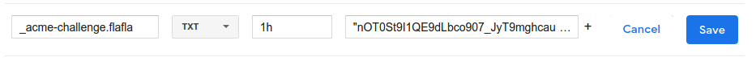
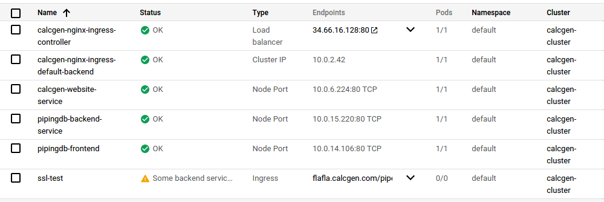
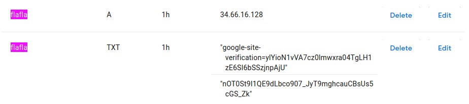

### CI/CD gke
https://medium.com/platformer-blog/ci-cd-with-gke-and-google-cloud-build-98a797ecf346

### SSL
https://estl.tech/configuring-https-to-a-web-service-on-google-kubernetes-engine-2d71849520d

If links do not work their pdf versions are contained in this repo

Follow it top to bottom.
Specially for ssl using lets encrypt provide all necessary info/ do yes for all

All k8s files in calcgen website new github works except ingress so need to apply it manually as contained in this repo
```
kubectl apply -f ingress.yaml
```

Piiping db needs only deployment and service with type nodePort files in k8s and ingress should be applied manually once for all in gke. Calcgen website new needs secret(database, apply secret for ssl only once, so need not add it in the file) and config-map files in k8s as well.

### Registering Domain
* Go to <b>my domains</b> in https://domains.google.com and then <b>DNS</b>
* Create sub domain
* Add key provided by lets encrypt as
```
_acme-challenge.flafla
```

In google domains add the above field with key provided by letsencrypt. It should contain the acme prefix as shown in fig.

<b>IN GKE</b> 

Here the ip on google domain should match that of the ingress controller created using apply ingress.yaml

<b>IN GOOGLE DOMAINS</b>

Also, the TXT type field consist of authenticated key from google.  


<b> Note: Using static ip seemed to have not worked during ssl so check it out when using</b>

