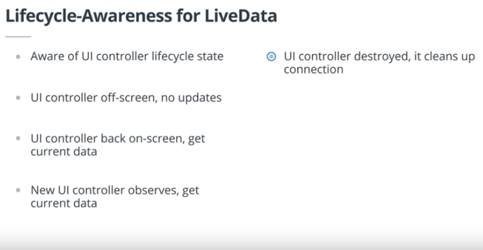

## Android

Different namespaces are used in layout res xml, like tools, android, and app. Android is the default, tools can be used parallely just for development purpose(it is not shown in built app) and app is based on jetpack which means it uses androidX for better backward compatibility. AppCompatActivity is also based on jetpack(AndroidX).
Linear layout is preferred for longer views while for small complex view constraintLayout is preferred.
### Binding
For a large deep view hierarchy, binding helps to maintain performance without any overheads.

### Data Binding: Views
Inside build.gradle (module) add
```
	dataBinding {
		enabled=true
		}
```
Wrap the viewgroup (linear/relativeLayout in xml) by layout 
```
	<layout app="" >
		<LinearLayout>
			...
		</LinearLayout>
	</layout>
```
In MainAcitvity or Activity class
```
	private lateinit var binding: ActivityMainBinding //lateinit allows later initializing of var instead of assigning null initially
	
	onCreate({
	...
	binding =DataBindingUtil.setContentView(this.R.layout.activity_main)
	
	binding.doneButton.setOnClickListener(it:View!
	addNickName(it)
	})
	
	private fun addNickName(view: View){
	binding.apply{ ...
		nickNameText.text = binding.nicNameEdit.text
		invalidateAll() //need to invalidate all previoius data before changing/recreating values
		nickNameEdit.visibility = View.GONE
		doneButton.visibility= View.GONE
		nickNameText.visibility= View.VISIBLE
		}
```

### Data Binding: Data
Create a data class
```
data class MyName (
	var name: String ="",
	var nickname: String="")
```
Bind the data class to xml
```
	<data>
		<variable 
			name="myName"
			type="com.example.android.aboutme.MyName"/>
	</data>
	<TextView 
	 	...
	 	android:text="@={myName.name}" />
```
Binding in activity
```
	var binding: ActivityMainBinding
	val myName: MyName = MyName ("aleks")
	binding.nameText ....
	binding.mayName?.nickname = "fishy"
```

### Constraint
A connection or alignment to another UI element, to the parent layou,or to an invisible guideline.

#### Advantages
* You can make it responsive to screens and resolutions
* Usually flatter view hierarchy
* Optimized for layoing out its views
* Free-form - place views anywhere, and the editor helps add constraints

### Using ConstraintLayout to createw box game
```
	onCreate({
	...
	setLIsteners();
	})
	private fun setListeners(){
	val clickableViews: LIst<Views> = 
	listOf(box_one_text, box_two_text, box_three_text, box_... )
	for (item in clickableViews){
	item.setOnClickListener(makeColored(it)}
	}


	fun makeColored(view: View) {
   when (view.id) {

       // Boxes using Color class colors for background
       R.id.box_one_text -> view.setBackgroundColor(Color.DKGRAY)
       R.id.box_two_text -> view.setBackgroundColor(Color.GRAY)

       // Boxes using Android color resources for background
       R.id.box_three_text -> view.setBackgroundResource(android.R.color.holo_green_light)
       R.id.box_four_text -> view.setBackgroundResource(android.R.color.holo_green_dark)
       R.id.box_five_text -> view.setBackgroundResource(android.R.color.holo_green_light)

       else -> view.setBackgroundColor(Color.LTGRAY)
   }
}
```

### Fragments
Basic structure of fragment

```
override fun onCreateView(inflater: LayoutInflater, container: ViewGroup?,
                         savedInstanceState: Bundle?): View? {
   val binding = DataBindingUtil.inflate<FragmentTitleBinding>(inflater, R.layout.fragment_title, container, false)
   return binding.root
}
```

Linking fragment to activity

```
<LinearLayout>
	<fragment android:anme="com.example.android.navigation.TitleFragment" ... /> //path to fragment class
</LinearLayout>
```

#### Principles of navigation
* There always a starting Place
* You can always go back (LIFO)
* Up goes back (no up at starting place)


* Adding navigation components to the project:
add ext variable to project build.gradle

```
	buildscript {
		ext {
			...
			version_navigation = '1.0.0'
			...
		}
```

Within App build.gradle file add dependencies for navigationfragment ktx and navigation UI ktx

```
	dependencies {
			...
			implementation "android.arch.navigation:navigation-fragment-ktx:$version_navigation"     
    		implementation "android.arch.navigation:navigation-ui-ktx:$version_navigation"
	}
```
* Adding the Navigation Graph to the project:
In the Project window, right-click on the res directory and select New > Android resource file. The New Resource dialog appears.

Select Navigation as the resource type, and give it the file name of navigation. Make sure it has no qualifiers. Select the navigation.xml file in the new navigation directory under res, and make sure the design tab is selected.

* Replace the Title Fragment with the Navigation Host Fragment in the Activity Layout
Go to the activity_main layout. Change the class name of the existing Title fragment to androidx.navigation.fragment.NavHostFragment. Change the ID to myNavHostFragment. It needs to know which navigation graph resource to use, so add the app:navGraph attribute and have it point to the navigation graph resource - @navigation/navigation. Finally, set defaultNavHost = true, which means that this navigation host will intercept the system back key.

```
<fragment
   android:id="@+id/myNavHostFragment"
   android:name="androidx.navigation.fragment.NavHostFragment"
   android:layout_width="match_parent"
   android:layout_height="match_parent"
   app:navGraph="@navigation/navigation"
   app:defaultNavHost="true"
   />
```

* Adding the Title and Game Fragments to the Navigation Graph
   Within the navigation editor, click the add button. A list of fragments and activities will drop down. Add fragment_title first, as it is the start destination. (you’ll see that it will automatically be set as the Start Destination for the graph.) Next, add the fragment_game.

```
   <fragment
   android:id="@+id/gameFragment"
   android:name="com.example.android.navigation.GameFragment"
   android:label="GameFragment"
   tools:layout="@layout/fragment_game" />
```

* Connecting the Title and Game Fragments with an Action
Begin by hovering over the titleFragment. You’ll see a circular connection point on the right side of the fragment view. Click on the connection point and drag it to gameFragment to add an Action that connects the two fragments. 

* Navigating when the Play Button is Hit
Return to onCreateView in the TitleFragment Kotlin code. The binding class has been exposed, so you just call binding.playButton.setOnClickListener with a new anonymous function, otherwise known as a lambda. Inside our lambda, use view.findNavcontroller to get the navigation controller for our Navigation Host Fragment. Then, use the navController to navigate using the titleFragment to gameFragment action, by calling navigate(R.id.action_titleFragment_to_gameFragment)

```
binding.playButton.setOnClickListener { view: View ->
        view.findNavController().navigate(R.id.action_titleFragment_to_gameFragment)
}
```
Navigation can create the onClick listener for us. We can replace the anonymous function with the Navigation.createNavigateOnClickListener call.

```
binding.playButton.setOnClickListener(
        Navigation.createNavigateOnClickListener(R.id.action_titleFragment_to_gameFragment))

```

#### Backstack manipulation
* For the action connecting the gameFragment to the gameOverFragment, set the pop behavior to popTo gameFragment inclusive
Go to the navigation editor and select the action for navigating from the GameFragment to the GameOverFragment. Select PopTo GameFragment in the attributes pane with the inclusive flag to tell the Navigation component to pop fragments off of the fragment back stack until it finds the GameFragment, and then pop off the gameFragment transaction.

* Create an action connecting the gameWonFragment to the gameFragment and from gameOverFragment to the gameFragment with pop behavior set to popTo titleFragment exclusive
Add an action connecting the gameOverFragment to the gameFragment, and from the gameWonFragment to the game fragment. For each fragment, Select PopTo TitleFragment with the inclusive flag turned off.

* Add an onClick Handler for the nextMatch/tryAgain button that navigates to the gameWonFragment

#### Adding Support for Up button
* Link the NavController to the ActionBar with NavigationUI.setupWithNavController.

```
val navController = this.findNavController(R.id.myNavHostFragment)
```
Link the NavController to our ActionBar.
```
NavigationUI.setupActionBarWithNavController(this, navController)
```
*  Override the onSupportNavigateUp method from the activity and call navigateUp in nav controller.
```
override fun onSupportNavigateUp(): Boolean {
   val navController = this.findNavController(R.id.myNavHostFragment)
   return navController.navigateUp()
}

```

#### Adding an overflow menu
* Add AboutFragment to the navigation graph
Click the "add" button. A list of fragments and activities will drop down. Add fragment_about. Name it with the title_about_trivia string. Set its id to aboutFragment. The menu will need this id to navigate to the correct fragment.

* Create new menu resource.
Right click on the res folder within the Android project and select New Resource File. We’ll call this one overflow_menu, with resource type of Menu. Click on the overflow_menu within the menu directory, to view our new (empty) menu.

* Create “About” menu item with ID of aboutFragment destination
Make sure the design tab is selected. Drag a menu item from the palette into the component tree below. Move to the attributes pane. Set the new item's id to aboutFragment, its destination. That's the id you used when adding the About fragment to the navigation graph. For title, we can use @string/about. The rest of the attributes should be left as their defaults.

* Call setHasOptionsMenu() in onCreateView of TitleFragment
```
override fun onCreateView(inflater: LayoutInflater, container: ViewGroup?,
                         savedInstanceState: Bundle?): View? {
   ...
   setHasOptionsMenu(true)
   return binding.root
}
```

* Override onCreateOptionsMenu and inflate menu resource
```
override fun onCreateOptionsMenu(menu: Menu?, inflater: MenuInflater?) {
   super.onCreateOptionsMenu(menu, inflater)
   inflater?.inflate(R.menu.overflow_menu, menu)
}
```
* Override onOptionsItemSelected and call NavigationUI.onNavDestinationSelected
```
override fun onOptionsItemSelected(item: MenuItem?): Boolean {
   return NavigationUI.onNavDestinationSelected(item!!,
           view!!.findNavController())
           || super.onOptionsItemSelected(item)
}
```
### Adding Safe Arguments

* Add safe-args dependency to project Gradle file
SafeArgs is implemented as a Gradle plugin, which means that it is a two-step process to add. First, we need to add the navigation-save-args-gradle-plugin dependency into the project Gradle file, which shows up in the Android view labeled Project: andfun-kotlin-android-trivia. SC - Project Gradle
```
dependencies {
   …
"android.arch.navigation:navigation-safe-args-gradle-plugin:$version_navigation"

   // NOTE: Do not place your application dependencies here; they belong
   // in the individual module build.gradle files
}
```

* Add safeargs plugin to app Gradle file
At the top of your app Gradle file, after all of the other plugins, add the apply plugin statement with the androidx navigation safeargs plugin

```
apply plugin: 'kotlin-kapt'
apply plugin: 'androidx.navigation.safeargs'
```

* Switch the GameFragment to use generated NavDirections when navigating to the GameOver and GameWon fragments.

```
view.findNavController().navigate(GameFragmentDirections.actionGameFragmentToGameWonFragment())
```

* Add the numQuestions and numCorrect Integer Arguments using the navigation editor
Next, go to the navigation editor and select the GameWon fragment. Click the little triangle next to arguments to expand the argument section. Add a numQuestions and a numCorrect argument, both with integer type. If you try to build the app now, you should get two compile errors.

* Add the parameters to the gameFragment to gameWonFragment action
Let’s add those parameters! Click on the error link in the Build tab to go right to the correct place in GameFragment.kt.
```
view.findNavController().navigate(GameFragmentDirections.actionGameFragmentToGameWonFragment(numQuestions, questionIndex))
```

* Fetch the args and expand into a class in onCreate within the GameWonFragment
So, now it will compile, but we haven’t yet extracted the parameters after the navigation is complete. We’ll use a Toast so we can see them get there successfully. Move to onCreate in GameWonFragment.kt.

* Display the arguments using a Toast
We’ll use GameWonFragmentArgs to extract the args class from the Bundle, which we can then display in a Toast. 
```
val args = GameWonFragmentArgs.fromBundle(arguments!!)
Toast.makeText(context, "NumCorrect: ${args.numCorrect}, NumQuestions: ${args.numQuestions}", Toast.LENGTH_LONG).show()
```

* Replace navigation to action IDs with NavDirections in GameOverFragment, GameWonFragment, and TitleFragment
Since we're using safe arguments, let's use NavDirections everywhere. Replace navigation to an action ID in GameOverFragment, GameWonFragment, and TitleFragment.


### Adding Sharing with an intent
* Add setHasOptionsMenu(true) to onCreateView() in GameWon Fragment


```
binding.nextMatchButton.setOnClickListener { view: View ->
 view.findNavController().navigate(GameWonFragmentDirections.actionGameWonFragmentToGameFragment())
}
setHasOptionsMenu(true)

```

* Create a getShareIntent method. Get the args and build the shareIntent inside.
```
private fun getShareIntent() : Intent {
   val args = GameWonFragmentArgs.fromBundle(arguments)
   val shareIntent = Intent(Intent.ACTION_SEND)
        shareIntent.setType("text/plain")
            .putExtra(Intent.EXTRA_TEXT, getString(R.string.share_success_text, args.numCorrect, args.numQuestions))
   return shareIntent
}

OR using sharecompat


private fun getShareIntent() : Intent {
   val args = GameWonFragmentArgs.fromBundle(arguments)
    return ShareCompat.IntentBuilder.from(activity).setText(getString(R.string.share_success_text, args.numCorrect, args.numQuestion)
    .setType("text/plain")
    .intent
}

```

* Create a shareSuccess method that starts the activity from the share Intent
```
private fun shareSuccess() {
   startActivity(getShareIntent())
}
```
* Override onCreateOptionsMenu and inflate our winner_menu.
Override onCreateOptionsMenu and begin by inflating the winner_menu. Then we’ll get the shareIntent using getShareIntent() and call resolveActivity using the packageManger to make sure our shareIntent resolves to an activity. 

* Hide the sharing menu item if the sharing intent doesn’t resolve to an Activity
```
override fun onCreateOptionsMenu(menu: Menu?, inflater: MenuInflater?) {
   super.onCreateOptionsMenu(menu, inflater)
   inflater?.inflate(R.menu.winner_menu, menu)
   // check if the activity resolves
   if (null == getShareIntent().resolveActivity(activity!!.packageManager)) {
       // hide the menu item if it doesn't resolve
       menu?.findItem(R.id.share)?.setVisible(false)
   }
}
```
* Override onOptionsIemSelected to link the menu to the shareSuccess action
```
override fun onOptionsItemSelected(item: MenuItem?): Boolean {
   when (item!!.itemId) {
       R.id.share -> shareSuccess()
   }
   return super.onOptionsItemSelected(item)
}
```

### Adding Navigation Drawer
*  Add the RulesFragment to the navigation graph.
Go to the navigation editor and click the "add" button. Add the rules fragment.

* Create the navDrawer menu with the rulesFragment and aboutFragment menu items
Then, we have to create the navdrawer_menu. Add two menu items by dragging menu items into the component tree.

The first item should have the id of the RulesFragment, the rules string and drawable
```
	id       rulesFragment
	title   @string/rules
	icon   @drawable/rule
```

The second item should have the ID of the AboutFragment, the about string and the android drawable. These are just arbitary options, could be other values
```
	id       aboutFragment
	title   @string/about
	icon   @drawable/androidAbout
```

* Add the DrawerLayout into the activity_main layout containing the LinearLayout and navHostFragment
It should be just inside of the Data Binding layout tag
```
<layout xmlns:android="http://schemas.android.com/apk/res/android"
   xmlns:app="http://schemas.android.com/apk/res-auto">

   <androidx.drawerlayout.widget.DrawerLayout
       android:id="@+id/drawerLayout"
       android:layout_width="match_parent"
       android:layout_height="match_parent"
   >
   ...
   ...
   <com.google.android.material.navigation.NavigationView
   android:id="@+id/navView"
   android:layout_width="wrap_content"
   android:layout_height="match_parent"
   android:layout_gravity="start"
   app:menu="@menu/navdrawer_menu" />
   </androidx.drawerlayout.widget.DrawerLayout>

```

* Add the NavigationView at the bottom of the DrawerLayout as shown above

* Move to MainActivity and add private lateinit vars for drawerLayout and appBarConfiguration
```
private lateinit var drawerLayout: DrawerLayout
private lateinit var appBarConfiguration: AppBarConfiguration
```

*  Initialize the drawerLayout from the binding variable
```
drawerLayout = binding.drawerLayout
```

* Add the DrawerLayout as the third parameter to setupActionBarWithNavController
```
Add the DrawerLayout as the third parameter to setupActionBarWithNavController
```

* Create an appBarConfiguration with the navController.graph and drawerLayout
```
appBarConfiguration = AppBarConfiguration(navController.graph, drawerLayout)
```

* Hook up the navigation UI up to the navigation view.
```
NavigationUI.setupWithNavController(binding.navView, navController)
```

* In onSupportNavigateUp, replace navController.navigateUp with NavigationUI.navigateUp with drawerLayout as parameter
```
override fun onSupportNavigateUp(): Boolean {
   val navController = this.findNavController(R.id.myNavHostFragment)
   return NavigationUI.navigateUp(drawerLayout, navController)
}

```

*  In the NavigationView at the bottom of the DrawerLayout within the main activity layout file, add the nav header as the headerLayout
```
<com.google.android.material.navigation.NavigationView
   android:id="@+id/navView"
   android:layout_width="wrap_content"
   android:layout_height="match_parent"
   android:layout_gravity="start"
   app:headerLayout="@layout/nav_header"
   app:menu="@menu/navdrawer_menu" />
```
### Using Navigation Listeners
You can prevent the drawer from being swiped anywhere other than the startDestination. All we need to do is call addOnDestinationChangedListener with a lambda that sets the DrawerLockMode depending on what destination we’re navigating to. When the id of our NavDestination matches the startDestination of our graph, we’ll unlock the drawerLayout; otherwise, we’ll lock and close the drawerLayout.
```

navController.addOnDestinationChangedListener { nc: NavController, nd: NavDestination, args: Bundle? ->
   if (nd.id == nc.graph.startDestination) {
       drawerLayout.setDrawerLockMode(DrawerLayout.LOCK_MODE_UNLOCKED)
   } else {
       drawerLayout.setDrawerLockMode(DrawerLayout.LOCK_MODE_LOCKED_CLOSED)
   }
}
```

### Creating Animations
* Create fade in animation resource.
We can do this by right clicking on the anim folder with New->Animation resource file.
Great! We then create our animation called fade_in.
```
<set xmlns:android="http://schemas.android.com/apk/res/android">
   <alpha
       android:duration="@android:integer/config_mediumAnimTime"
       android:fromAlpha="0.0"
       android:toAlpha="1.0" />
</set>
```
* Create slide in left animation resource.
```
<set xmlns:android="http://schemas.android.com/apk/res/android">
   <translate
       android:fromXDelta="-100%"
       android:toXDelta="0%"
       android:fromYDelta="0%"
       android:toYDelta="0%"
       android:duration="@android:integer/config_shortAnimTime" />
</set>

```
* Add transitions to all actions

```
navController.addOnDestinationChangedListener { nc: NavController, nd: NavDestination, args: Bundle? ->
   if (nd.id == nc.graph.startDestination) {
       drawerLayout.setDrawerLockMode(DrawerLayout.LOCK_MODE_UNLOCKED)
   } else {
       drawerLayout.setDrawerLockMode(DrawerLayout.LOCK_MODE_LOCKED_CLOSED)
   }
}
```
### Lifecycles
<div class="_main--content-container--ILkoI"><div><div class="index--container--2OwOl"><div class="index--atom--lmAIo layout--content--3Smmq"><div><div class="video-atom--video--1rflY" style="width: 100%;"><div class="vds-loading vds-loading--md" role="status" aria-label="Loading…"><div class="vds-loading__children"><div class="_1UN_ejel6QzQCa_M5Nn4bu"><div class="_2lGVVA99VY-snhn6dzPP-z"><div class="_3h3jXAJ1HmC2_sa49itKME _2nvHtsDYiD14gMJ8MpUp2c"><div class=""><iframe allowfullscreen="1" allow="accelerometer; autoplay; encrypted-media; gyroscope; picture-in-picture" title="YouTube video player" src="https://www.youtube.com/embed/efYCAKJBq5k?showinfo=0&amp;rel=0&amp;autohide=1&amp;vq=hd720&amp;hl=en-us&amp;cc_load_policy=0&amp;enablejsapi=1&amp;origin=https%3A%2F%2Fclassroom.udacity.com&amp;widgetid=19" id="widget20" width="640" height="360" frameborder="0"></iframe></div></div></div></div></div></div></div></div><span></span></div></div></div><div><div class="index--container--2OwOl"><div class="index--atom--lmAIo layout--content--3Smmq"><div class="ltr"><div class="index-module--markdown--2MdcR ureact-markdown "><h1 id="summary-of-lifecycle-state-and-activity-lifecycle">Summary of Lifecycle State and Activity Lifecycle</h1>
<p>You've learned a lot of new terms and received advice on how to use Activity Lifecycle states. This is summarized below:</p>
</div></div><span></span></div></div></div><div><div class="index--container--2OwOl"><div class="index--atom--lmAIo layout--content--3Smmq"><div><div role="button" tabindex="0" aria-label="Show Image Fullscreen" class="image-atom--image-atom--1XDdu"><div class="image-atom-content--CDPca"><div class="image-and-annotations-container--1U01s"></div></div></div></div><span></span></div></div></div><div><div class="index--container--2OwOl"><div class="index--atom--lmAIo layout--content--3Smmq"><div class="ltr"><div class="index-module--markdown--2MdcR ureact-markdown ">
<h1 id="general-definitions">General Definitions</h1><p><strong>Visible Lifecycle:</strong> The part of the Lifecycle between onStart and onStop when the Activity is visible.</p>
<p><strong>Focus:</strong> An Activity is said to have focus when it's the activity the user can interact with.</p>
<p><strong>Foreground:</strong> When the activity is on screen.</p>
<p><strong>Background:</strong> When the activity is fully off screen, it is considered in the background.</p>
<h1 id="lifecycle-states">Lifecycle States</h1>
<p>These are the same for both the Fragment Lifecycle and the Activity Lifecycle.</p>
<p><strong>Initialized:</strong> This is the starting state whenever you make a new activity. This is a transient state -- it immediately goes to Created.</p>
<p><strong>Created:</strong> Activity has just been created, but it’s not visible and it doesn’t have focus (you’re not able to interact with it).</p>
<p><strong>Started:</strong> Activity is visible but doesn’t have focus.</p>
<p><strong>Resumed:</strong> The state of the activity when it is running. It’s visible and has focus.</p>
<p><strong>Destroyed:</strong> Activity is destroyed. It can be ejected from memory at any point and should not be referenced or interacted with.</p>
<h1 id="activity-lifecycle-callbacks">Activity Lifecycle Callbacks</h1>
<p><strong>onCreate:</strong> This is called the first time the activity starts and is therefore only called once during the lifecycle of the activity. It represents when the activity is created and initialized. The activity is not yet visible and you can't interact with it. You must implement onCreate. In onCreate you should:</p>
<ul>
<li>Inflate the activity's UI, whether that's using findViewById or databinding.</li>
<li>Initialize variables.</li>
<li>Do any other initialization that only happens once during the activity lifetime.</li>
</ul>
<p><strong>onStart:</strong> This is triggered when the activity is about to become visible. It can be called multiple times as the user navigates away from the activity and then back. Examples of the user "navigating away" are when they go to the home screen, or to a new activity in the app. At this point, the activity is not interactive. In onStart you should:</p>
<ul>
<li>Start any sensors, animations or other procedures that need to start when the activity is visible.</li>
</ul>
<p><strong>onResume:</strong> This is triggered when the activity has focus and the user can interact with it.
Here you should:</p>
<ul>
<li>Start any sensors, animations or other procedures that need to start when the activity has focus (the activity the user is currently interacting with).</li>
</ul>
<p><strong>onPause:</strong> The mirror method to onResume. This method is called as soon as the activity loses focus and the user can't interact with it. An activity can lose focus without fully disappearing from the screen (for example, when a dialog appears that partially obscures the activity). Here you should:</p>
<ul>
<li>Stop any sensors, animations or other procedures that should not run when the activity doesn't have focus and is partially obscured.</li>
<li>Keep execution fast. The next activity is not shown until this completes.</li>
</ul>
<p><strong>onStop:</strong> This is the mirror method to onStart. It is called when you can no longer see the activity. Here you should:</p>
<ul>
<li>Stop any sensor, animations or other procedures that should not run when the activity is not on screen.</li>
<li>You can use this to persist (permanently save) data, which you’ll be learning more about in Lesson 6</li>
<li>Stop logic that updates the UI. This should not be running when the activity is off-screen; it's a waste of resources.</li>
<li>There are also restrictions as soon as the app goes into the background, which is when all activities in your app are in the background. We'll talk more about this in Lesson 9.</li>
</ul>
<p><strong>onDestroy:</strong> This is the mirror method to onCreate. It is called once when the activity is fully destroyed. This happens when you navigate back out of the activity (as in press the back button), or manually call finish(). It is your last chance to clean up resources associated with the activity. Here you should:</p>
<ul>
<li>Tear down or release any resources that are related to the activity and are not automatically released for you. Forgetting to do this could cause a memory leak! Logic that refers to the activity or attempts to update the UI after the activity has been destroyed could crash the app!</li>
</ul>
</div></div><span></span></div></div></div><div><div class="index--container--2OwOl"><div class="index--atom--lmAIo layout--content--3Smmq"><div class="ltr"><div class="index-module--markdown--2MdcR ureact-markdown "><h1 id="summary-of-the-fragment-lifecycle">Summary of the Fragment Lifecycle</h1>
<p>Fragments also have lifecycle states that they go between. The lifecycle states are the same as the activity states. You’ll notice that in your Android Trivia app, you’re using the onCreateView callback - while the fragment lifecycle states are the same, <strong>the callbacks are different</strong>.</p>
<p>A deep dive into the fragment lifecycle could be a lesson in itself. Here, we’ll just cover the basics with the summary below:</p>
<h2 id="important-fragment-callbacks-to-implement">Important Fragment Callbacks to Implement</h2>
<p><strong>onCreate:</strong> Similar to the Activity’s onCreate callback. This is when the fragment is created. This will only get called once. Here you should:</p>
<ul>
<li>Initialize anything essential for you fragment.</li>
<li><strong>DO NOT inflate XML</strong>, do that in onCreateView, when the system is first drawing the fragment 
NOT reference the activity, it is still being created. Do this in onActivityCreated.</li>
</ul>
<p><strong>onCreateView:</strong> This is called between onCreate and onActivityCreated. when the system will draw the fragment for the first time when the fragment becomes visible again. You must return a view in this callback if your fragment has a UI.  Here you should:</p>
<ul>
<li>Create your views by inflating your XML.</li>
</ul>
<p><strong>onStop:</strong> Very similar to Activity’s onStop. This callback is called when the user leaves your fragment. Here you should:</p>
<ul>
<li>Save any permanent fragment state (this will be discussed in lesson 6)</li>
</ul>
<h2 id="other-callbacks">Other callbacks</h2>
<p><strong>onAttach:</strong> When the fragment is first attached to the activity. This is only called once during the lifecycle of the fragment.</p>
<p><strong>onActivityCreated:</strong> Called when the activity onCreate method has returned and the activity has been initialized. If the fragment is added to an activity that's already created, this still gets called. It's purpose is to contain any code the requires the activity exists and it is called multiple times during the lifecycle of the fragment. Here you should:</p>
<ul>
<li>Execute any code that requires an activity instance</li>
</ul>
<p><strong>onStart:</strong> Called right before the fragment is visible to the user.</p>
<p><strong>onResume:</strong> When the activity resumes the fragment. This means the fragment is visible, has focus and is running.</p>
<p><strong>onStop:</strong> Called when the Activity’s onStop is called. The fragment no longer has focus.</p>
<p><strong>onDestroyView:</strong> Unlike activities, <strong>fragment views are destroyed every time they go off screen</strong>. This is called after the view is no longer visible.</p>
<ul>
<li>Do not refer to views in this callback, since they are destroyed</li>
</ul>
<p><strong>onDestroy:</strong> Called when the Activity’s onDestroy is called.</p>
<p><strong>onDetach:</strong> Called when the association between the fragment and the activity is destroyed.</p>
<h1 id="lifecycle-cheat-sheets">Lifecycle Cheat sheets</h1>
<p>What you’ve seen up to this point are the Activity Lifecycle and the Fragment Lifecycle for a single Activity or Fragment. For more complicated apps, it becomes important to understand the interactions between Activity and Fragment life cycles and multiple activities. This is outside of the scope of this lesson, but there are a series of excellent blog posts and cheat sheets posted by Googler which are helpful references for this:</p>
<ul>
<li><a target="_blank" href="https://medium.com/androiddevelopers/the-android-lifecycle-cheat-sheet-part-i-single-activities-e49fd3d202ab"><strong>The Android Lifecycle cheat sheet — part I: Single Activity</strong></a> - This is a visual recap of much of the material here.</li>
<li><a target="_blank" href="https://medium.com/androiddevelopers/the-android-lifecycle-cheat-sheet-part-ii-multiple-activities-a411fd139f24"><strong>The Android Lifecycle cheat sheet — part II: Multiple Activities</strong></a>  - This shows the order of lifecycle calls when two activities interact.</li>
<li><a target="_blank" href="https://medium.com/androiddevelopers/the-android-lifecycle-cheat-sheet-part-iii-fragments-afc87d4f37fd"><strong>The Android Lifecycle cheat sheet — part III: Fragments</strong></a> - This show the order of lifecycle calls when an activity and fragment interact.</li>
</ul>
</div></div><span></span></div></div></div></div>

### LifeCycle Observer
<div class="index-module--markdown--2MdcR ureact-markdown ">
<p><strong>1. Make DessertTimer a LifecycleObserver: </strong></p>
<p>In order to achieve this, DessertTimer should implement a LifecycleObserver, take in a Lifecycle as a parameter and establish observer relationship in init block.</p>
<pre><code><span class="hljs-class"><span class="hljs-keyword">class</span> <span class="hljs-type">DessertTimer</span><span class="hljs-container">(<span class="hljs-title">lifecycle</span>: <span class="hljs-type">Lifecycle</span>)</span> : <span class="hljs-type">LifecycleObserver</span> {
    init {
        lifecycle.addObserver<span class="hljs-container">(<span class="hljs-title">this</span>)</span>
    }
}</span>
</code></pre><p><strong>2. Annotate startTimer and stopTimer with <a target="_blank" href="https://developer.android.com/reference/android/arch/lifecycle/OnLifecycleEvent">@OnLifecycleEvent</a> and the correct event:</strong></p>
<pre><code><span class="hljs-variable">@OnLifecycleEvent</span>(Lifecycle.Event.ON_START)
fun <span class="hljs-function">startTimer</span>() {...}

<span class="hljs-variable">@OnLifecycleEvent</span>(Lifecycle.Event.ON_STOP)
fun <span class="hljs-function">stopTimer</span>() {...}
</code></pre><p><strong>3. Pass in 'this' MainActivity's lifecycle so that it is observed:</strong></p>
<pre><code>dessertTimer = DessertTimer<span class="hljs-list">(<span class="hljs-keyword">this</span>.lifecycle)</span>
</code></pre>

</div>

### onSaveInstanceSave
<div class="index-module--markdown--2MdcR ureact-markdown "><p>Now it’s your turn to complete this exercise yourself. </p>
<p>In this exercise you'll make sure that your data is saved and restored, even if your app is shut down in the background.</p>
<p><strong>1. Override onSaveInstanceState and onRestoreInstanceState: </strong></p>
<p>You can use the keyboard shortcut Ctrl + O to do this. For onSaveInstanceState, you can use the <a href="https://developer.android.com/reference/android/app/Activity.html#onSaveInstanceState(android.os.Bundle)" target="_blank">version that has one parameter</a>, the Bundle.</p>
<p><strong>2. Save the data in onSaveInstanceState: </strong></p>
<p>You should save the revenue, dessertsSold and dessertTimer.secondsCount in the state Bundle. Here's an example of saving the revenue:</p>
<pre><code><span class="hljs-tag">outState</span><span class="hljs-class">.putInt</span>(<span class="hljs-tag">KEY_REVENUE</span>, <span class="hljs-tag">revenue</span>)
</code></pre><p>Note that <code>KEY_REVENUE</code> is a string constant.</p>
<p><strong>3. Retrieve and use the data in onCreate if you're restarting to Activity: </strong></p>
<p>Check that the Bundle is not null in onCreate, and then retrieve and use the data. For example:</p>
<pre><code><span class="hljs-keyword">if</span> (savedInstanceState != <span class="hljs-literal">null</span>) {
        revenue = savedInstanceState.getInt(KEY_REVENUE, <span class="hljs-number">0</span>)
     }
</code></pre><p>If you want to start at this step, you can download this exercise code from: <a target="_blank" href="https://github.com/udacity/andfun-kotlin-L4/archive/Step.05-Exercise-Implement-onSaveInstanceState.zip">Step.05-Exercise-Implement-onSaveInstanceState</a>.</p>

</div>


### MVVM


<br>
### Adding ViewModel
<div class="index-module--markdown--2MdcR ureact-markdown ">
<p><strong>1. Add lifecycle-extensions gradle dependency:</strong></p>
<p>In the Module: app build.gradle file, add the lifecycle-extensions dependency. You can find the most current version of the dependency <a target="_blank" href="https://developer.android.com/jetpack/androidx/releases/lifecycle#declaring_dependencies">here</a>.</p>
<pre><code><span class="hljs-title">implementation</span> <span class="hljs-string">'androidx.lifecycle:lifecycle-extensions:2.0.0'</span> 
</code></pre><p>Don't forget to sync!</p>
<p><strong>2. Create the <code>GameViewModel</code> class, extending <code>ViewModel</code>:</strong>
Create a new file called <code>GameViewModel.kt</code> in the <code>java/com.example.android.guesstheword/game</code> package. Then in this file, create a class GameViewModel that extends ViewModel:</p>
<pre><code><span class="hljs-class"><span class="hljs-keyword">class</span> <span class="hljs-title">GameViewModel</span> : <span class="hljs-title">ViewModel</span>()</span>
</code></pre><p><strong>3. Add init block and override <code>onCleared</code>.  Add log statements to both:</strong> </p>
<p>Make an init block that prints out a log saying “GameViewModel created!”.  Then override onCleared so you can track the lifetime of this ViewModel. You can use the keyboard shortcut Ctrl + O to do the override. Then add the log statement saying "GameViewModel destroyed!" to onCleared.</p>
<p><strong>4.Create and initialize a <code>GameViewModel</code>, using <code>ViewModelProviders</code>.  Add a log statement:</strong> </p>
<p>Back in GameFragment use <code>lateinit</code> to create a field for GameViewModel called <code>viewModel</code>. Then in onCreateView, request the current GameViewModel using the <code>ViewModelProviders</code> class:</p>
<pre><code>viewModel = ViewModelProviders.<span class="hljs-keyword">of</span>(<span class="hljs-keyword">this</span>).get(<span class="hljs-attribute">GameViewModel</span>::<span class="hljs-class"><span class="hljs-keyword">class</span>.<span class="hljs-title">java</span>)</span>
</code></pre><p>Add a log statement before calling viewModel, saying "Called ViewModelProviders.of"</p>
<p>Finally run your code, and make sure you see the expected logs. Rotate your device a few times and notice how the <code>GameViewModel</code> does <strong>not</strong> get created again. </p>

</div>

### View Model vs View Controller


### LiveData (Similar to state in react)

<div class="index-module--markdown--2MdcR ureact-markdown "><p>Now it’s your turn to complete this exercise yourself.</p>
<p>In this exercise you'll add your first LiveData.</p>
<p><strong>1. Wrap <code>word</code> and <code>score</code> in MutableLiveData:</strong> </p>
<p>In GameViewModel, set up <code>word</code> and <code>score</code> as MutableLiveData. <code>word</code> should be a String and <code>score</code> should be a integer.</p>
<p>For example:
<code>val score = MutableLiveData&lt;Int&gt;()</code></p>
<p><strong>2. Change references to <code>score</code> and <code>word</code> to <code>score.value</code> and <code>word.value</code> and add the required null safety checks:</strong></p>
<p>Check the onSkip() and onCorrect() methods and change references.  Add null safety checks, then call the minus and plus functions, respectively. For example:</p>
<pre><code><span class="hljs-function">fun <span class="hljs-title">onSkip</span><span class="hljs-params">()</span> </span>{
    score.value = (score.value)?.minus(<span class="hljs-number">1</span>)
    nextWord()
}
</code></pre><p><strong>3. Initialize score.value to 0.</strong></p>
<p><strong>4. Set up the observation relationship for the <code>score</code> and <code>word</code> LiveDatas:</strong></p>
<p>Move over to GameFragment. UI controllers are where you'll set up the observation relationship. Get the LiveData from your view model and call the <code>observe</code> method.  Make sure to pass in <code>this</code> and then an observer lambda.  Here's the code to set up an observation relationship for score. This should be in GameFragment.onCreate:</p>
<pre><code>viewModel.score.observe(<span class="hljs-keyword">this</span>, Observer { newScore -&gt;
})
</code></pre><p><strong>5. Move UI update code to your observers and delete unnecessary code:</strong></p>
<p>You can now move the code to update the score TextView and the word TextView to your Observers. For example, your completed observer for score LiveData should look like this:</p>
<pre><code>viewModel.score.observe(<span class="hljs-keyword">this</span>, Observer { newScore -&gt;
    binding.scoreText.text = newScore.toString()
})
</code></pre><p>Once you've done this, you can delete updateWordText and updateScoreText and any references to them - you shouldn't need them!</p>
<p><strong>6. Add a null safety check when passing <code>currentScore</code> in the <code>gameFinished</code> method:</strong></p>
<p>viewModel.score.value can possibly be null, so add a null safety check in the gameFinished method:</p>
<pre><code>val currentScore = viewModel.score.value ?: <span class="hljs-number">0</span>
</code></pre>
</div>



### Encapsulation

<div class="index-module--markdown--2MdcR ureact-markdown ">
<p><strong>1. Make internal and external versions of <code>word</code> and <code>score</code>:</strong> </p>
<p>Open up GameViewModel. The internal version should be a MutableLiveData, have an underscore in front of its name, and be private. The underscore is our convention for marking the variable as the internal version of a variable.</p>
<p>The external version should be a LiveData and <strong>not</strong> have an underscore in front of its name. </p>
<p>For example, here’s the internal and external version of <code>score</code>:</p>
<pre><code><span class="hljs-comment">// internal</span>
<span class="hljs-keyword">private</span> val _score = MutableLiveData&lt;<span class="hljs-keyword">Int</span>&gt;()
<span class="hljs-comment">//external</span>
val score: LiveData&lt;<span class="hljs-keyword">Int</span>&gt;

</code></pre><p><strong>2. Make a backing property for the external version that returns the internal MutableLiveData as a LiveData:</strong></p>
<p><a target="_blank" href="https://kotlinlang.org/docs/reference/properties.html#getters-and-setters">Kotlin automatically makes getters and setters for your fields</a>. If you want to override the getter for <code>score</code>, you can do so using a <a target="_blank" href="https://kotlinlang.org/docs/reference/properties.html#backing-properties">backing property</a>. You've actually already defined your backing properties (<code>_score</code> and <code>_word</code>).  Now you can take your public versions of the variables (<code>score</code> and <code>word</code>) and override <code>get</code> to return the backing properties. </p>
<p>For example, here’s the full encapsulated <code>score</code>:</p>
<pre><code><span class="hljs-keyword">private</span> val _score = MutableLiveData&lt;<span class="hljs-keyword">Int</span>&gt;()
val score: LiveData&lt;<span class="hljs-keyword">Int</span>&gt;
    get() = _score
</code></pre><p>By making the return type <strong>LiveData</strong> rather than MutableLiveData, you've exposed only <code>score</code> and <code>word</code> as LiveData.</p>
<p><strong>3. In the view model, use the internal, mutable versions of <code>score</code> and <code>word</code>:</strong></p>
<p>In GameViewModel, update the code so that you use the mutable versions, <code>_score</code> and <code>_word</code>, throughout the view model. When you’re finished, make sure to run your code!</p>

</div>

### End Game Event and handling lifecyle flaw of livedata

<div class="index-module--markdown--2MdcR ureact-markdown ">
<p><strong>1. Make a properly encapsulated LiveData called <code>eventGameFinish</code> that holds a boolean:</strong> </p>
<p>You'll create this LiveData in the GameViewModel. Check out <code>word</code> and <code>score</code> to see how to do this.</p>
<p><strong>2. Make the function <code>onGameFinishComplete</code> which makes the value of <code>eventGameFinish</code> false:</strong></p>
<p>This function simply sets the value of <code>_eventGameFinish</code> to false. This is to signal that you've handled the game finish event and that you don't need to handle it again.  In this specific example, it's a way to say you've done the navigation.</p>
<p><strong>3. Set <code>eventGameFinish</code> to true, to signify that the game is over:</strong></p>
<p>In the GameViewModel, find the condition where the <code>wordList</code> is empty.  If it's empty, the game is over, so signal that by setting the value of <code>eventGameFinish</code> to true.</p>
<p><strong>4. Add an observer of <code>eventGameFinish</code>:</strong></p>
<p>Back in GameFragment, add an observer of <code>eventGameFinish</code>.  </p>
<p>In the observer lambda you should:</p>
<ol>
<li>Make sure that the boolean holding the current value of <code>eventGameFinished</code> is true. This means the game has finished.</li>
<li>If the game has finished, call <code>gameFinished</code>.</li>
<li>Tell the view model that you've handled the game finished event by calling <code>onGameFinishComplete</code>.</li>
</ol>

</div>

### Adding a Timer
<div class="index-module--markdown--2MdcR ureact-markdown ">
<p><strong>1. Copy the provided companion object with the timer constants:</strong> </p>
<p>In GameViewModel, copy the following <a target="_blank" href="https://kotlinlang.org/docs/reference/java-to-kotlin-interop.html#static-fields">companion object</a> code. This companion object has constants for our timer:</p>
<pre><code>companion object {
    <span class="hljs-comment">// These represent different important times</span>
    <span class="hljs-comment">// This is when the game is over</span>
    <span class="hljs-keyword">const</span> val DONE = <span class="hljs-number">0L</span>
    <span class="hljs-comment">// This is the number of milliseconds in a second</span>
    <span class="hljs-keyword">const</span> val ONE_SECOND = <span class="hljs-number">1000L</span>
    <span class="hljs-comment">// This is the total time of the game</span>
    <span class="hljs-keyword">const</span> val COUNTDOWN_TIME = <span class="hljs-number">60000L</span>
}
</code></pre><p>Feel free to change the <code>COUNTDOWN_TIME</code> constant so that the game doesn't last a whole minute. This can be helpful for running the app to check whether it's working.</p>
<p><strong>2. Create a <code>timer</code> field of type CountDownTimer in the GameViewModel:</strong>
You don’t need to worry about initializing it yet. Just declare it and ignore the error for now.</p>
<p><strong>3. Create a properly encapsulated LiveData for the current time called <code>currentTime</code>:</strong></p>
<p>Use the same method as you did earlier to encapsulate LiveData for <code>score</code> and <code>word</code>. The type of <code>currentTime</code> should be of type Long.</p>
<p><strong>4. Copy over the CountDownTimer code and then update <code>currentTime</code> and <code>eventGameFinish</code> appropriately as the timer ticks and finishes:</strong></p>
<p>In the <code>init</code> of GameViewModel, copy the CountDownTimer code below:</p>
<pre><code>timer = <span class="hljs-class"><span class="hljs-keyword">object</span> :</span> <span class="hljs-type">CountDownTimer</span>(<span class="hljs-type">COUNTDOWN_TIME</span>, <span class="hljs-type">ONE_SECOND</span>) {

    <span class="hljs-keyword">override</span> fun onTick(millisUntilFinished: <span class="hljs-type">Long</span>) {
        <span class="hljs-comment">// TODO implement what should happen each tick of the timer</span>
    }

    <span class="hljs-keyword">override</span> fun onFinish() {
        <span class="hljs-comment">// TODO implement what should happen when the timer finishes</span>
    }
}

timer.start()
</code></pre><p>What should happen on each tick?  What about when the timer finishes?  Fill these in yourself.</p>
<p><strong>5. Update the logic in the <code>nextWord</code> function so that it doesn't end the game:</strong></p>
<p>The game should finish when the timer runs out <strong>not</strong> when there are no words left in the list. If there are no words in the list, you should add the words back to the list and re-shuffle the list. </p>
<p>You can do this using <code>resetList</code>.  Update the code so that it doesn't end the game, but instead calls <code>resetList</code>.</p>
<p><strong>6. Cancel the timer in <code>onCleared</code>:</strong></p>
<p>To avoid memory leaks, you should always cancel a CountDownTimer if you no longer need it. To do that, you can call:</p>
<pre><code><span class="hljs-keyword">override</span> fun onCleared() {
    <span class="hljs-keyword">super</span>.onCleared()
    timer.cancel()
}
</code></pre><p><strong>7. Update the UI:</strong></p>
<p>You want the <code>timerText</code> on screen to show the appropriate time. Figure out how to use LiveData from the GameViewModel to do this - remember, you've done something similar for <code>score</code> and <code>word</code>.  You'll need to convert the Long for the timer into a String. You can use the DateUtils tool to do that:</p>
<pre><code><span class="hljs-tag">DateUtils</span><span class="hljs-class">.formatElapsedTime</span>(<span class="hljs-tag">newTime</span>)
</code></pre>
</div>

### Adding constuctures(Factory) to initialize live data in viewmodel(Values passed during navigation)

<div class="index-module--markdown--2MdcR ureact-markdown ">
<p><strong>1. Create the ScoreViewModel class and have it take in an integer constructor parameter called <code>finalScore</code>:</strong> </p>
<p>Make sure to create the ScoreViewModel class file in the same package as the ScoreFragment.</p>
<p><strong>2. Copy over ScoreViewModelFactory:</strong></p>
<p>Create ScoreViewModel factory in the same package as the ScoreFragment. You can use this code later if you ever need to create a view model factory.</p>
<p>Copy the following code:</p>
<pre><code><span class="hljs-class"><span class="hljs-keyword">class</span> <span class="hljs-title">ScoreViewModelFactory</span>(</span><span class="hljs-keyword">private</span> <span class="hljs-keyword">val</span> finalScore: <span class="hljs-type">Int</span>) : <span class="hljs-type">ViewModelProvider</span>.<span class="hljs-type">Factory</span> {
    <span class="hljs-keyword">override</span> fun &lt;<span class="hljs-type">T</span> : <span class="hljs-type">ViewModel</span>?&gt; create(modelClass: <span class="hljs-type">Class</span>&lt;<span class="hljs-type">T</span>&gt;): <span class="hljs-type">T</span> {
        <span class="hljs-keyword">if</span> (modelClass.isAssignableFrom(<span class="hljs-type">ScoreViewModel</span>::<span class="hljs-class"><span class="hljs-keyword">class</span>.<span class="hljs-title">java</span>)) {</span>
            <span class="hljs-comment">// TODO Construct and return the ScoreViewModel</span>
        }
        <span class="hljs-keyword">throw</span> <span class="hljs-type">IllegalArgumentException</span>(<span class="hljs-string">"Unknown ViewModel class"</span>)
    }
}
</code></pre><p>Note that the <strong>constructor</strong> of your view model factory should take any parameters you want to pass into your ScoreViewModel. In this case, it takes in the final score.</p>
<p><strong>3. In the overridden create method, construct and return an instance of <code>ScoreViewModel</code>, passing in <code>finalScore</code>:</strong></p>
<p>The create method's purpose is to create and return your view model. So you should construct a new ScoreViewModel and return it. You'll also need to deal with the generics, so the statement will be:</p>
<pre><code><span class="hljs-keyword">return</span> ScoreViewModel(finalScore) <span class="hljs-keyword">as</span> T
</code></pre><p><strong>4. Create and construct a ScoreViewModelFactory:</strong></p>
<p>In ScoreFragment, create viewModelFactory from ScoreViewModelFactory. For example:</p>
<pre><code>viewModelFactory = ScoreViewModelFactory<span class="hljs-list">(<span class="hljs-keyword">&lt;final</span> score here&gt;)</span>
</code></pre><p>Remember, you need to pass in the final score. It gets passed through with the ScoreFragmentArgs bundle when you navigate.</p>
<p><strong>5. Create ScoreViewModel by using ViewModelProviders.of as usual, except you’ll also pass in your ScoreViewModelFactory:</strong></p>
<pre><code>ViewModelProviders.<span class="hljs-keyword">of</span>(<span class="hljs-keyword">this</span>, viewModelFactory).get(<span class="hljs-attribute">ScoreViewModel</span>::<span class="hljs-class"><span class="hljs-keyword">class</span>.<span class="hljs-title">java</span>)</span>
</code></pre><p>By passing in the ViewModel factory, you're telling ViewModelProviders to use this factory to create ScoreViewModel.</p>
<p><strong>6. Add a LiveData for the score and the play again event:</strong></p>
<p>Create LiveData for <code>score</code> and <code>eventPlayAgain</code> using the best practices for encapsulation and event handling that you've learned. Make sure to initialize <code>score</code>’s value to the <code>finalScore</code> you pass into the view model.</p>
<p><strong>7. Convert ScoreFragment to properly observe and use ScoreViewModel to update the UI:</strong></p>
<p>In ScoreFragment, add observers for <code>score</code> and <code>eventPlayAgain</code> LiveData. Use them to update the UI.</p>

</div>

### Data binding to handle click events(remove dependency on UICOntroller[Activity/fragment] and interact viewmodel with views[xmls layout] directly)

<div class="index-module--markdown--2MdcR ureact-markdown ">
<p><strong>1. Add a GameViewModel data binding variable to GameFragment layout:</strong> </p>
<p>In the layout xml file for the GameFragment (game_fragment.xml), create a <code>gameViewModel</code> variable inside the layout. For example:</p>
<pre><code>&lt;<span class="hljs-typedef"><span class="hljs-keyword">data</span>&gt;</span>
    &lt;variable
        name=<span class="hljs-string">"gameViewModel"</span>
        <span class="hljs-typedef"><span class="hljs-keyword">type</span>="com.example.android.guesstheword.screens.game.<span class="hljs-type">GameViewModel</span>" /&gt;</span>
&lt;/<span class="hljs-typedef"><span class="hljs-keyword">data</span>&gt;</span>
</code></pre><p>You should rebuild the code so all of the generated data binding code is regenerated.</p>
<p><strong>2. In the GameFragment layout, use the view model variable and data binding to handle clicking:</strong></p>
<p>In xml, you can define an <code>onClick</code> attribute for buttons. Using data binding, you can define a <a target="_blank" href="https://developer.android.com/topic/libraries/data-binding/expressions">data binding expression</a> which is a <a target="_blank" href="https://developer.android.com/topic/libraries/data-binding/expressions#listener_bindings">Listener binding</a>. Essentially this means that you define the OnClickListener in the xml. You also have your view model variable available via data binding. So to create an onClick attribute that will call <code>onSkip</code> in the view model, you can use:</p>
<pre><code>android:onClick=<span class="hljs-string">"<span class="hljs-subst">@{() -&gt; gameViewModel.onSkip()}</span>"</span>
</code></pre><p>Update both the Correct and Skip buttons to call the appropriate methods in the view model when clicked.</p>
<p><strong>3. Pass the GameViewModel into the data binding:</strong></p>
<p>In the GameFragment.onCreate, pass in the view model to the GameFragmentBinding.</p>
<pre><code>binding.gameViewModel = viewModel
</code></pre><p>Now you can (and should) <strong>remove</strong> the OnClickListener setup from the GameFragment. Everything should work just as before.</p>
<p><strong>4. Add a ScoreViewModel data binding variable to ScoreFragment layout:</strong></p>
<p>In score_fragment.xml, repeat the process you used for game_fragment.xml in Step 1.</p>
<p><strong>5. In the ScoreFragment layout, use the view model variable and data binding to handle clicking.</strong></p>
<p><strong>6. Pass the ScoreViewModel into the data binding and remove OnClickListener setup for <code>playAgainButton</code>.</strong></p>
<p>Now instead of defining OnClickListener code in the fragment, you're using data binding. Run your app and see how all the buttons still work. </p>

</div>

### Data Binding for LIveData

<div class="index-module--markdown--2MdcR ureact-markdown ">LiveData to auto-magically update your layout via data binding</a>. This will allow you to remove all of your observation lambdas for simple UI updates.</p>
<p><strong>1. For <code>score_text</code> and <code>word_text</code> use the LiveData from GameViewModel to set the text attribute:</strong> </p>
<p>Open up the game_fragment layout. You can use the word LiveData to set the text for the word_text and score_text TextViews. For example, for word_text:</p>
<pre><code>android:text=<span class="hljs-string">"<span class="hljs-subst">@{<span class="hljs-variable">@string</span>/quote_format(gameViewModel.word)}</span>"</span>
</code></pre><p>Notice we used quote_format from the string resource to add quotes to each word.</p>
<p>Do the same for score_text using the score_format from the string resources.</p>
<p><strong>2. Call binding.setLifecycleOwner to make the data binding lifecycle aware:</strong></p>
<p>Open GameFragment. To make your data binding lifecycle aware and to have it play nicely with LiveData, you need to call binding.setLifecycleOwner. You must pass in <code>this</code> -- which refers to GameFragment. This looks like:</p>
<pre><code>binding.setLifecycleOwner(<span class="hljs-keyword">this</span>)
</code></pre><p><strong>3. Remove the score and word observers:</strong></p>
<p>Note that we'll fix the <code>currentTime</code> observation in the next exercise. Once you've removed the score and word observers, you should be able to run your app and see that the score and word text still updates.</p>
<p>Now it's time to update the Score screen.</p>
<p><strong>4. Use the LiveData from ScoreViewModel to set the score_text text attribute:</strong></p>
<p>This is very similar to what you just did with <code>word_text</code> and <code>score_text</code>. Repeat in score_fragment.xml. Note that since score is a an Int, you'll need to use <code>String.valueOf()</code> in your binding expression to convert the Int to a String.</p>
<p><strong>5. Call binding.setLifecycleOwner and remove the score observer.</strong></p>
<p>Repeat steps 2 and 3 in the ScoreFragment code. Run your app again to make sure it compiles and runs.</p>

</div>

### Live Data Map Transformation
<div class="index-module--markdown--2MdcR ureact-markdown ">In this step you'll use a <a target="_blank" href="https://developer.android.com/reference/kotlin/androidx/lifecycle/Transformations#map(androidx.lifecycle.LiveData,%20androidx.arch.core.util.Function)">Tranformations.map</a> to convert the current time into a formatted String.</p>
<p><strong>1. In GameViewModel create a new LiveData called <code>currentTimeString</code>:</strong> </p>
<p>This will store the String version of currentTime.</p>
<p><strong>2. Use Transformation.map to take currentTime to a String output from <code>currentTimeString</code>.</strong></p>
<p>What you want is to use DateUtils to convert the currentTime number output into a String. Then we want to emit that from the currentTimeString LiveData. To do that:</p>
<pre><code>val currentTimeString = Transformations.<span class="hljs-keyword">map</span>(currentTime) { <span class="hljs-keyword">time</span> -&gt;
    DateUtils.formatElapsedTime(<span class="hljs-keyword">time</span>)
}
</code></pre><p><strong>3. Set <code>timer_text</code> to the value of <code>currentTimeString</code>:</strong></p>
<p>In the game_fragment.xml, find the <code>timer_text</code> view and set the text attribute to the value of <code>currentTimeString</code> (not currentTime!) in a binding expression.</p>
<p><strong>4. Delete the observer for <code>currentTime</code> from GameFragment:</strong></p>
<p>We don't need it anymore! As always, run your code!</p>

</div>

### Configuring an entity(table) for database
<div class="index-module--markdown--2MdcR ureact-markdown ">
<li><p><strong>Create the <code>SleepNight</code> data class with parameters for an ID, start time and end time in milliseconds, and a numerical sleep quality rating:</strong></p>
<pre><code class="lang-java"><span class="hljs-function">data class <span class="hljs-title">SleepNight</span>  <span class="hljs-params">(
    var nightId: Long = <span class="hljs-number">0</span>L,
    val startTimeMilli: Long =  System.currentTimeMillis()</span>,
    var endTimeMilli: Long </span>= startTimeMilli,
    var sleepQuality: Int = -<span class="hljs-number">1</span>
)
</code></pre>
</li>
<li><p><strong>Annotate the data class with <code>@Entity</code>, and name the table <code>daily_sleep_quality_table</code>.</strong></p>
<p>(Remember to perform the necessary imports for this and all the following annotations.)</p>
<pre><code><span class="hljs-property">@Entity</span>(tableName = <span class="hljs-string">"daily_sleep_quality_table"</span>)
</code></pre></li>
<li><p><strong>Identify the <code>nightId</code> as the primary key by annotating it with <code>@PrimaryKey</code>, and set the <code>autoGenerate</code> parameter to <code>true</code>:</strong></p>
<p><code>@PrimaryKey(autoGenerate = true)</code></p>
</li>
<li><p><strong>Annotate the remaining properties with <code>@ColumnInfo</code> and customize their names as shown below.</strong></p>
<p>Your finished code should look like this: </p>
<pre><code><span class="hljs-variable">@Entity</span>(tableName = <span class="hljs-string">"daily_sleep_quality_table"</span>)
data class <span class="hljs-function">SleepNight</span>(
    <span class="hljs-variable">@PrimaryKey</span>(autoGenerate = true)
    var <span class="hljs-attribute">nightId</span>: Long = <span class="hljs-number">0</span>L,
    <span class="hljs-variable">@ColumnInfo</span>(name = <span class="hljs-string">"start_time_milli"</span>)
    val <span class="hljs-attribute">startTimeMilli</span>: Long = System.<span class="hljs-function">currentTimeMillis</span>(),
    <span class="hljs-variable">@ColumnInfo</span>(name = <span class="hljs-string">"end_time_milli"</span>)
    var <span class="hljs-attribute">endTimeMilli</span>: Long = startTimeMilli,
    <span class="hljs-variable">@ColumnInfo</span>(name = <span class="hljs-string">"quality_rating"</span>)
    var <span class="hljs-attribute">sleepQuality</span>: Int = -<span class="hljs-number">1</span>
)
</code></pre></li>
<li><p><strong>Build and run your code to make sure it has no errors.</strong> </p>
</li>
</ol>

</div>

### DAO
<div class="index-module--markdown--2MdcR ureact-markdown ">
<p>In this step, you'll create queries for inserting, requesting,, and updating sleep data.</p>
<ol>
<li><p><strong>Create an interface <code>SleepDatabaseDao</code> and annotate it with <code>@Dao</code>:</strong></p>
<pre><code class="lang-java"><span class="hljs-annotation">@Dao</span>
<span class="hljs-class"><span class="hljs-keyword">interface</span> <span class="hljs-title">SleepDatabaseDao</span> </span>{}
</code></pre>
</li>
<li><p><strong>Add an <code>@Insert annotation</code>, and an <code>insert()</code> function that takes one <code>SleepNight</code>.</strong></p>
<p>That's it. <code>Room</code> will generate all the necessary code to insert the passed-in <code>SleepNight</code> into the database. <strong>Note</strong> that you can call the function anything you want:</p>
<pre><code class="lang-java"><span class="hljs-annotation">@Insert</span>
<span class="hljs-function">fun <span class="hljs-title">insert</span><span class="hljs-params">(night: SleepNight)</span></span>
</code></pre>
</li>
<li><p><strong>In the same way, add an <code>@Update</code> annotation with an <code>update()</code> function for one <code>SleepNight</code>:</strong> </p>
<pre><code class="lang-java"><span class="hljs-annotation">@Update</span>
<span class="hljs-function">fun <span class="hljs-title">update</span><span class="hljs-params">(night: SleepNight)</span></span>
</code></pre>
</li>
<li><p><strong>Add a <code>@Query</code> annotation with a function <code>get()</code> that takes a <code>Long</code> key argument and returns a nullable <code>SleepNight</code>:</strong></p>
<pre><code class="lang-java"><span class="hljs-annotation">@Query</span>
<span class="hljs-function">fun <span class="hljs-title">get</span><span class="hljs-params">(key: Long)</span>: SleepNight?</span>
</code></pre>
</li>
<li><p><strong>Add a parameter to <code>@Query</code>.</strong></p>
<p>Make it a <code>String</code> that is a SQLite query that selects all columns from the <code>daily_sleep_quality_table WHERE</code> the <code>nightId</code> matches the <code>:key</code> argument.</p>
<pre><code class="lang-java"><span class="hljs-annotation">@Query</span>(<span class="hljs-string">"SELECT * from daily_sleep_quality_table WHERE nightId = :key"</span>)
<span class="hljs-function">fun <span class="hljs-title">get</span><span class="hljs-params">(key: Long)</span>: SleepNight?</span>
</code></pre>
</li>
<li><p><strong>Add another <code>@Query</code> with a <code>clear()</code> function and a SQLite query to delete everything from the <code>daily_sleep_quality_table</code>:</strong></p>
<pre><code class="lang-java"><span class="hljs-annotation">@Query</span>(<span class="hljs-string">"DELETE FROM daily_sleep_quality_table"</span>)
<span class="hljs-function">fun <span class="hljs-title">clear</span><span class="hljs-params">()</span></span>
</code></pre>
</li>
<li><p><strong>Add a <code>@Query</code> to <code>getAllNights()</code>. </strong></p>
<p>The SQLite query should return all columns from the <code>daily_sleep_quality_table</code>, ordered in descending order. Let <code>getAllNights()</code> return a list of <code>SleepNight</code> as <code>LiveData</code>. <code>Room</code> keeps this <code>LiveData</code> updated for us, and we don't have to specify an observer for it.</p>
<pre><code class="lang-java"><span class="hljs-annotation">@Query</span>(<span class="hljs-string">"SELECT * FROM daily_sleep_quality_table ORDER BY nightId DESC"</span>)
<span class="hljs-function">fun <span class="hljs-title">getAllNights</span><span class="hljs-params">()</span>: LiveData&lt;List&lt;SleepNight&gt;&gt;</span>
</code></pre>
</li>
<li><p><strong>Add a <code>@Query</code> to <code>getTonight()</code>. Make the returned <code>SleepNight</code> nullable, so that it can handle if the table is empty.</strong></p>
<p>You get tonight by writing a SQLite query that returns the first element of a list of results ordered by nightId in descending order. Use <code>LIMIT 1</code> to return only one element. </p>
<pre><code class="lang-java"><span class="hljs-annotation">@Query</span>(<span class="hljs-string">"SELECT * FROM daily_sleep_quality_table ORDER BY nightId DESC LIMIT 1"</span>)
<span class="hljs-function">fun <span class="hljs-title">getTonight</span><span class="hljs-params">()</span>: SleepNight?</span>
</code></pre>
</li>
<li><p><strong>Run your app to make sure it has no errors.</strong></p>
</li>
</ol>

</div>

### Configuring Database
<div class="index-module--markdown--2MdcR ureact-markdown "><p>Now it’s your turn to complete this exercise yourself.</p>
<p>In this step, you'll write the code to create a Room database for your app. </p>
<ol>
<li><p><strong>In <code>SleepDatabase.kt</code>, create an abstract class that extends <code>RoomDatabase</code>.</strong></p>
<p>Annotate the class with <code>@Database</code> and supply the <code>SleepNight</code> for <code>entities</code>, <code>version</code> as <code>1</code>, and <code>exportSchema</code> set to <code>false</code>.</p>
<pre><code><span class="hljs-annotation">@Database</span>(entities = [<span class="hljs-type">SleepNight</span>::<span class="hljs-class"><span class="hljs-keyword">class</span>], <span class="hljs-title">version</span> =</span> <span class="hljs-number">1</span>,  exportSchema = <span class="hljs-literal">false</span>)
<span class="hljs-keyword">abstract</span> <span class="hljs-class"><span class="hljs-keyword">class</span> <span class="hljs-title">SleepDatabase</span> :</span> <span class="hljs-type">RoomDatabase</span>() {
</code></pre></li>
<li><p><strong>Declare an <code>abstract</code> value that returns the <code>SleepDatabaseDao</code>:</strong></p>
<pre><code><span class="hljs-keyword">abstract</span> <span class="hljs-keyword">val</span> sleepDatabaseDao: <span class="hljs-type">SleepDatabaseDao</span>
</code></pre></li>
<li><p><strong>Below, define a companion object:</strong></p>
<pre><code>companion <span class="hljs-class"><span class="hljs-keyword">object</span> {</span>}
</code></pre></li>
<li><p><strong>Inside the companion object, declare a private nullable variable <code>INSTANCE</code> for the database.</strong></p>
<p>Initialize it to null, and annotate <code>INSTANCE</code> with <code>@Volatile</code>:</p>
<pre><code><span class="hljs-annotation">@Volatile</span>
<span class="hljs-keyword">private</span> <span class="hljs-keyword">var</span> <span class="hljs-type">INSTANCE</span>: <span class="hljs-type">SleepDatabase</span>? = <span class="hljs-literal">null</span>
</code></pre></li>
<li><p><strong>Below, still inside the companion object, define the <code>getInstance()</code>method with a <code>Context</code> parameter, which will return a reference to the <code>SleepDatabase</code>:</strong> </p>
<pre><code><span class="hljs-tag">fun</span> <span class="hljs-tag">getInstance</span>(<span class="hljs-attribute">context</span>: Context): <span class="hljs-tag">SleepDatabase</span> {}
</code></pre></li>
<li><p><strong>Inside <code>getInstance()</code> add a <code>synchronized{}</code> block, and pass in <code>this</code>:</strong></p>
<pre><code><span class="hljs-keyword">synchronized</span>(<span class="hljs-keyword">this</span>) {}
</code></pre></li>
<li><p><strong>Inside the <code>synchronized</code> block, copy the current value of <code>INSTANCE</code> to a local variable, <code>instance</code>:</strong>  </p>
<pre><code><span class="hljs-keyword">var</span> instance = INSTANCE
</code></pre></li>
<li><p><strong>At the end of the <code>synchronized</code> block, still inside the block, return <code>instance</code>:</strong></p>
<pre><code><span class="hljs-keyword">return</span> instance
</code></pre></li>
<li><p><strong>Above the return statement, check if there is already a database stored in <code>instance</code>.</strong></p>
<p>If <code>instance</code> is <code>null</code>, use the database builder to get a database:</p>
<pre><code><span class="hljs-keyword">if</span> (instance == <span class="hljs-literal">null</span>) {}
</code></pre></li>
<li><p><strong>Invoke Room’s <code>databaseBuilder</code> and supply the context that we passed in, the database class, and a name for the database:</strong> </p>
<pre><code>instance = Room.databaseBuilder(
           context.applicationContext,
           <span class="hljs-attribute">SleepDatabase</span>::<span class="hljs-class"><span class="hljs-keyword">class</span>.<span class="hljs-title">java</span>,</span>
           <span class="hljs-string">"sleep_history_database"</span>
           )
</code></pre></li>
<li><p><strong>Add the required migration strategy to the builder:</strong></p>
<pre><code><span class="hljs-class">.fallbackToDestructiveMigration</span>()
</code></pre></li>
<li><p><strong>And call <code>.build()</code>:</strong></p>
<pre><code><span class="hljs-class">.build</span>()
</code></pre></li>
<li><p><strong>Assign <code>INSTANCE = instance</code> as the final step inside the <code>if</code> statement:</strong> </p>
<pre><code><span class="hljs-type">INSTANCE</span> = <span class="hljs-keyword">instance</span>
</code></pre></li>
<li><p><strong>Your final code should look like this:</strong>  </p>
<pre><code><span class="hljs-annotation">@Database</span>(entities = [<span class="hljs-type">SleepNight</span>::<span class="hljs-class"><span class="hljs-keyword">class</span>], <span class="hljs-title">version</span> =</span> <span class="hljs-number">1</span>, exportSchema = <span class="hljs-literal">false</span>)
<span class="hljs-keyword">abstract</span> <span class="hljs-class"><span class="hljs-keyword">class</span> <span class="hljs-title">SleepDatabase</span> :</span> <span class="hljs-type">RoomDatabase</span>() {
<span class="hljs-keyword">abstract</span> <span class="hljs-keyword">val</span> sleepDatabaseDao: <span class="hljs-type">SleepDatabaseDao</span>
companion <span class="hljs-class"><span class="hljs-keyword">object</span> {</span>
    <span class="hljs-annotation">@Volatile</span>
    <span class="hljs-keyword">private</span> <span class="hljs-keyword">var</span> <span class="hljs-type">INSTANCE</span>: <span class="hljs-type">SleepDatabase</span>? = <span class="hljs-literal">null</span>
    fun getInstance(context: <span class="hljs-type">Context</span>): <span class="hljs-type">SleepDatabase</span> {
        synchronized(<span class="hljs-keyword">this</span>) {
            <span class="hljs-keyword">var</span> instance = <span class="hljs-type">INSTANCE</span>
            <span class="hljs-keyword">if</span> (instance == <span class="hljs-literal">null</span>) {
                instance = <span class="hljs-type">Room</span>.databaseBuilder(
                        context.applicationContext,
                        <span class="hljs-type">SleepDatabase</span>::<span class="hljs-class"><span class="hljs-keyword">class</span>.<span class="hljs-title">java</span>,
</span>                        <span class="hljs-string">"sleep_history_database"</span>
                )
                        .fallbackToDestructiveMigration()
                        .build()
                <span class="hljs-type">INSTANCE</span> = instance
            }
            <span class="hljs-keyword">return</span> instance
        }
     }
  }
}
</code></pre></li>
<li><p><strong>Build and run your code to make sure there are no basic errors.</strong>   </p>
</li>
</ol>

</div>

### Adding ViewModel
<div class="index-module--markdown--2MdcR ureact-markdown ">In this step, you'll look at the <code>SleepTrackerViewModel</code> and <code>SleepTrackerViewModelFactory</code> classes, then create a view model in the <code>SleepTrackerFragment</code> and add it to data binding and the layout. </p>
<p><strong>In SleepTrackerViewModel</strong></p>
<ol>
<li><p><strong>In the <code>sleeptracker</code> package, open <code>SleepTrackerViewModel.kt</code>.</strong> </p>
</li>
<li><p><strong>Inspect the provided <code>SleepTrackerViewModel</code> class definition that extends <code>AndroidViewModel()</code>.</strong></p>
<p>This class is the same as <code>ViewModel</code>, but it takes the application context as a parameter and makes it available as a property. You are going to need this later on to access resources.  </p>
<p>The <code>ViewModel</code> needs access to the data in the database, so pass in an instance of the <code>SleepDatabaseDao</code>. And then pass this up to the superclass as well:</p>
<pre><code><span class="hljs-class"><span class="hljs-keyword">class</span> <span class="hljs-type">SleepTrackerViewModel</span><span class="hljs-container">(
    <span class="hljs-title">val</span> <span class="hljs-title">database</span>: <span class="hljs-type">SleepDatabaseDao</span>,
    <span class="hljs-title">application</span>: <span class="hljs-type">Application</span>)</span> : <span class="hljs-type">AndroidViewModel</span><span class="hljs-container">(<span class="hljs-title">application</span>)</span> {
}</span>
</code></pre></li></ol><p><strong>In SleepTrackerViewModelFactory</strong></p>
<ol><li><p><strong>In the <code>sleeptracker</code> package, open <code>SleepTrackerViewModelFactory.kt</code>.</strong></p>
<p>The provided <code>SleepTrackerViewModelFactory</code> takes the same argument as the <code>ViewModel</code> and extends <code>ViewModelProvider.Factory</code>.</p>
<p>Inside the factory, the code overrides <code>create()</code>, which takes any class type as an argument and returns a <code>ViewModel</code>.</p>
</li>
<li><p><strong>In the body of <code>create()</code>, we check that there is a <code>SleepTrackerViewModel</code> class available, and if there is, return an instance of it. Otherwise, we throw an exception.</strong> </p>
<p><strong>Tip:</strong> This is mostly boilerplate code, so it looks very similar to what you created in the previous lesson, and you can reuse it for future view model factories. </p>
</li></ol><p><strong>SleepTrackerFragment</strong></p>
<ol><li><p><strong>In the <code>SleepTrackerFragment</code>, in <code>onCreateView()</code>, get a reference to the application context.</strong></p>
<pre><code>val <span class="hljs-type">application</span> = requireNotNull(this.activity).<span class="hljs-type">application</span>
</code></pre></li>
<li><p><strong>Define a <code>dataSource</code>.</strong></p>
<p>To get a reference to the DAO of the database, use <code>SleepDatabase.getInstance(application).sleepDatabaseDao</code>.</p>
<pre><code>val dataSource = SleepDatabase.getInstance(<span class="hljs-type">application</span>).sleepDatabaseDao
</code></pre></li>
<li><p><strong>Create an instance of the <code>viewModelFactory</code>.</strong> </p>
<p>You'll need to pass in <code>dataSource</code> as well as <code>application</code>.</p>
<pre><code>val viewModelFactory = SleepTrackerViewModelFactory<span class="hljs-list">(<span class="hljs-keyword">dataSource</span>, application)</span>
</code></pre></li>
<li><p><strong>Get a reference to the <code>SleepTrackerViewModel</code>.</strong></p>
<p>To the <code>ViewModelProvider</code>, specify to use the <code>viewModelFactory</code> and get an instance of <code>SleepTrackerViewModel::class.java</code>.</p>
<pre><code>val sleepTrackerViewModel =
    ViewModelProviders.<span class="hljs-keyword">of</span>(
            <span class="hljs-keyword">this</span>, viewModelFactory).get(<span class="hljs-attribute">SleepTrackerViewModel</span>::<span class="hljs-class"><span class="hljs-keyword">class</span>.<span class="hljs-title">java</span>)</span>
</code></pre></li>
<li><p><strong>Your finished code in the <code>SleepTrackerFragment</code> should look like this:</strong></p>
<pre><code><span class="hljs-comment">// Create an instance of the ViewModel Factory.</span>
<span class="hljs-keyword">val</span> dataSource = <span class="hljs-type">SleepDatabase</span>.getInstance(application).sleepDatabaseDao
<span class="hljs-keyword">val</span> viewModelFactory = <span class="hljs-type">SleepTrackerViewModelFactory</span>(dataSource, application)
<span class="hljs-comment">// Get a reference to the ViewModel associated with this fragment.</span>
<span class="hljs-keyword">val</span> sleepTrackerViewModel =
    <span class="hljs-type">ViewModelProviders</span>.of(
            <span class="hljs-keyword">this</span>, viewModelFactory).get(<span class="hljs-type">SleepTrackerViewModel</span>::<span class="hljs-class"><span class="hljs-keyword">class</span>.<span class="hljs-title">java</span>)</span>
</code></pre></li></ol><p><strong>Data Binding for ViewModel</strong></p>
<ol><li><p><strong>In <code>SleepTrackerFragment</code> inside <code>onCreateView()</code>:</strong></p>
<p>Set the current activity as the lifecycle owner of the binding.</p>
<pre><code>binding.setLifecycleOwner(<span class="hljs-keyword">this</span>)
</code></pre></li>
<li><p><strong>In <code>fragment_sleep_tracker.xml</code>:</strong></p>
<p>Inside the <code>&lt;data&gt;</code> block, create a <code>&lt;variable&gt;</code> that references the <code>SleepTrackerViewModel</code> class.</p>
<pre><code>&lt;<span class="hljs-typedef"><span class="hljs-keyword">data</span>&gt;</span>
&lt;variable
    name=<span class="hljs-string">"sleepTrackerViewModel"</span>
    <span class="hljs-typedef"><span class="hljs-keyword">type</span>="com.example.android.trackmysleepquality.sleeptracker.<span class="hljs-type">SleepTrackerViewModel</span>" /&gt;</span>
&lt;/<span class="hljs-typedef"><span class="hljs-keyword">data</span>&gt;</span>
</code></pre></li>
<li><p><strong>In <code>SleepTrackerFragment</code> inside <code>onCreateView()</code>:</strong></p>
<p>Assign the <code>sleepTrackerViewModel</code> binding variable to the <code>sleepTrackerViewModel</code>.</p>
<pre><code>binding.sleepTrackerViewModel = sleepTrackerViewModel
</code></pre></li>
<li><p><strong>Finally, as always, make sure your code builds and runs without errors.</strong></p>
</li>
</ol>
</div>

### Coroutine


<div class="index-module--markdown--2MdcR ureact-markdown ">
<p>In this step, you'll use coroutines to implement the app's database calls and display the sleep data. </p>
<ol>
<li><p><strong>Open the <code>SleepTrackerViewModel.kt</code> file.</strong></p>
</li>
<li><p>Define <code>viewModelJob</code> and assign it an instance of <code>Job</code>. </p>
<pre><code><span class="hljs-keyword">private</span> <span class="hljs-keyword">var</span> viewModelJob = Job()
</code></pre></li>
<li><p><strong>Override <code>onCleared()</code> and cancel all coroutines.</strong></p>
<pre><code><span class="hljs-keyword">override</span> fun onCleared() {
   <span class="hljs-keyword">super</span>.onCleared()
   viewModelJob.cancel()
 }
</code></pre></li>
<li><p><strong>Define a <code>uiScope</code> for the coroutines:</strong></p>
<pre><code>private val uiScope = CoroutineScope<span class="hljs-list">(<span class="hljs-keyword">Dispatchers</span>.Main +  viewModelJob)</span>
</code></pre></li>
<li><p><strong>Define a variable, <code>tonight</code>, to hold the current night, and make it <code>MutableLiveData</code>:</strong></p>
<pre><code><span class="hljs-keyword">private</span> <span class="hljs-keyword">var</span> tonight = MutableLiveData&lt;SleepNight<span class="hljs-preprocessor">?&gt;</span>()
</code></pre></li>
<li><p><strong>Define a variable, <code>nights</code>. Then <code>getAllNights()</code> from the database and assign to the <code>nights</code> variable:</strong></p>
<pre><code><span class="hljs-keyword">private</span> <span class="hljs-keyword">val</span> nights = database.getAllNights()
</code></pre></li>
<li><p><strong>To initialize the <code>tonight</code> variable, create an <code>init</code> block and call <code>initializeTonight()</code>, which you'll define in the next step:</strong> </p>
<pre><code><span class="hljs-name">init</span> {
 initializeTonight()
}
</code></pre></li>
<li><p><strong>Implement <code>initializeTonight()</code>. In the <code>uiScope</code>, launch a coroutine.</strong></p>
<p>Inside, get the value for <code>tonight</code> from the database by calling <code>getTonightFromDatabase()</code>, which you will define in the next step, and assign it to <code>tonight.value</code>:</p>
<pre><code><span class="hljs-function"><span class="hljs-keyword">private</span> fun <span class="hljs-title">initializeTonight</span><span class="hljs-params">()</span> </span>{
 uiScope.launch {
     tonight.value = getTonightFromDatabase()
 }
}
</code></pre></li>
<li><p><strong>Implement <code>getTonightFromDatabase()</code>. Define is as a private suspend function that returns a nullable <code>SleepNight</code>, if there is no current started <code>sleepNight</code>.</strong></p>
<p>This leaves you with an error, because you will have to return something. </p>
<pre><code><span class="hljs-function"><span class="hljs-keyword">private</span> suspend fun <span class="hljs-title">getTonightFromDatabase</span><span class="hljs-params">()</span>:  SleepNight? </span>{ }
</code></pre></li>
<li><p><strong>Inside the function body, return the result from a coroutine that runs in the <code>Dispatchers.IO</code> context:</strong></p>
<pre><code><span class="hljs-tag">return</span> <span class="hljs-tag">withContext</span>(<span class="hljs-tag">Dispatchers</span><span class="hljs-class">.IO</span>) <span class="hljs-rules">{}</span>
</code></pre></li>
<li><p><strong>Let the coroutine get tonight from the database. If the start and end times are the not the same, meaning, the night has already been completed, return null.  Otherwise, return <code>night</code>:</strong> </p>
<pre><code><span class="hljs-keyword">var</span> night = database.getTonight() 

<span class="hljs-keyword">if</span> (night?.endTimeMilli != night?.startTimeMilli) {
 night = <span class="hljs-literal">null</span>
}
night
</code></pre></li>
<li><p><strong>Implement <code>onStartTracking()</code>, the click handler for the Start button:</strong> </p>
<pre><code><span class="hljs-tag">fun</span> <span class="hljs-tag">onStartTracking</span>() {}
</code></pre></li>
<li><p><strong>Inside <code>onStartTracking()</code>, launch a coroutine in <code>uiScope</code>:</strong></p>
<pre><code><span class="hljs-tag">uiScope</span><span class="hljs-class">.launch</span> <span class="hljs-rules">{}</span>
</code></pre></li>
<li><p><strong>Inside the coroutine, create a new <code>SleepNight</code>,  which captures the current time as the start time:</strong></p>
<pre><code>val newNight = SleepNight<span class="hljs-list">()</span>
</code></pre></li>
<li><p><strong>Call <code>insert()</code> to insert it into the database. You will define <code>insert()</code> shortly:</strong></p>
<pre><code>insert<span class="hljs-list">(<span class="hljs-keyword">newNight</span>)</span>
</code></pre></li>
<li><p><strong>Set tonight to the new night:</strong> </p>
<pre><code>tonight.value = getTonightFromDatabase()
</code></pre></li>
<li><p><strong>Define <code>insert()</code> as a private suspend function that takes a <code>SleepNight</code> as its argument:</strong> </p>
<pre><code>private suspend fun insert<span class="hljs-list">(<span class="hljs-keyword">night</span>: SleepNight)</span> 
</code></pre></li>
<li><p><strong>For the body of <code>insert()</code>, launch a coroutine in the IO context and insert the <code>night</code> into the database:</strong></p>
<pre><code><span class="hljs-function"><span class="hljs-title">withContext</span><span class="hljs-params">(<span class="hljs-variable">Dispatchers</span>.<span class="hljs-variable">IO</span>)</span> {
  <span class="hljs-title">database</span>.<span class="hljs-title">insert</span><span class="hljs-params">(night)</span>
}</span>
</code></pre></li>
</ol>
<p><strong>Add Click Handlers for the Buttons</strong></p>
<ol>
<li><p><strong>Add <code>onStopTracking()</code> to the view model.  Launch a coroutine in the <code>uiScope</code>.</strong></p>
<p>If it hasn't been set yet, set the <code>endTimeMilli</code> to the current system time and call <code>update()</code> with the night. There are several ways to implement this, and one is shown below:</p>
<pre><code>fun onStopTracking() {
 uiScope.<span class="hljs-command">launch</span> {
     val oldNight = tonight.value ?: <span class="hljs-constant">return</span>@<span class="hljs-command">launch</span>
     oldNight.endTimeMilli = System.currentTimeMillis()
    update(oldNight)
 }
}
</code></pre></li>
<li><p><strong>Implement <code>update()</code> using the same pattern as <code>insert()</code>:</strong></p>
<pre><code>private suspend fun <span class="hljs-function">update</span>(night<span class="hljs-value">: SleepNight) {
 <span class="hljs-function">withContext</span>(Dispatchers.IO) {
     database.<span class="hljs-function">update</span>(night)
 }
}</span>
</code></pre></li>
<li><p><strong>Analogously, implement <code>onClear()</code> and <code>clear()</code>:</strong></p>
<pre><code><span class="hljs-function">fun <span class="hljs-title">onClear</span><span class="hljs-params">()</span> </span>{
   uiScope.launch {
     clear()
     tonight.value = <span class="hljs-keyword">null</span>
   }
}

<span class="hljs-function">suspend fun <span class="hljs-title">clear</span><span class="hljs-params">()</span> </span>{
 withContext(Dispatchers.IO) {
     database.clear()
 }
}
</code></pre></li>
<li><p><strong>Open <code>fragment_sleep_tracker.xml</code> and add click handlers to the three buttons:</strong></p>
<pre><code>android:onClick=<span class="hljs-string">"<span class="hljs-subst">@{() -&gt;  sleepTrackerViewModel.onStartTracking()}</span>"</span>
android:onClick=<span class="hljs-string">"<span class="hljs-subst">@{() -&gt; sleepTrackerViewModel.onStopTracking()}</span>"</span>
android:onClick=<span class="hljs-string">"<span class="hljs-subst">@{() -&gt; sleepTrackerViewModel.onClear()}</span>"</span>
</code></pre></li>
</ol>
<p><strong>Display the data</strong></p>
<ol>
<li><p><strong>Add code to transform <code>nights</code> into a <code>nightsString</code> using the <code>formatNights()</code> function from <code>Util.kt</code>:</strong></p>
<pre><code><span class="hljs-title">val</span> nightsString = Transformations.map(nights) { <span class="hljs-title">nights</span> -&gt;
 formatNights(nights, application.resources)
}
</code></pre></li>
<li><p><strong>In <code>fragment_sleep_tracker.xml</code>, in the <code>TextView</code>, in the <code>android:text</code> property, replace the resource string with a reference to <code>nightsString</code>:</strong> </p>
<pre><code><span class="hljs-string">"<span class="hljs-subst">@{sleepTrackerViewModel.nightsString}</span>"</span>
</code></pre></li>
<li><p><strong>In <code>Util.kt</code> and uncomment the commented code.</strong> </p>
</li>
<li><p><strong> Rebuild and run your code.</strong>  </p>
</li>
</ol>

</div>


### Navigation, binding for sleep quality
<div class="index-module--markdown--2MdcR ureact-markdown ">In this step, you'll add navigation and sleep quality recording to your app. </p>
<p><strong>Navigation</strong></p><ol><li><p><strong>Inspect the provided <code>SleepQualityFragment.kt</code>.</strong> </p>
</li><li><p><strong>Inspect the provided <code>fragment_sleep_quality.xml</code>.</strong> </p>
</li><li><p><strong>Open <code>navigation.xml</code> and inspect the code.</strong></p>
<p>In particular, look for the <code>&lt;argument&gt;</code> where we are passing a <code>sleepNightKey</code> from the <code>SleepTrackerFragment</code> to the <code>SleepQualityFragment</code>.</p>
</li>
<li><p><strong>Open <code>SleepTrackerViewModel.kt</code>.</strong></p>
<p>You need to add Navigation, so that when the user taps the STOP button, you navigate to the <code>SleepQualityFragment</code> to collect a quality rating. </p>
</li><li><p><strong>In <code>SleepTrackerViewModel.kt</code>, in <code>onStopTracking()</code> set a <code>LiveData</code> that changes when you want to navigate.</strong></p>
<p>Use encapsulation to expose only a gettable version to the fragment:</p>
<pre><code><span class="hljs-keyword">private</span> <span class="hljs-keyword">val</span> _navigateToSleepQuality = <span class="hljs-type">MutableLiveData</span>&lt;<span class="hljs-type">SleepNight</span>&gt;()
<span class="hljs-keyword">val</span> navigateToSleepQuality: <span class="hljs-type">LiveData</span>&lt;<span class="hljs-type">SleepNight</span>&gt;
get() = _navigateToSleepQuality
</code></pre></li>
<li><p><strong>Add a <code>doneNavigating()</code> function that resets the event.</strong> </p>
<pre><code><span class="hljs-function">fun <span class="hljs-title">doneNavigating</span><span class="hljs-params">()</span> </span>{
    _navigateToSleepQuality.value = <span class="hljs-keyword">null</span>
}
</code></pre></li>
<li><p><strong>In the click handler for the STOP button, <code>onStopTracking()</code>, trigger this navigation:</strong></p>
<pre><code><span class="hljs-constant">_navigateToSleepQuality.value</span> = oldNight
</code></pre></li>
<li><p><strong>In the <code>SleepTrackerFragment</code>, in <code>onCreateView()</code>, add an observer for <code>navigateToSleepQuality</code>.</strong></p>
<pre><code><span class="hljs-tag">sleepTrackerViewModel</span><span class="hljs-class">.navigateToSleepQuality</span><span class="hljs-class">.observe</span>(<span class="hljs-tag">this</span>, <span class="hljs-tag">Observer</span> <span class="hljs-rules">{
}</span>)
</code></pre></li>
<li><p><strong>Inside the observer block, navigate and pass along the ID of the current <code>night</code>, and then call <code>doneNavigating()</code>:</strong></p>
<pre><code><span class="hljs-title">night</span> -&gt;
<span class="hljs-title">night</span>?.<span class="hljs-keyword">let</span> {
<span class="hljs-title">this</span>.findNavController().navigate(
        <span class="hljs-type">SleepTrackerFragmentDirections</span>
                .actionSleepTrackerFragmentToSleepQualityFragment(night.nightId))
<span class="hljs-title">sleepTrackerViewModel</span>.doneNavigating()
}
</code></pre></li>
<li><p><strong>Build and run your app. Click START, then click STOP, which should take you to the SleepQualityFragment screen.</strong></p>
<p>To get back, use the Back button.</p></li></ol><p><strong>Record the Sleep Quality</strong></p><ol><li><p><strong>In the <code>sleepquality</code> package, open <code>SleepQualityViewModel.kt</code>.</strong></p></li><li><p><strong>Create a <code>SleepQualityViewModel</code> that takes  <code>sleepNightKey</code> and <code>database</code> as arguments:</strong></p>
<pre><code><span class="hljs-class"><span class="hljs-keyword">class</span> <span class="hljs-type">SleepQualityViewModel</span><span class="hljs-container">(
    <span class="hljs-title">private</span> <span class="hljs-title">val</span> <span class="hljs-title">sleepNightKey</span>: <span class="hljs-type">Long</span> = 0L,
    <span class="hljs-title">val</span> <span class="hljs-title">database</span>: <span class="hljs-type">SleepDatabaseDao</span>)</span> : <span class="hljs-type">ViewModel</span><span class="hljs-container">()</span> {
}</span>
</code></pre></li>
<li><p><strong> Define a <code>Job</code>, <code>uiScope</code>, and override <code>onCleared()</code>, as previously:</strong></p>
<pre><code><span class="hljs-keyword">private</span> <span class="hljs-keyword">val</span> viewModelJob = <span class="hljs-type">Job</span>()
<span class="hljs-keyword">private</span> <span class="hljs-keyword">val</span> uiScope =  <span class="hljs-type">CoroutineScope</span>(<span class="hljs-type">Dispatchers</span>.<span class="hljs-type">Main</span> + viewModelJob)
<span class="hljs-keyword">override</span> fun onCleared() {
<span class="hljs-keyword">super</span>.onCleared()
viewModelJob.cancel()
}
</code></pre></li>
<li><p><strong>To navigate back to the <code>SleepTrackerFragment</code>, analogously implement <code>navigateToSleepTracker</code> and <code>_navigateToSleepTracker</code>, as well as <code>doneNavigating()</code>:</strong></p>
<pre><code><span class="hljs-keyword">private</span> val _navigateToSleepTracker =  MutableLiveData&lt;<span class="hljs-keyword">Boolean</span>?&gt;()

val navigateToSleepTracker: LiveData&lt;<span class="hljs-keyword">Boolean</span>?&gt;
get() = _navigateToSleepTracker

fun doneNavigating() {
     _navigateToSleepTracker.value = <span class="hljs-keyword">null</span>
}
</code></pre></li>
<li><p><strong>Now, create one click handler that you will use for all the smiley sleep quality images, <code>onSetSleepQuality()</code>. </strong></p>
<p>Use the same coroutine pattern. Launch a coroutine in <code>uiScope</code>, switch to the IO dispatcher, get <code>tonight</code> using the <code>sleepNightKey</code>, set the sleep quality, update the database, and trigger navigation: </p>
<pre><code>fun onSetSleepQuality(quality: Int) {
 uiScope.<span class="hljs-command">launch</span> {
     withContext(Dispatchers.IO) {
        val tonight = database.<span class="hljs-keyword">get</span>(sleepNightKey) ?: <span class="hljs-constant">return</span>@withContext
        tonight.sleepQuality = quality
        database.update(tonight)
     }
     _navigateToSleepTracker.value = <span class="hljs-constant">true</span>
   }
}
</code></pre></li>
<li><p><strong>Create a <code>SleepQualityViewModelFactory</code>.</strong></p>
<p>Since this is a version of the same boilerplate code, here is the code. Inspect the code before you move on: </p>
<pre><code><span class="hljs-class"><span class="hljs-keyword">class</span> <span class="hljs-title">SleepQualityViewModelFactory</span>(</span>
    <span class="hljs-keyword">private</span> <span class="hljs-keyword">val</span> sleepNightKey: <span class="hljs-type">Long</span>,
    <span class="hljs-keyword">private</span> <span class="hljs-keyword">val</span> dataSource: <span class="hljs-type">SleepDatabaseDao</span>) : <span class="hljs-type">ViewModelProvider</span>.<span class="hljs-type">Factory</span> {

<span class="hljs-annotation">@Suppress</span>(<span class="hljs-string">"unchecked_cast"</span>)
<span class="hljs-keyword">override</span> fun &lt;<span class="hljs-type">T</span> : <span class="hljs-type">ViewModel</span>?&gt; create(modelClass: <span class="hljs-type">Class</span>&lt;<span class="hljs-type">T</span>&gt;): <span class="hljs-type">T</span> {
    <span class="hljs-keyword">if</span> (modelClass.isAssignableFrom(<span class="hljs-type">SleepQualityViewModel</span>::<span class="hljs-class"><span class="hljs-keyword">class</span>.<span class="hljs-title">java</span>)) {</span>
        <span class="hljs-keyword">return</span> <span class="hljs-type">SleepQualityViewModel</span>(sleepNightKey, dataSource) as <span class="hljs-type">T</span>
    }
    <span class="hljs-keyword">throw</span> <span class="hljs-type">IllegalArgumentException</span>(<span class="hljs-string">"Unknown ViewModel class"</span>)
  }
}
</code></pre></li>
<li><p><strong>Open <code>SleepQualityFragment</code>.</strong> </p>
</li>
<li><p><strong>Get the <code>arguments</code>:</strong></p>
<pre><code><span class="hljs-function_or_atom">val</span> <span class="hljs-function_or_atom">arguments</span> = <span class="hljs-variable">SleepQualityFragmentArgs</span>.<span class="hljs-function_or_atom">fromBundle</span>(<span class="hljs-function_or_atom">arguments</span><span class="hljs-exclamation_mark">!</span><span class="hljs-exclamation_mark">!</span>)
</code></pre></li>
<li><p><strong>Get the <code>dataSource</code>:</strong> </p>
<pre><code>val dataSource = SleepDatabase.getInstance(<span class="hljs-type">application</span>).sleepDatabaseDao
</code></pre></li>
<li><p><strong>And create a factory passing in the <code>dataSource</code> and <code>sleepNightKey</code>:</strong></p>
<pre><code>val viewModelFactory = SleepQualityViewModelFactory<span class="hljs-list">(<span class="hljs-keyword">arguments</span>.sleepNightKey, dataSource)</span>
</code></pre></li>
<li><p><strong>Get a <code>SleepQualityViewModel</code> reference:</strong></p>
<pre><code>val sleepQualityViewModel =
    ViewModelProviders.<span class="hljs-keyword">of</span>(
            <span class="hljs-keyword">this</span>, viewModelFactory).get(<span class="hljs-attribute">SleepQualityViewModel</span>::<span class="hljs-class"><span class="hljs-keyword">class</span>.<span class="hljs-title">java</span>)</span>
</code></pre></li>
<li><p><strong>Add the <code>sleepQualityViewModel</code> to the <code>binding</code> object:</strong></p>
<pre><code>binding.sleepQualityViewModel = sleepQualityViewModel
</code></pre></li>
<li><p><strong>And add the observer, as before:</strong></p>
<pre><code>sleepQualityViewModel.navigateToSleepTracker.observe(<span class="hljs-keyword">this</span>,  Observer {
<span class="hljs-keyword">if</span> (it == <span class="hljs-literal">true</span>) { <span class="hljs-regexp">//</span> Observed state <span class="hljs-keyword">is</span> <span class="hljs-literal">true</span>.
    <span class="hljs-keyword">this</span>.findNavController().navigate(
            SleepQualityFragmentDirections.actionSleepQualityFragmentToSleepTrackerFragment())
    sleepQualityViewModel.doneNavigating()
  }
})
</code></pre></li>
<li><p><strong>Open <code>fragment_sleep_quality.xml</code> and add a variable for the <code>SleepQualityViewModel</code> to the <code>&lt;data&gt;</code> block:</strong> </p>
<pre><code>&lt;<span class="hljs-typedef"><span class="hljs-keyword">data</span>&gt;</span>
    &lt;variable
        name=<span class="hljs-string">"sleepQualityViewModel"</span>
        <span class="hljs-typedef"><span class="hljs-keyword">type</span>="com.example.android.trackmysleepquality.sleepquality.<span class="hljs-type">SleepQualityViewModel</span>" /&gt;</span>
&lt;/<span class="hljs-typedef"><span class="hljs-keyword">data</span>&gt;</span>
</code></pre></li>
<li><p><strong>Add a click handler like the one below to each image.</strong></p>
<p>Match the quality rating to the image.</p>
<pre><code>android:onClick=<span class="hljs-string">"<span class="hljs-subst">@{() -&gt; sleepQualityViewModel.onSetSleepQuality(<span class="hljs-number">5</span>)}</span>"</span>
</code></pre></li>
<li><p><strong>Clear cache, rebuild your app, and make sure it runs without errors.</strong> </p>
</li>
</ol>
</div>

### Navigation Map and binding to control button visibility
<div class="index-module--markdown--2MdcR ureact-markdown ">In this step, you'll add states to show and hide the buttons, and use a <code>SnackBar</code> to notify the user when they clear the data. </p><p><strong>Button States</strong></p><ol><li><p><strong>Open <code>fragment_sleep_tracker.xml</code>.</strong></p></li><li><p><strong>Add the <code>enabled</code> property to each button, and give it the value of a state variable:</strong></p>
<pre><code>android:enabled=<span class="hljs-string">"<span class="hljs-subst">@{sleepTrackerViewModel.startButtonVisible}</span>"</span> 
android:enabled=<span class="hljs-string">"<span class="hljs-subst">@{sleepTrackerViewModel.stopButtonVisible}</span>"</span> 
android:enabled=<span class="hljs-string">"<span class="hljs-subst">@{sleepTrackerViewModel.clearButtonVisible}</span>"</span>
</code></pre></li>
<li><p><strong>Open <code>SleepTrackerViewModel.kt</code> and create three corresponding variables.</strong></p>
<p>Assign them a <code>Transformations</code> that tests it against the value of <code>tonight</code>.</p>
<p>The START button should be <code>visible</code> when <code>tonight</code> is null, the STOP button when <code>tonight</code> is not null, and the CLEAR button if <code>nights</code> contains any <code>nights</code>:</p>
<pre><code><span class="hljs-keyword">val</span> startButtonVisible = <span class="hljs-type">Transformations</span>.map(tonight) {
<span class="hljs-literal">null</span> == it
}
<span class="hljs-keyword">val</span> stopButtonVisible = <span class="hljs-type">Transformations</span>.map(tonight) {
<span class="hljs-literal">null</span> != it
}
<span class="hljs-keyword">val</span> clearButtonVisible = <span class="hljs-type">Transformations</span>.map(nights) {
it?.isNotEmpty()
}
</code></pre></li>
<li><p><strong>Run your app, and that's all there is to it!</strong></p>
</li></ol><p><strong>Snackbar</strong></p>
<p>Use the same pattern as for navigation  to set up and trigger a snackbar when the data is cleared. </p><ol>
<li><p><strong>In the <code>SleepTrackerViewModel</code>, create the encapsulated event:</strong></p>
<pre><code><span class="hljs-keyword">private</span> <span class="hljs-keyword">var</span> _showSnackbarEvent = MutableLiveData&lt;Boolean&gt;()
val showSnackBarEvent: LiveData&lt;Boolean&gt;
   <span class="hljs-keyword">get</span>() = _showSnackbarEvent
</code></pre></li>
<li><p><strong>Then implement <code>doneShowingSnackbar()</code>:</strong></p>
<pre><code><span class="hljs-function">fun <span class="hljs-title">doneShowingSnackbar</span><span class="hljs-params">()</span> </span>{
_showSnackbarEvent.value = <span class="hljs-literal">false</span>
}
</code></pre></li>
<li><p><strong>In the <code>SleepTrackerFragment</code>, add an observer:</strong></p>
<pre><code><span class="hljs-tag">sleepTrackerViewModel</span><span class="hljs-class">.showSnackBarEvent</span><span class="hljs-class">.observe</span>(<span class="hljs-tag">this</span>, <span class="hljs-tag">Observer</span> <span class="hljs-rules">{ }</span>)
</code></pre></li>
<li><p><strong>Display the snackbar and immediately reset the event:</strong></p>
<pre><code><span class="hljs-keyword">if</span> (it == <span class="hljs-constant">true</span>) { <span class="hljs-comment">// Observed state is true.</span>
    Snackbar.<span class="hljs-built_in">make</span>(
            activity!!.findViewById(android.R.id.content),
            getString(R.<span class="hljs-typename">string</span>.cleared_message),
            Snackbar.LENGTH_SHORT <span class="hljs-comment">// How long to display the message.</span>
    ).show()
    sleepTrackerViewModel.doneShowingSnackbar()
}
</code></pre></li>
<li><p><strong>To trigger the event, in <code>onClear()</code>, set the event value to <code>true</code>:</strong></p>
<pre><code><span class="hljs-constant">_showSnackbarEvent.value</span> = <span class="hljs-literal">true</span>
</code></pre></li>
<li><p><strong>Build and run your app!</strong></p></li></ol>
</div>