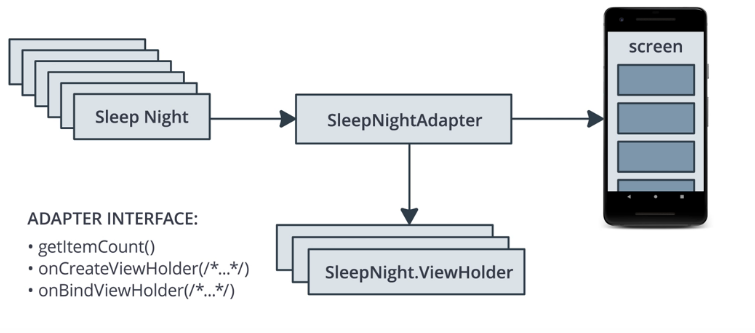

## Android


### Adapters


### Adding RecyclerView
<div class="index-module--markdown--2MdcR ureact-markdown ">

<p>In this first exercise, you will replace your main ScrollView with a RecyclerView, then implement an Adapter for displaying list items.  There are quite a few steps, but when you're done, you'll have a working app that uses a RecyclerView to display data. </p>
<ol>
<li><p><strong>Add RecyclerView to layout.</strong>
Open <code>fragment_sleep_tracker.xml</code> and replace the entire ScrollView, including the enclosed TextView, with a <code>RecyclerView</code>:</p>
<pre><code>&lt;androidx.recyclerview.widget.RecyclerView
  android:<span class="hljs-property">id</span>=<span class="hljs-string">"@+id/sleep_list"</span>
  android:layout_width=<span class="hljs-string">"0dp"</span>
  android:layout_height=<span class="hljs-string">"0dp"</span>
  app:layout_constraintBottom_toTopOf=<span class="hljs-string">"@+id/clear_button"</span>
  app:layout_constraintEnd_toEndOf=<span class="hljs-string">"parent"</span>
  app:layout_constraintStart_toStartOf=<span class="hljs-string">"parent"</span>
  app:layout_constraintTop_toBottomOf=<span class="hljs-string">"@+id/stop_button"</span>
  app:layoutManager=<span class="hljs-string">"androidx.recyclerview.widget.LinearLayoutManager"</span>/&gt;
</code></pre><p>You should be able to see that it's constrained correctly in the Design tab. The <code>RecyclerView</code> should fill all the space between the buttons. There should not be a <code>ScrollView</code> anymore.</p>
</li>
</ol>
<p><strong>In SleepNightAdapter.kt</strong></p>
<ol>
<li><p><strong>Create the SleepNightAdapter class.</strong> </p>
<p>The class should extend RecyclerView.Adapter and hold a TextItemViewHolder.</p>
<pre><code><span class="hljs-class"><span class="hljs-keyword">class</span> <span class="hljs-title">SleepNightAdapter</span>: <span class="hljs-title">RecyclerView</span>.<span class="hljs-title">Adapter</span><span class="hljs-inheritance">&lt;<span class="hljs-parent">TextItemViewHolder</span></span>&gt;() </span>
</code></pre><p>The code won’t compile yet, since you haven’t implemented all of the required overrides yet. We'll do that below.
<br><br></p>
</li>
<li><strong>Define a data source.</strong> 
Create  variable <code>data</code> and assign it to <code>listOf&lt;SleepNight&gt;</code>.
<br><br></li>
<li><strong>Override <code>getItemCount()</code> and have it return <code>data.size</code>.</strong> 
<br><br></li>
<li><p><strong>Override onBindViewHolder()</strong> </p>
<p>The function should retrieve the item from the data list, and set <code>holder.textView.text</code> to <code>item.sleepQuality.toString()</code>.
<br><br></p>
</li>
<li><p><strong>Override <code>onCreateViewHolder()</code>.</strong></p>
<p><strong><em>NOTE</em></strong> The Adapter requires this method, but we won't fill it in here.  We’ll cover it in a later exercise, but for now it just make sure it contains the line, <code>TODO("not implemented")</code>, so the code will compile.
<br><br></p>
</li>
<li><p><strong>Verify that the code compiles and runs without errors.</strong></p>
<p><strong><em>NOTE</em></strong> You should be able to click <code>START</code> and <code>STOP</code>, and assign sleep quality, but <strong>items will not appear on the screen yet</strong> because we’ve removed the ScrollView.  In the next exercise,  you'll display data in the RecyclerView.</p>
</li>
</ol>

</div>

<ol>
<li><p><strong>In SleepNightAdapter, onCreateViewHolder(), inflate the <code>text_item_view</code> layout and return the ViewHolder.</strong> </p>
<p>Get the <code>LayoutInflater</code> from <code>parent.context</code> and inflate <code>R.layout.text_item_view</code>.</p>
<p>Remember to pass <code>false</code> to <code>attachParent</code> since the <code>RecyclerView</code> will take care of attaching it for us.</p>
<pre><code>override fun onCreateViewHolder(<span class="hljs-keyword">parent</span>: ViewGroup, viewType: Int): TextItemViewHolder {
       val layoutInflater = LayoutInflater.from(<span class="hljs-keyword">parent</span>.context)
       val view = layoutInflater
            .inflate(R.layout.text_item_view, <span class="hljs-keyword">parent</span>, <span class="hljs-keyword">false</span>) <span class="hljs-keyword">as</span> TextView
       <span class="hljs-keyword">return</span> TextItemViewHolder(view)
 }
</code></pre><p><br></p>
</li>
<li><p><strong>In <code>SleepNightAdapter</code>, add a custom setter to <code>data</code> that calls <code>notifyDataSetChanged()</code> and tell Kotlin to save the new value by setting <code>field = value</code>.</strong></p>
<pre><code> <span class="hljs-operator"><span class="hljs-keyword">set</span>(<span class="hljs-keyword">value</span>) {
   <span class="hljs-keyword">field</span> = <span class="hljs-keyword">value</span>
   notifyDataSetChanged()
 }</span>
</code></pre><p><br></p>
</li>
<li><p><strong>In <code>SleepTrackerFragment</code>, create a new <code>SleepNightAdapter</code>, and use binding to associate it with the <code>RecyclerView</code>:</strong></p>
<pre><code>binding.sleepList.adapter = adapter 
</code></pre><p><br></p>
</li>
<li><p><strong>Create an observer on <code>sleepTrackerViewModel.nights</code> that sets the <code>Adapter</code> when there is new data.</strong></p>
<p><code>LiveData</code> observers are sometimes passed <code>null</code>, so make sure you check for <code>null</code>.
<br></p>
</li>
</ol>

```
 val adapter = SleepNightAdapter()
        binding.sleepList.adapter = adapter

        sleepTrackerViewModel.nights.observe(viewLifecycleOwner, Observer {
            it?.let {
                adapter.data = it
            }
        })

```

<div class="index-module--markdown--2MdcR ureact-markdown "><p>In this lesson, we'll explore how onBindViewHolder works when views get recycled.</p>
<ol>
<li><p><strong>Update <code>onBindViewHolder</code> to show low sleep quality in red.</strong> </p>
<p>Add an if block and set the sleep quality to red if sleepQuality is 1 or less:</p>
<pre><code> <span class="hljs-keyword">if</span> (<span class="hljs-property">item</span>.sleepQuality &lt;= <span class="hljs-number">1</span>) {
   holder.textView.setTextColor(Color.RED) 
 } 
</code></pre><p><br></p>
</li>
<li><p><strong>Run your app again to see your <code>RecyclerView Adapter</code> in action:</strong> </p>
<p>Add enough items that you can scroll up and down. Notice that rows that scroll back onto the screen are in red, regardless of their sleepQuality value.  We’ll fix that now.
<br><br></p>
</li>
<li><p><strong>Add an <code>else</code> block to reset the color:</strong> </p>
<p>This will fix the bug we just introduced by making sure to always set the text color correctly, based on the value of sleepQuality.</p>
<pre><code> <span class="hljs-keyword">if</span> (<span class="hljs-property">item</span>.sleepQuality &lt;= <span class="hljs-number">1</span>) {
    holder.textView.setTextColor(Color.RED) 
 } <span class="hljs-keyword">else</span> {
    holder.textView.setTextColor(Color.BLACK) 
 }
</code></pre><p><br></p>
</li>
<li><p><strong>Run your app again to see your <code>RecyclerView Adapter</code> in action:</strong> </p>
<p>You will see that the color is always set correctly now!</p>
</li>
</ol>

</div>

The code should look something like
```
class SleepNightAdapter : RecyclerView.Adapter<TextItemViewHolder>() {

    var data = listOf<SleepNight>()
        set(value) {
            field = value
            notifyDataSetChanged()
        }

    override fun getItemCount() = data.size

    override fun onBindViewHolder(holder: TextItemViewHolder, position: Int) {
        val item = data[position]
        holder.textView.text = item.sleepQuality.toString()

        if (item.sleepQuality <= 1) {
            holder.textView.setTextColor(Color.RED) // red
        } else {
            // reset
            holder.textView.setTextColor(Color.BLACK) // black
        }
    }

    override fun onCreateViewHolder(parent: ViewGroup, viewType: Int): TextItemViewHolder {

        val layoutInflater = LayoutInflater.from(parent.context)
        val view = layoutInflater
                .inflate(R.layout.text_item_view, parent, false) as TextView

        return TextItemViewHolder(view)
    }
}
```

### Recyler view with custom view
<div class="_main--content-container--ILkoI"><ol><li><strong>In <code>list_item_sleep_night</code>,  add views to the <code>ConstraintLayout</code> to build the design below.</strong></li>
</ol></div></div><span></span></div></div></div><div></div></div><div><div class="index--container--2OwOl"><div class="index--atom--lmAIo layout--content--3Smmq"><div class="ltr"><div class="index-module--markdown--2MdcR ureact-markdown "><ol start="2">
<li><p><strong>Add Add an <code>ImageView</code> and set its <code>id</code> to <code>quality_image</code>:</strong></p><pre><code>&lt;ImageView
     android:id=<span class="hljs-string">"<span class="hljs-variable">@+</span>id/quality_image"</span>
     android:layout_width=<span class="hljs-string">"<span class="hljs-variable">@dimen</span>/icon_size"</span>
     android:layout_height=<span class="hljs-string">"60dp"</span>
     android:layout_marginStart=<span class="hljs-string">"16dp"</span>
     android:layout_marginTop=<span class="hljs-string">"8dp"</span>
     android:layout_marginBottom=<span class="hljs-string">"8dp"</span>app:layout_constraintBottom_toBottomOf=<span class="hljs-string">"parent"</span>
     app:layout_constraintStart_toStartOf=<span class="hljs-string">"parent"</span>
     app:layout_constraintTop_toTopOf=<span class="hljs-string">"parent"</span>
     tools:srcCompat=<span class="hljs-string">"<span class="hljs-variable">@drawable</span>/ic_sleep_5"</span> /&gt;</code></pre><p><br></p></li><li><p><strong>Add a TextView to the right of quality_image and set its id to sleep_length:</strong></p><pre><code>&lt;TextView
     android:<span class="hljs-property">id</span>=<span class="hljs-string">"@+id/quality_string"</span>
     android:layout_width=<span class="hljs-string">"0dp"</span>
     android:layout_height=<span class="hljs-string">"20dp"</span>
     android:layout_marginTop=<span class="hljs-string">"8dp"</span>
     app:layout_constraintEnd_toEndOf=<span class="hljs-string">"@+id/sleep_length"</span>
     app:layout_constraintStart_toStartOf=<span class="hljs-string">"@+id/sleep_length"</span>
     app:layout_constraintTop_toBottomOf=<span class="hljs-string">"@+id/sleep_length"</span>
     tools:<span class="hljs-type">text</span>=<span class="hljs-string">"Excellent!!!"</span> /&gt;</code></pre><p><br></p></li><li><p><strong>Add a TextView to the right of quality_image and set its id to sleep_length:</strong></p><pre><code>&lt;TextView
     android:<span class="hljs-property">id</span>=<span class="hljs-string">"@+id/sleep_length"</span>
     android:layout_width=<span class="hljs-string">"0dp"</span>
     android:layout_height=<span class="hljs-string">"20dp"</span>
     android:layout_marginStart=<span class="hljs-string">"8dp"</span>
     android:layout_marginTop=<span class="hljs-string">"8dp"</span>
     android:layout_marginEnd=<span class="hljs-string">"16dp"</span>
     app:layout_constraintEnd_toEndOf=<span class="hljs-string">"parent"</span>
     app:layout_constraintStart_toEndOf=<span class="hljs-string">"@+id/quality_image"</span>
     app:layout_constraintTop_toTopOf=<span class="hljs-string">"@+id/quality_image"</span>
     tools:<span class="hljs-type">text</span>=<span class="hljs-string">"Wednesday"</span> /&gt;</code></pre></li></ol><p><strong>In SleepNightAdapter</strong></p><ol><li><p><strong>Inside the SleepNightAdapter class, create a <code>ViewHolder</code> class that  extends <code>RecyclerView.ViewHolder</code>.</strong> <br><br></p></li><li><p><strong>Use <code>findViewById</code> to find views.</strong> </p>
<p>Inside the <code>ViewHolder</code>, use <code>findViewById()</code> to create properties <code>sleepLength</code>, <code>quality</code>, and <code>qualityImage</code>.</p>
<p>Make sure <code>sleepLength</code> and <code>quality</code> are <code>TextViews</code>. Also ensure <code>qualityImage</code> is an <code>ImageView</code>:</p>
<pre><code>val sleepLength: TextView = itemView.findViewById(R.<span class="hljs-property">id</span>.sleep_length)
val quality: TextView = itemView.findViewById(R.<span class="hljs-property">id</span>.quality_string)
val qualityImage: ImageView = itemView.findViewById(R.<span class="hljs-property">id</span>.quality_image)</code></pre><p><br></p></li><li><p><strong>Update SleepNightAdapter to use ViewHolder:</strong> </p><p>Go to the declaration of <code>SleepNightAdapter</code> and change the type parameter of <code>RecyclerView.Adapter</code> to <code>SleepNightAdapter.ViewHolder</code></p><pre><code><span class="hljs-class"><span class="hljs-keyword">class</span> <span class="hljs-title">SleepNightAdapter</span>: <span class="hljs-title">RecyclerView</span>.<span class="hljs-title">Adapter</span><span class="hljs-inheritance">&lt;<span class="hljs-parent">SleepNightAdapter</span></span>.<span class="hljs-title">ViewHolder</span>&gt;()</span>
</code></pre><p><strong>NOTE:</strong> Your code won't compile after making this change because it doesn’t implement all of the required overrides.  We’ll fix that in the next steps.
<br><br></p></li><li><p><strong>Change onCreateViewHolder()’s return type to <code>ViewHolder</code>, and inflate <code>list_item_sleep_night</code> instead of <code>text_item_view</code>:</strong> </p>
<pre><code>override fun onCreateViewHolder(<span class="hljs-keyword">parent</span>: ViewGroup, viewType: Int): ViewHolder {
  val layoutInflater = LayoutInflater.from(<span class="hljs-keyword">parent</span>.context)
  val view = layoutInflater.inflate(R.layout.text_item_view, <span class="hljs-keyword">parent</span>, <span class="hljs-keyword">false</span>)

 <span class="hljs-keyword">return</span> ViewHolder(view)
}
</code></pre><p><em>Don’t forget</em> to remove <code>as TextView</code> from the call to <code>.inflate</code>, or your code will crash!<br><br></p></li><li><p><strong>Update onBindViewHolder.</strong> </p><p>Change <code>onBindViewHolder</code> to take <code>holder: ViewHolder</code> as a parameter and update the views in <code>ViewHolder</code> to display icon resources instead of colors.</p><pre><code><span class="hljs-title">override</span> fun onBindViewHolder(holder: <span class="hljs-type">ViewHolder</span>, position: <span class="hljs-type">Int</span>) {
    val item = <span class="hljs-typedef"><span class="hljs-keyword">data</span>[position]</span>
    val res = holder.itemView.context.resources
    holder.sleepLength.text = convertDurationToFormatted(item.startTimeMilli, item.endTimeMilli, res)
    holder.quality.text = convertNumericQualityToString(item.sleepQuality, res)
    holder.qualityImage.setImageResource(when (item.sleepQuality) {
          <span class="hljs-number">0</span> -&gt; <span class="hljs-type">R</span>.drawable.ic_sleep_0
          <span class="hljs-number">1</span> -&gt; <span class="hljs-type">R</span>.drawable.ic_sleep_1
          <span class="hljs-number">2</span> -&gt; <span class="hljs-type">R</span>.drawable.ic_sleep_2
          <span class="hljs-number">3</span> -&gt; <span class="hljs-type">R</span>.drawable.ic_sleep_3
          <span class="hljs-number">4</span> -&gt; <span class="hljs-type">R</span>.drawable.ic_sleep_4
          <span class="hljs-number">5</span> -&gt; <span class="hljs-type">R</span>.drawable.ic_sleep_5
         <span class="hljs-keyword">else</span> -&gt; <span class="hljs-type">R</span>.drawable.ic_sleep_active
   })
}
</code></pre><p><br></p></li><li><p><strong>Run the app and you should see the styled list!</strong></p></li>
</ol></div>
```
class SleepNightAdapter : RecyclerView.Adapter<SleepNightAdapter.ViewHolder>() {

    var data = listOf<SleepNight>()
        set(value) {
            field = value
            notifyDataSetChanged()
        }

    override fun getItemCount() = data.size

    override fun onBindViewHolder(holder: ViewHolder, position: Int) {
        val item = data[position]
        val res = holder.itemView.context.resources
        holder.sleepLength.text = convertDurationToFormatted(item.startTimeMilli, item.endTimeMilli, res)
        holder.quality.text = convertNumericQualityToString(item.sleepQuality, res)
        holder.qualityImage.setImageResource(when (item.sleepQuality) {
            0 -> R.drawable.ic_sleep_0
            1 -> R.drawable.ic_sleep_1
            2 -> R.drawable.ic_sleep_2
            3 -> R.drawable.ic_sleep_3
            4 -> R.drawable.ic_sleep_4
            5 -> R.drawable.ic_sleep_5
            else -> R.drawable.ic_sleep_active
        })
    }

    override fun onCreateViewHolder(parent: ViewGroup, viewType: Int): ViewHolder {
        val layoutInflater = LayoutInflater.from(parent.context)
        val view = layoutInflater
                .inflate(R.layout.list_item_sleep_night, parent, false)

        return ViewHolder(view)
    }

    class ViewHolder(itemView: View) : RecyclerView.ViewHolder(itemView){
        val sleepLength: TextView = itemView.findViewById(R.id.sleep_length)
        val quality: TextView = itemView.findViewById(R.id.quality_string)
        val qualityImage: ImageView = itemView.findViewById(R.id.quality_image)
    }

}
```
### Refactor onBindViewHolder (Encapsulating such that vieHolder attributes are inside viewHolder and not adapter)

<div class="index-module--markdown--2MdcR ureact-markdown "><p>In this exercise, you’ll begin refactoring the ViewHolder in the SleepNightAdapter.  By encapsulating the logic in onBindViewHolder in this exercise, and onCreateViewHolder in the next exercise, you’ll create code that’s easier to maintain and enhance.   </p>
<p>Let’s start by encapsulating the logic for binding the ViewHolder into a <code>bind()</code> method.  When you’re done, <code>onBindViewHolder</code> will call <code>holder.bind(holder,item,res)</code>.  </p>
<p>Watch the video to see how to use Android Studio tools to do most of this refactor for you.</p>
<ol>
<li><strong>Refactor logic in <code>onBind()</code> to a separate function called bind()</strong>:</li>
</ol>
<pre><code>     <span class="hljs-function"><span class="hljs-keyword">private</span> fun <span class="hljs-title">bind</span><span class="hljs-params">(holder: ViewHolder, item: SleepNight, res: Resources)</span> </span>{
        holder.sleepLength.text = convertDurationToFormatted(item.startTimeMilli, item.endTimeMilli, res)
        holder.quality.text = convertNumericQualityToString(item.sleepQuality, res)
        holder.qualityImage.setImageResource(when (item.sleepQuality) {
            <span class="hljs-number">0</span> -&gt; R.drawable.ic_sleep_0
            <span class="hljs-number">1</span> -&gt; R.drawable.ic_sleep_1
            <span class="hljs-number">2</span> -&gt; R.drawable.ic_sleep_2
            <span class="hljs-number">3</span> -&gt; R.drawable.ic_sleep_3
            <span class="hljs-number">4</span> -&gt; R.drawable.ic_sleep_4
            <span class="hljs-number">5</span> -&gt; R.drawable.ic_sleep_5
            <span class="hljs-keyword">else</span> -&gt; R.drawable.ic_sleep_active
        })
     }
</code></pre><p><br></p>
<ol>
<li><p><strong>In new <code>bind()</code> function, convert the <code>holder</code> parameter to a receiver.</strong></p>
<p>Place the cursor over (but don’t select) the <code>holder</code> parameter.  Use keyboard <em>Option-Enter</em>, and select <em>Convert parameter to receiver</em>.</p>
<p>onBindViewHolder, will now call <code>holder.*bind*(item,res)</code>.
<br><br></p>
</li>
<li><strong>Cut the entire <code>bind()</code> function and paste it into the <code>ViewHolder</code> class, then remove its <code>ViewHolder</code> and <code>private</code> modifiers.</strong>
<br><br></li>
<li><p><strong>Cut the line <code>val res = holder.itemView.context.resources</code> from onBindViewHolder(), and paste it into the bind() function, then remove the `res’ parameter from bind().</strong></p>
<p>Your <code>ViewHolder</code> class should now look like this:</p>
<pre><code><span class="hljs-class"> <span class="hljs-keyword">class</span> <span class="hljs-type">ViewHolder</span><span class="hljs-container">(<span class="hljs-title">itemView</span>: <span class="hljs-type">View</span>)</span> : <span class="hljs-type">RecyclerView</span>.<span class="hljs-type">ViewHolder</span><span class="hljs-container">(<span class="hljs-title">itemView</span>)</span> {
   val res = itemView.context.resources

   val sleepLength: <span class="hljs-type">TextView</span> = itemView.findViewById<span class="hljs-container">(<span class="hljs-type">R</span>.<span class="hljs-title">id</span>.<span class="hljs-title">sleep_length</span>)</span>
   val quality: <span class="hljs-type">TextView</span> = itemView.findViewById<span class="hljs-container">(<span class="hljs-type">R</span>.<span class="hljs-title">id</span>.<span class="hljs-title">quality_string</span>)</span>
   val qualityImage: <span class="hljs-type">ImageView</span> = itemView.findViewById<span class="hljs-container">(<span class="hljs-type">R</span>.<span class="hljs-title">id</span>.<span class="hljs-title">quality_image</span>)</span>

   fun bind<span class="hljs-container">(<span class="hljs-title">item</span>: <span class="hljs-type">SleepNight</span>)</span> {
       sleepLength.text = convertDurationToFormatted<span class="hljs-container">(<span class="hljs-title">item</span>.<span class="hljs-title">startTimeMilli</span>, <span class="hljs-title">item</span>.<span class="hljs-title">endTimeMilli</span>, <span class="hljs-title">res</span>)</span>
       quality.text = convertNumericQualityToString<span class="hljs-container">(<span class="hljs-title">item</span>.<span class="hljs-title">sleepQuality</span>, <span class="hljs-title">res</span>)</span>
       qualityImage.setImageResource<span class="hljs-container">(<span class="hljs-title">when</span> (<span class="hljs-title">item</span>.<span class="hljs-title">sleepQuality</span>)</span> {
           0 -&gt; <span class="hljs-type">R</span>.drawable.ic_sleep_0
           1 -&gt; <span class="hljs-type">R</span>.drawable.ic_sleep_1
           2 -&gt; <span class="hljs-type">R</span>.drawable.ic_sleep_2
           3 -&gt; <span class="hljs-type">R</span>.drawable.ic_sleep_3
           4 -&gt; <span class="hljs-type">R</span>.drawable.ic_sleep_4
           5 -&gt; <span class="hljs-type">R</span>.drawable.ic_sleep_5
           else -&gt; <span class="hljs-type">R</span>.drawable.ic_sleep_active
      })
   }
 }</span>
</code></pre><p><br></p>
</li>
<li><strong>Build and run the app and verify it runs exactly as before.</strong></li>
</ol>

</div>

### Refactor onCreateViewHolder (Encapsulating such that vieHolder attributes are inside viewHolder and not adapter)

<div class="index-module--markdown--2MdcR ureact-markdown ">
<p>In this exercise, we’ll continue the refactor we started in the prior lesson by encapsulating the logic for creating the ViewHolder into a method called from(), which we’ll then place into a companion object in the ViewHolder class.  </p>
<ol>
<li><p><strong>Encapsulate the logic for creating the <code>ViewHolder</code>.</strong></p>
<p>Select the code in onCreateViewHolder() and, using the same process as above, refactor it into a <code>public</code> method called <code>from</code>.</p>
<p>Watch the video to see how to use Android Studio tools to do most of this refactor for you.
<br><br></p>
</li>
<li><p><strong>Move the <code>from</code> code into a <code>companion object</code>.</strong></p>
<p>Click option-enter on the <code>from</code> method, and select <code>Move to companion object</code>.  Then move the resulting <code>companion object</code> into the <code>ViewHolder</code> class.
<br><br></p>
</li>
<li><p><strong>Change the <code>ViewHolder</code> class declaration to be a <code>private constructor</code>:</strong></p>
<pre><code><span class="hljs-class"><span class="hljs-keyword">class</span> <span class="hljs-type">ViewHolder</span> private constructor<span class="hljs-container">(<span class="hljs-title">itemView</span>: <span class="hljs-type">View</span>)</span></span>
</code></pre><p><br></p>
</li>
<li><p><strong>Finally, change the return statement in onBindViewHolder to <code>return ViewHolder.from(parent)</code>.</strong></p>
<p>Your refactored SleepNightAdapter should now look like this:</p>
<pre><code><span class="hljs-class">  <span class="hljs-keyword">class</span> <span class="hljs-type">SleepNightAdapter</span> : <span class="hljs-type">RecyclerView</span>.<span class="hljs-type">Adapter</span>&lt;<span class="hljs-type">SleepNightAdapter</span>.<span class="hljs-type">ViewHolder</span>&gt;<span class="hljs-container">()</span> {

     var data = listOf&lt;<span class="hljs-type">SleepNight</span>&gt;<span class="hljs-container">()</span>
         set<span class="hljs-container">(<span class="hljs-title">value</span>)</span> {
             field = value
             notifyDataSetChanged<span class="hljs-container">()</span>
         }

     override fun getItemCount<span class="hljs-container">()</span> = data.size

     override fun onBindViewHolder<span class="hljs-container">(<span class="hljs-title">holder</span>: <span class="hljs-type">ViewHolder</span>, <span class="hljs-title">position</span>: <span class="hljs-type">Int</span>)</span> {
         val item = data[position]

         holder.bind<span class="hljs-container">(<span class="hljs-title">item</span>)</span>
     }

     override fun onCreateViewHolder<span class="hljs-container">(<span class="hljs-title">parent</span>: <span class="hljs-type">ViewGroup</span>, <span class="hljs-title">viewType</span>: <span class="hljs-type">Int</span>)</span>: <span class="hljs-type">ViewHolder</span> {
         return <span class="hljs-type">ViewHolder</span>.from<span class="hljs-container">(<span class="hljs-title">parent</span>)</span>
     }

     <span class="hljs-keyword">class</span> <span class="hljs-type">ViewHolder</span><span class="hljs-container">(<span class="hljs-title">itemView</span>: <span class="hljs-type">View</span>)</span> : <span class="hljs-type">RecyclerView</span>.<span class="hljs-type">ViewHolder</span><span class="hljs-container">(<span class="hljs-title">itemView</span>)</span>{
         val sleepLength: <span class="hljs-type">TextView</span> = itemView.findViewById<span class="hljs-container">(<span class="hljs-type">R</span>.<span class="hljs-title">id</span>.<span class="hljs-title">sleep_length</span>)</span>
         val quality: <span class="hljs-type">TextView</span> = itemView.findViewById<span class="hljs-container">(<span class="hljs-type">R</span>.<span class="hljs-title">id</span>.<span class="hljs-title">quality_string</span>)</span>
         val qualityImage: <span class="hljs-type">ImageView</span> = itemView.findViewById<span class="hljs-container">(<span class="hljs-type">R</span>.<span class="hljs-title">id</span>.<span class="hljs-title">quality_image</span>)</span>

         fun bind<span class="hljs-container">(<span class="hljs-title">item</span>: <span class="hljs-type">SleepNight</span>)</span> {
             val res = itemView.context.resources

             sleepLength.text = convertDurationToFormatted<span class="hljs-container">(<span class="hljs-title">item</span>.<span class="hljs-title">startTimeMilli</span>, <span class="hljs-title">item</span>.<span class="hljs-title">endTimeMilli</span>, <span class="hljs-title">res</span>)</span>
             quality.text = convertNumericQualityToString<span class="hljs-container">(<span class="hljs-title">item</span>.<span class="hljs-title">sleepQuality</span>, <span class="hljs-title">res</span>)</span>
             qualityImage.setImageResource<span class="hljs-container">(<span class="hljs-title">when</span> (<span class="hljs-title">item</span>.<span class="hljs-title">sleepQuality</span>)</span> {
                 0 -&gt; <span class="hljs-type">R</span>.drawable.ic_sleep_0
                 1 -&gt; <span class="hljs-type">R</span>.drawable.ic_sleep_1
                 2 -&gt; <span class="hljs-type">R</span>.drawable.ic_sleep_2
                 3 -&gt; <span class="hljs-type">R</span>.drawable.ic_sleep_3
                 4 -&gt; <span class="hljs-type">R</span>.drawable.ic_sleep_4
                 5 -&gt; <span class="hljs-type">R</span>.drawable.ic_sleep_5
                 else -&gt; <span class="hljs-type">R</span>.drawable.ic_sleep_active
             })
         }

         companion object {
             fun from<span class="hljs-container">(<span class="hljs-title">parent</span>: <span class="hljs-type">ViewGroup</span>)</span>: <span class="hljs-type">ViewHolder</span> {
                 val layoutInflater = <span class="hljs-type">LayoutInflater</span>.from<span class="hljs-container">(<span class="hljs-title">parent</span>.<span class="hljs-title">context</span>)</span>
                 val view = layoutInflater
                .inflate<span class="hljs-container">(<span class="hljs-type">R</span>.<span class="hljs-title">layout</span>.<span class="hljs-title">list_item_sleep_night</span>, <span class="hljs-title">parent</span>, <span class="hljs-title">false</span>)</span>

                 return <span class="hljs-type">ViewHolder</span><span class="hljs-container">(<span class="hljs-title">view</span>)</span>
             }
          }
        }
   }</span>
</code></pre><p><br></p>
</li>
<li><p><strong>Run the app and verify that it runs exactly as it did before the refactor.</strong></p>
</li>
</ol>
<p><strong>Wow, that was a lot of steps!</strong>  And the app didn’t change at all!  But by using encapsulation to achieve <em>separation of concerns</em>, you’ve made your code much more readable, and easier to maintain. </p>

</div>

### Diff Util



<div class="index-module--markdown--2MdcR ureact-markdown ">
<p>In this step you'll take the <code>Adapter</code> you finished in the last section and add <code>DiffUtil</code>s to calculate changes when the list changes.</p>
<p>When you've completed this exercise you will have refactored the <code>SleepNightAdapter</code> to use <code>ListAdapter</code>, and replaced <code>notifyDataSetChanced</code> with the more optimized <code>DiffUtil</code>.</p>
<ol>
<li><p><strong>At the bottom of <code>SleepNightAdapter.kt</code>, create a new class <code>SleepNightDiffCallback</code> that extends <code>DiffUtil.ItemCallback&lt;SleepNight&gt;</code>.</strong></p>
<pre><code> <span class="hljs-class"><span class="hljs-keyword">class</span> <span class="hljs-title">SleepNightDiffCallback</span> : 
        <span class="hljs-title">DiffUtil</span>.<span class="hljs-title">ItemCallback</span>&lt;<span class="hljs-title">SleepNight</span>&gt;() </span>{
 }
</code></pre><p><br></p>
</li>
<li><p><strong>In <code>SleepNightDiffCallback</code> override <code>areItemsTheSame</code>.</strong></p>
<p>Two items are the same if their <code>nightId</code> values are equal.
<br><br></p>
</li>
<li><p><strong>Override <code>areContentsTheSame</code> in <code>SleepNightDiffCallback</code>.</strong></p>
<p>Two items are the same if they have the same value, <code>oldItem == newItem</code>.
<br><br></p>
</li>
<li><p><strong>Update <code>SleepNightAdapter</code> to extend <code>ListAdapter</code> with a <code>SleepNightDiffCallback()</code> parameter:</strong> </p>
<pre><code> <span class="hljs-class"><span class="hljs-keyword">class</span> <span class="hljs-title">SleepNightAdapter</span> : <span class="hljs-title">ListAdapter</span><span class="hljs-inheritance">&lt;<span class="hljs-parent">SleepNight</span></span>, <span class="hljs-title">SleepNightAdapter</span>.<span class="hljs-title">ViewHolder</span>&gt;(<span class="hljs-title">SleepNightDiffCallback</span>())</span>
</code></pre><p>Make sure to import <code>ListAdapter</code> from <code>androidx.recyclerview.widget.ListAdapter</code>.
<br></p>
</li>
<li><p><strong>Delete the data field and getItemCount().</strong> </p>
<p>Remove the code for <code>val data</code> and <code>getItemCount</code>.</p>
<p><strong>NOTE:</strong> Your code will not compile after this step. We'll fix that in the next few steps.
<br><br></p>
</li>
<li><p><strong>In <code>onBindViewHolder()</code> replace <code>data[position]</code> with a call to <code>getItem()</code>.</strong> 
<br><br></p>
</li>
<li><p><strong>In <code>SleepTrackerFragment</code> <code>nights</code> observer, replace <code>adapter.data</code> assignment with a call to <code>adapter.submitList()</code>.</strong><br><br></p>
</li>
<li><p><strong>Run the app again! You should see the items animate when you start a sleep night.</strong></p>
</li>
</ol>

</div>

The code will look like:
```
class SleepNightAdapter : ListAdapter<SleepNight,
        SleepNightAdapter.ViewHolder>(SleepNightDiffCallback()) {

    override fun onBindViewHolder(holder: ViewHolder, position: Int) {
        val item = getItem(position)

        holder.bind(item)
    }

    override fun onCreateViewHolder(parent: ViewGroup, viewType: Int): ViewHolder {
        return ViewHolder.from(parent)
    }

    class ViewHolder private constructor (itemView: View) : RecyclerView.ViewHolder(itemView){
        val sleepLength: TextView = itemView.findViewById(R.id.sleep_length)
        val quality: TextView = itemView.findViewById(R.id.quality_string)
        val qualityImage: ImageView = itemView.findViewById(R.id.quality_image)

        fun bind(item: SleepNight) {
            val res = itemView.context.resources

            sleepLength.text = convertDurationToFormatted(item.startTimeMilli, item.endTimeMilli, res)
            quality.text = convertNumericQualityToString(item.sleepQuality, res)
            qualityImage.setImageResource(when (item.sleepQuality) {
                0 -> R.drawable.ic_sleep_0
                1 -> R.drawable.ic_sleep_1
                2 -> R.drawable.ic_sleep_2
                3 -> R.drawable.ic_sleep_3
                4 -> R.drawable.ic_sleep_4
                5 -> R.drawable.ic_sleep_5
                else -> R.drawable.ic_sleep_active
            })
        }

        companion object {
            fun from(parent: ViewGroup): ViewHolder {
                val layoutInflater = LayoutInflater.from(parent.context)
                val view = layoutInflater
                        .inflate(R.layout.list_item_sleep_night, parent, false)

                return ViewHolder(view)
            }
        }
    }
}

/**
 * Callback for calculating the diff between two non-null items in a list.
 *
 * Used by ListAdapter to calculate the minumum number of changes between and old list and a new
 * list that's been passed to `submitList`.
 */
class SleepNightDiffCallback : DiffUtil.ItemCallback<SleepNight>() {
    override fun areItemsTheSame(oldItem: SleepNight, newItem: SleepNight): Boolean {
        return oldItem.nightId == newItem.nightId
    }

    override fun areContentsTheSame(oldItem: SleepNight, newItem: SleepNight): Boolean {
        return oldItem == newItem
    }
}
```
And in Fragment submitList will handle update/changes to list
```
val adapter = SleepNightAdapter()
        binding.sleepList.adapter = adapter

        sleepTrackerViewModel.nights.observe(viewLifecycleOwner, Observer {
            it?.let {
                adapter.submitList(it)
            }
        })
```

### Adding Data binding to recycler adapter
<div class="index-module--markdown--2MdcR ureact-markdown ">In this exercise you'll take the Adapter you finished in the last exercise and update it to use Data Binding. This is a refactor, and it won't change the behavior of your list.</p>
<ol><li><p><strong>In <code>list_item_sleep_night.xml</code>, wrap the <code>ConstraintLayout</code> in a <code>layout</code> tag.</strong> </p><p>You can use the intention menu via <code>Alt+Enter</code> to "Convert to data binding layout".<br><br></p></li><li><p><strong>Add a data tag and a variable called <code>sleep</code>, then rebuild the app.</strong></p>
<pre><code> &lt;<span class="hljs-typedef"><span class="hljs-keyword">data</span>&gt;</span>
   &lt;variable 
         name=”sleep” <span class="hljs-typedef"><span class="hljs-keyword">type</span>="com.example.android.trackmysleepquality.database.<span class="hljs-type">SleepNight</span>" /&gt;</span>
 &lt;/<span class="hljs-typedef"><span class="hljs-keyword">data</span>&gt;</span>
</code></pre></li></ol><p><strong>In <code>SleepNightAdapter.ViewHolder</code></strong></p><ol><li><p><strong>In the <code>companion object</code>, Replace <code>LayoutInflater</code> with <code>ListItemSleepNightBinding</code>:</strong> </p>
<pre><code><span class="hljs-class"> <span class="hljs-keyword">class</span> <span class="hljs-type">ViewHolder</span> private constructor<span class="hljs-container">(<span class="hljs-title">val</span> <span class="hljs-title">binding</span>: <span class="hljs-type">ListItemSleepNightBinding</span>)</span> </span></code></pre><p><br></p></li><li><p><strong>In the <code>from()</code> function, use <code>ListItemSleepNightBinding.inflate</code> to create a binding object.</strong></p><pre><code> fun from(<span class="hljs-keyword">parent</span>: ViewGroup): ViewHolder {
     val layoutInflater = LayoutInflater.from(<span class="hljs-keyword">parent</span>.context)
     val binding = ListItemSleepNightBinding.inflate(layoutInflater, <span class="hljs-keyword">parent</span>, <span class="hljs-keyword">false</span>)
     <span class="hljs-keyword">return</span> ViewHolder(binding)
 }
</code></pre><p><br></p></li><li><p><strong>Refactor and rename the ViewHolder class’s constructor parameter to take a <code>ListItemSleepNightBinding</code> parameter called <code>binding.root</code>.</strong></p><p>Remember to pass the parameter to the parent constructor:</p><pre><code><span class="hljs-class"> <span class="hljs-keyword">class</span> <span class="hljs-type">ViewHolder</span> private constructor<span class="hljs-container">(<span class="hljs-title">val</span> <span class="hljs-title">binding</span>: <span class="hljs-type">ListItemSleepNightBinding</span>)</span>:
       <span class="hljs-type">RecyclerView</span>.<span class="hljs-type">ViewHolder</span><span class="hljs-container">(<span class="hljs-title">binding</span>.<span class="hljs-title">root</span>)</span> {
 }</span>
</code></pre><p><em>Note</em> Your app won't compile after this step. We'll fix that next.
<br><br></p></li><li><p><strong>In <code>ViewHolder</code>, replace <code>findViewById</code> calls with references to binding object fields, then inline them:</strong> </p><pre><code><span class="hljs-keyword">val</span> sleepLength: <span class="hljs-type">TextView</span> = binding.sleepLength
<span class="hljs-keyword">val</span> quality: <span class="hljs-type">TextView</span> = binding.qualityString
<span class="hljs-keyword">val</span> qualityImage: <span class="hljs-type">ImageView</span> = binding.qualityImage
</code></pre><p>Once your code is compiling you can inline the new definitions. Do this by right clicking on each field, then selecting <em>Refactor &gt; Inline</em>. Select <em>Inline all references and remove the property</em> to tell Android studio to remove the property.</p><p>Inline is a very common refactor.  It's worth taking a moment to learn the keyboard shortcut. You can find the keyboard shortcut in the context menu next to <em>Inline</em>.</p><p>Your refactored <code>ViewHolder</code> should now look like this:</p><pre><code><span class="hljs-class"> <span class="hljs-keyword">class</span> <span class="hljs-type">ViewHolder</span> private constructor<span class="hljs-container">(<span class="hljs-title">val</span> <span class="hljs-title">binding</span>: <span class="hljs-type">ListItemSleepNightBinding</span>)</span>: <span class="hljs-type">RecyclerView</span>.<span class="hljs-type">ViewHolder</span><span class="hljs-container">(<span class="hljs-title">binding</span>.<span class="hljs-title">root</span>)</span> {
    fun bind<span class="hljs-container">(<span class="hljs-title">item</span>: <span class="hljs-type">SleepNight</span>)</span> {
        val res = itemView.context.resources
        binding.sleepLength.text = convertDurationToFormatted<span class="hljs-container">(<span class="hljs-title">item</span>.<span class="hljs-title">startTimeMilli</span>, <span class="hljs-title">item</span>.<span class="hljs-title">endTimeMilli</span>, <span class="hljs-title">res</span>)</span>
        binding.qualityString.text = convertNumericQualityToString<span class="hljs-container">(<span class="hljs-title">item</span>.<span class="hljs-title">sleepQuality</span>, <span class="hljs-title">res</span>)</span>
        binding.qualityImage.setImageResource<span class="hljs-container">(<span class="hljs-title">when</span> (<span class="hljs-title">item</span>.<span class="hljs-title">sleepQuality</span>)</span> {
            0 -&gt; <span class="hljs-type">R</span>.drawable.ic_sleep_0
            1 -&gt; <span class="hljs-type">R</span>.drawable.ic_sleep_1
            2 -&gt; <span class="hljs-type">R</span>.drawable.ic_sleep_2
            3 -&gt; <span class="hljs-type">R</span>.drawable.ic_sleep_3
            4 -&gt; <span class="hljs-type">R</span>.drawable.ic_sleep_4
            5 -&gt; <span class="hljs-type">R</span>.drawable.ic_sleep_5
            else -&gt; <span class="hljs-type">R</span>.drawable.ic_sleep_active
        })
    }
    companion object {
          fun from<span class="hljs-container">(<span class="hljs-title">parent</span>: <span class="hljs-type">ViewGroup</span>)</span>: <span class="hljs-type">ViewHolder</span> {
               val layoutInflater = <span class="hljs-type">LayoutInflater</span>.from<span class="hljs-container">(<span class="hljs-title">parent</span>.<span class="hljs-title">context</span>)</span>
               val binding = <span class="hljs-type">ListItemSleepNightBinding</span>.inflate<span class="hljs-container">(<span class="hljs-title">layoutInflater</span>, <span class="hljs-title">parent</span>, <span class="hljs-title">false</span>)</span>
               return <span class="hljs-type">ViewHolder</span><span class="hljs-container">(<span class="hljs-title">binding</span>)</span>
         }
    }
 }</span></code></pre><p><br></p></li><li><p><strong>Build and run the app, and verify the refactor has not changed anything visible to the user.</strong></p>
</li></ol></div>

### Creation of Binding Adapter
<div class="index-module--markdown--2MdcR ureact-markdown ">
<p>In this exercise you'll create binding adapters and move data binding to logic to XML.</p>
<p>When you've completed this exercise you will have refactored the <code>SleepNightAdapter</code> to use DataBinding, and replaced <code>bind</code>.</p><ol><li><p><strong>In <code>BindingUtils</code>, define three Binding Adapters, one for each view in <code>list_item_sleep_night</code>:</strong> </p><p>For the <code>ImageView</code>, move the code from <code>SleepNightAdapter.ViewHolder bind()</code> function into an extension function:</p><pre><code> @<span class="hljs-type">BindingAdapter</span>(<span class="hljs-string">"sleepImage"</span>)
 fun <span class="hljs-type">ImageView</span>.setSleepImage(item: <span class="hljs-type">SleepNight</span>) {
      setImageResource(when (item.sleepQuality) {
          <span class="hljs-number">0</span> -&gt; <span class="hljs-type">R</span>.drawable.ic_sleep_0
          <span class="hljs-number">1</span> -&gt; <span class="hljs-type">R</span>.drawable.ic_sleep_1
          <span class="hljs-number">2</span> -&gt; <span class="hljs-type">R</span>.drawable.ic_sleep_2
          <span class="hljs-number">3</span> -&gt; <span class="hljs-type">R</span>.drawable.ic_sleep_3
          <span class="hljs-number">4</span> -&gt; <span class="hljs-type">R</span>.drawable.ic_sleep_4
          <span class="hljs-number">5</span> -&gt; <span class="hljs-type">R</span>.drawable.ic_sleep_5
          <span class="hljs-keyword">else</span> -&gt; <span class="hljs-type">R</span>.drawable.ic_sleep_active
     })
 }
</code></pre><p>For the two <code>TextView</code>s, convert the data to formatted text using the functions provided in <code>Util.kt</code>:</p><pre><code> @BindingAdapter(<span class="hljs-string">"sleepDurationFormatted"</span>)
 fun TextView.setSleepDurationFormatted(<span class="hljs-property">item</span>: SleepNight?) {
      <span class="hljs-property">item</span>?.let {
          <span class="hljs-type">text</span> = convertDurationToFormatted(<span class="hljs-property">item</span>.startTimeMilli, <span class="hljs-property">item</span>.endTimeMilli,context.resources)
      }
 }

 @BindingAdapter(<span class="hljs-string">"sleepQualityString"</span>)
 fun TextView.setSleepQualityString(<span class="hljs-property">item</span>: SleepNight?) {
      <span class="hljs-property">item</span>?.let {
          <span class="hljs-type">text</span> = convertNumericQualityToString(<span class="hljs-property">item</span>.sleepQuality, context.resources)
      }
 }
</code></pre><p><br></p></li><li><p><strong>Replace the code in <code>SleepNightAdapter.ViewHolder.bind</code> with a single binding to the SleepNight item,  followed by <code>executePendingBindings()</code>:</strong></p><pre><code>binding.sleep = <span class="hljs-property">item</span>binding.executePendingBindings()
</code></pre><p><br></p></li><li><p><strong>In <code>list_item_sleep_night</code>, add attributes to bind the views to the adapters you created in BindingAdapters:</strong> </p><p>For example, for the <code>ImageView</code>, add <code>app:sleepImage="@{sleep}"</code><br><br></p></li><li><strong>Build and run your code.</strong> </li>
</ol>
</div>
```

@BindingAdapter("sleepImage")
fun ImageView.setSleepImage(item: SleepNight?) {
    item?.let {
        setImageResource(when (item.sleepQuality) {
            0 -> R.drawable.ic_sleep_0
            1 -> R.drawable.ic_sleep_1
            2 -> R.drawable.ic_sleep_2
            3 -> R.drawable.ic_sleep_3
            4 -> R.drawable.ic_sleep_4
            5 -> R.drawable.ic_sleep_5
            else -> R.drawable.ic_sleep_active
        })
    }
}

@BindingAdapter("sleepDurationFormatted")
fun TextView.setSleepDurationFormatted(item: SleepNight?) {
    item?.let {
        text = convertDurationToFormatted(item.startTimeMilli, item.endTimeMilli, context.resources)
    }
}

@BindingAdapter("sleepQualityString")
fun TextView.setSleepQualityString(item: SleepNight?) {
    item?.let {
        text = convertNumericQualityToString(item.sleepQuality, context.resources)
    }
}
```
```
class SleepNightAdapter : ListAdapter<SleepNight,
        SleepNightAdapter.ViewHolder>(SleepNightDiffCallback()) {

    override fun onBindViewHolder(holder: ViewHolder, position: Int) {
        val item = getItem(position)

        holder.bind(item)
    }

    override fun onCreateViewHolder(parent: ViewGroup, viewType: Int): ViewHolder {
        return ViewHolder.from(parent)
    }

    class ViewHolder private constructor(val binding: ListItemSleepNightBinding)
        : RecyclerView.ViewHolder(binding.root) {

        fun bind(item: SleepNight) {
            binding.sleep = item
            binding.executePendingBindings()
        }

        companion object {
            fun from(parent: ViewGroup): ViewHolder {
                val layoutInflater = LayoutInflater.from(parent.context)
                val binding = ListItemSleepNightBinding.inflate(layoutInflater, parent, false)

                return ViewHolder(binding)
            }
        }
    }
}

/**
 * Callback for calculating the diff between two non-null items in a list.
 *
 * Used by ListAdapter to calculate the minumum number of changes between and old list and a new
 * list that's been passed to `submitList`.
 */
class SleepNightDiffCallback : DiffUtil.ItemCallback<SleepNight>() {
    override fun areItemsTheSame(oldItem: SleepNight, newItem: SleepNight): Boolean {
        return oldItem.nightId == newItem.nightId
    }

    override fun areContentsTheSame(oldItem: SleepNight, newItem: SleepNight): Boolean {
        return oldItem == newItem
    }
}
```


### GridLayout
<div class="_main--content-container--ILkoI"><div>
<p>In this exercise you'll take the RecyclerView you finished in the last exercise and update it display using a GridLayoutManager.</p><p>When you've completed this exercise your app will display the data using a grid.</p><ol><li><p><strong>In <code>fragment_sleep_tracker.xml</code>, remove <code>LinearLayoutManager</code>.</strong> </p>
<p>Delete the line <code>app:layoutManager="androidx.recyclerview.widget.LinearLayoutManager"</code>.<br><br></p></li><li><p><strong>In <code>SleepTrackerFragment</code> <code>onCreateView</code>, create a new <code>GridLayoutManager</code> and bind it to the <code>RecyclerView</code>.</strong></p>
<p>Access the <code>RecyclerView</code> in the binding object using <code>binding.sleepList</code>.</p><pre><code>val manager = GridLayoutManager(activity, <span class="hljs-number">3</span>)
binding.sleepList.layoutManager = manager
</code></pre><p><br></p></li><li><p><strong>In <code>list_item_sleep_night</code>, delete the <code>sleep_length</code> <code>TextView</code> because it is not used in the new design.</strong><br><br></p></li><li><p><strong>In <code>list_item_sleep_night</code>, edit the <code>quality_string</code> TextView to display to place it underneath the ImageView so it displays correctly in the <code>GridView</code>.</strong></p><p>For a challenge, you can update the XML yourself to create the layout in the design surface view below:</p></li></ol></div></div><span></span></div></div></div><div><div class="index--container--2OwOl"><div class="index--atom--lmAIo layout--content--3Smmq"><div class="ltr"><div class="index-module--markdown--2MdcR ureact-markdown "><p> Your updated layout should look like this:</p><pre><code><span class="hljs-pi">&lt;?xml version="1.0" encoding="utf-8"?&gt;</span><span class="hljs-tag">&lt;<span class="hljs-title">layout</span> <span class="hljs-attribute">xmlns:android</span>=<span class="hljs-value">"http://schemas.android.com/apk/res/android"</span>
    <span class="hljs-attribute">xmlns:app</span>=<span class="hljs-value">"http://schemas.android.com/apk/res-auto"</span>
    <span class="hljs-attribute">xmlns:tools</span>=<span class="hljs-value">"http://schemas.android.com/tools"</span>&gt;</span>
    <span class="hljs-tag">&lt;<span class="hljs-title">data</span>&gt;</span>
        <span class="hljs-tag">&lt;<span class="hljs-title">variable</span>
            <span class="hljs-attribute">name</span>=<span class="hljs-value">"sleep"</span>
            <span class="hljs-attribute">type</span>=<span class="hljs-value">"com.example.android.trackmysleepquality.database.SleepNight"</span> /&gt;</span>
    <span class="hljs-tag">&lt;/<span class="hljs-title">data</span>&gt;</span>
    <span class="hljs-tag">&lt;<span class="hljs-title">androidx.constraintlayout.widget.ConstraintLayout</span>
        <span class="hljs-attribute">android:layout_width</span>=<span class="hljs-value">"match_parent"</span>
        <span class="hljs-attribute">android:layout_height</span>=<span class="hljs-value">"wrap_content"</span>
        <span class="hljs-attribute">android:orientation</span>=<span class="hljs-value">"vertical"</span>&gt;</span>
        <span class="hljs-tag">&lt;<span class="hljs-title">ImageView</span>
            <span class="hljs-attribute">android:id</span>=<span class="hljs-value">"@+id/quality_image"</span>
            <span class="hljs-attribute">android:layout_width</span>=<span class="hljs-value">"@dimen/icon_size"</span>
            <span class="hljs-attribute">android:layout_height</span>=<span class="hljs-value">"60dp"</span>
            <span class="hljs-attribute">android:layout_marginStart</span>=<span class="hljs-value">"16dp"</span>
            <span class="hljs-attribute">android:layout_marginTop</span>=<span class="hljs-value">"8dp"</span>
            <span class="hljs-attribute">android:layout_marginBottom</span>=<span class="hljs-value">"8dp"</span>
            <span class="hljs-attribute">app:layout_constraintBottom_toBottomOf</span>=<span class="hljs-value">"parent"</span>
            <span class="hljs-attribute">app:layout_constraintStart_toStartOf</span>=<span class="hljs-value">"parent"</span>
            <span class="hljs-attribute">app:layout_constraintTop_toTopOf</span>=<span class="hljs-value">"parent"</span>
            <span class="hljs-attribute">tools:srcCompat</span>=<span class="hljs-value">"@drawable/ic_sleep_5"</span>
            <span class="hljs-attribute">app:sleepImage</span>=<span class="hljs-value">"@{sleep}"</span>/&gt;</span>
        <span class="hljs-tag">&lt;<span class="hljs-title">TextView</span>
            <span class="hljs-attribute">android:id</span>=<span class="hljs-value">"@+id/quality_string"</span>
            <span class="hljs-attribute">android:layout_width</span>=<span class="hljs-value">"0dp"</span>
            <span class="hljs-attribute">android:layout_height</span>=<span class="hljs-value">"wrap_content"</span>
            <span class="hljs-attribute">android:layout_marginTop</span>=<span class="hljs-value">"8dp"</span>
            <span class="hljs-attribute">app:layout_constraintEnd_toEndOf</span>=<span class="hljs-value">"@+id/quality_image"</span>
            <span class="hljs-attribute">app:layout_constraintStart_toStartOf</span>=<span class="hljs-value">"@+id/quality_image"</span>
            <span class="hljs-attribute">app:layout_constraintTop_toBottomOf</span>=<span class="hljs-value">"@+id/quality_image"</span>
            <span class="hljs-attribute">app:sleepQualityString</span>=<span class="hljs-value">"@{sleep}"</span>/&gt;</span>
    <span class="hljs-tag">&lt;/<span class="hljs-title">androidx.constraintlayout.widget.ConstraintLayout</span>&gt;</span>
    <span class="hljs-tag">&lt;/<span class="hljs-title">layout</span>&gt;</span></code></pre><ol tart="5"><li><p><strong>Build and run the app. You should now see the data in your new grid layout!</strong></p>
</li></ol>
</div>


### Recycler view interaction 


<div class="index-module--markdown--2MdcR ureact-markdown "><p>Now it’s your turn to complete this exercise yourself!</p>
<p>In this exercise you'll implement a ClickListener and bind it in the adapter.</p>
<ol>
<li><p><strong>In <code>SleepNightAdapter</code>, create a new class called <code>SleepNightListener</code>.</strong> </p>
<p>The listener class receives a <code>SleepNight</code> object and passes its <code>nightId</code> field: </p>
<pre><code><span class="hljs-class"> <span class="hljs-keyword">class</span> <span class="hljs-type">SleepNightListener</span><span class="hljs-container">(<span class="hljs-title">val</span> <span class="hljs-title">clickListener</span>: (<span class="hljs-title">sleepId</span>: <span class="hljs-type">Long</span>)</span> -&gt; <span class="hljs-type">Unit</span>) {
     fun onClick<span class="hljs-container">(<span class="hljs-title">night</span>: <span class="hljs-type">SleepNight</span>)</span> = clickListener<span class="hljs-container">(<span class="hljs-title">night</span>.<span class="hljs-title">nightId</span>)</span>
 }</span>
</code></pre><p><br></p>
</li>
<li><p><strong>Wire up the new listener to class to your <code>list_item_sleep_night.xml</code> by creating new variable.</strong></p>
<pre><code> &lt;variable
     name=<span class="hljs-string">"clickListener"</span> <span class="hljs-class"><span class="hljs-keyword">type</span>=</span><span class="hljs-string">"com.example.android.trackmysleepquality.sleeptracker.SleepNightListener"</span>/&gt;
</code></pre><p><br></p>
</li>
<li><p><strong>In order to tell the view to call your click listener, add your click listener to onClick property of the ConstaintLayout.</strong></p>
<pre><code>android:onClick=<span class="hljs-string">"<span class="hljs-subst">@{() -&gt; clickListener.onClick(<span class="hljs-keyword">sleep</span>)}</span>"</span>
</code></pre><p><br></p>
</li>
<li><p><strong>Add a SleepNightListener reference to the SleepNightAdapter class declaration.</strong></p>
<pre><code><span class="hljs-class"><span class="hljs-keyword">class</span> <span class="hljs-type">SleepNightAdapter</span><span class="hljs-container">(<span class="hljs-title">val</span> <span class="hljs-title">clickListener</span>: <span class="hljs-type">SleepNightListener</span>)</span> </span>
</code></pre><p><br></p>
</li>
<li><p><strong>To finish the adapter, add clickListener to DataBinding in onBindViewHolder method.</strong> </p>
<p>Edit the call to holder.bind to pass the click listener:</p>
<pre><code><span class="hljs-function_or_atom">holder</span>.<span class="hljs-function_or_atom">bind</span>(<span class="hljs-function_or_atom">clickListener</span>,<span class="hljs-function_or_atom">getItem</span>(<span class="hljs-function_or_atom">position</span>)<span class="hljs-exclamation_mark">!</span><span class="hljs-exclamation_mark">!</span>) 
</code></pre><p><br></p>
</li>
<li><p><strong>Following the prior step, pass the click listener to <code>bind()</code> and add it to the <code>binding</code>:</strong></p>
<pre><code> fun bind(clickListener: SleepNightListener, <span class="hljs-property">item</span>: SleepNight) {
       binding.sleep = <span class="hljs-property">item</span>
       binding.clickListener = clickListener
       binding.executePendingBindings()
 }
</code></pre><p><br></p>
</li>
<li><p><strong>In <code>SleepTrackerFragment</code>, fix the error on the <code>adapter = SleepNightAdapter()</code> declaration by passing the <code>SleepNightListener</code> object.</strong> </p>
<p>Have the listener display the nightId in a toast message when the user clicks the item in the grid.</p>
<pre><code> val adapter = SleepNightAdapter<span class="hljs-list">(<span class="hljs-keyword">SleepNightListener</span> { nightId -&gt;
      Toast.makeText<span class="hljs-list">(<span class="hljs-keyword">context</span>, <span class="hljs-string">"${nightId}"</span>, Toast.LENGTH_LONG)</span>.show<span class="hljs-list">()</span>
 })</span>
</code></pre><p><br></p>
</li>
<li><p><strong>Build and run the code, and try out your new click listener!</strong> </p>
</li>
</ol>
</div>

<div class="index-module--markdown--2MdcR ureact-markdown ">In this exercise you'll change your listener to navigate to a new fragment and pass the data. </p>
<ol>
<li><p>**Open fragment_sleep_detail.xml and uncomment the code inside the ConstraintLayout.
<br><br></p>
</li>
<li><p><strong>In SleepTrackerFragment, update the SleepNightListener code to pass the data to view model.</strong>   </p>
<pre><code> val adapter = SleepNightAdapter<span class="hljs-list">(<span class="hljs-keyword">SleepNightListener</span> {
     nightId -&gt;  sleepTrackerViewModel.onSleepNightClicked<span class="hljs-list">(<span class="hljs-keyword">nightId</span>)</span>
 })</span>
</code></pre><p><br></p>
</li>
<li><p><strong>In SleepTrackerViewModel, add a handler for the click event.</strong></p>
<p>You also need to add a <code>MutableLiveData</code> object to control the navigation.</p>
<pre><code> <span class="hljs-keyword">private</span> <span class="hljs-keyword">val</span> _navigateToSleepDataQuality = <span class="hljs-type">MutableLiveData</span>&lt;<span class="hljs-type">Long</span>&gt;()
 <span class="hljs-keyword">val</span> navigateToSleepDataQuality
    get() = _navigateToSleepDataQuality
</code></pre><p><br></p>
</li>
<li><p><strong>Define method to initiate and complete naviattion.</strong></p>
<p>Initiate navigation by setting _navigateToSleepDataQuality.value to <code>id</code>:</p>
<pre><code> fun onSleepNightClicked(<span class="hljs-property">id</span>: Long){
     _navigateToSleepDataQuality.value = <span class="hljs-property">id</span>
 }
</code></pre><p>and then set it to <code>null</code> once navigation is completed:</p>
<pre><code> <span class="hljs-function">fun <span class="hljs-title">onSleepDataQualityNavigated</span><span class="hljs-params">()</span> </span>{
     _navigateToSleepDataQuality.value = <span class="hljs-keyword">null</span>
 }
</code></pre><p><br></p>
</li>
<li><p><strong>In <code>SleepTrackerFragment</code>, add an observer to trigger navigation when the listener passes the data to <code>ViewModel</code>.</strong></p>
<p>Make sure you call <code>onSleepDataQualityNavigated</code> when navigation is complete.</p>
<pre><code> sleepTrackerViewModel.navigateToSleepDataQuality.observe(<span class="hljs-keyword">this</span>, Observer {night -&gt;
       night?.let {
          <span class="hljs-keyword">this</span>.findNavController().navigate(SleepTrackerFragmentDirections
                          .actionSleepTrackerFragmentToSleepDetailFragment(night))
          sleepTrackerViewModel.onSleepDataQualityNavigated()
       }
 })
</code></pre><p><br></p>
</li>
</ol>

</div>

### Adding Header to recycler view
<div class="index-module--markdown--2MdcR ureact-markdown "><p> <strong>This is an EXTRA CREDIT exercise, so complete it if you're up for a challenge!</strong></p>
<p>In this exercise you'll add a header to your RecyclerView.  It has lots of steps, but when you're done, your app will display a header as the first row of the list.</p>
<p>Let's finish the adapter using <code>DataItems</code>. You can use this more advanced pattern when you have more than two types of views to hold in a <code>RecyclerView</code>.</p>
<ol>
<li><p><strong>At the bottom of <code>SleepNightAdapter</code>, add a sealed class called <code>DataItem</code>:</strong></p>
<pre><code> <span class="hljs-keyword">sealed</span> <span class="hljs-class"><span class="hljs-keyword">class</span> <span class="hljs-title">DataItem</span> {</span>
     data <span class="hljs-class"><span class="hljs-keyword">class</span> <span class="hljs-title">SleepNightItem</span>(</span><span class="hljs-keyword">val</span> sleepNight: <span class="hljs-type">SleepNight</span>): <span class="hljs-type">DataItem</span>() {
         <span class="hljs-keyword">override</span> <span class="hljs-keyword">val</span> id = sleepNight.nightId
     }
     <span class="hljs-class"><span class="hljs-keyword">object</span> <span class="hljs-title">Header</span>:</span> <span class="hljs-type">DataItem</span>() {
         <span class="hljs-keyword">override</span> <span class="hljs-keyword">val</span> id = <span class="hljs-type">Long</span>.<span class="hljs-type">MIN_VALUE</span>
     }
     <span class="hljs-keyword">abstract</span> <span class="hljs-keyword">val</span> id: <span class="hljs-type">Long</span>
 }
</code></pre><p><br></p>
</li>
<li><p><strong>Add the TextHolder class inside the <code>SleepNightAdapter</code> class.</strong></p>
<pre><code><span class="hljs-class"> <span class="hljs-keyword">class</span> <span class="hljs-type">TextViewHolder</span><span class="hljs-container">(<span class="hljs-title">view</span>: <span class="hljs-type">View</span>)</span>: <span class="hljs-type">RecyclerView</span>.<span class="hljs-type">ViewHolder</span><span class="hljs-container">(<span class="hljs-title">view</span>)</span> {
       companion object {
           fun from<span class="hljs-container">(<span class="hljs-title">parent</span>: <span class="hljs-type">ViewGroup</span>)</span>: <span class="hljs-type">TextViewHolder</span> {
               val layoutInflater = <span class="hljs-type">LayoutInflater</span>.from<span class="hljs-container">(<span class="hljs-title">parent</span>.<span class="hljs-title">context</span>)</span>
               val view = layoutInflater.inflate<span class="hljs-container">(<span class="hljs-type">R</span>.<span class="hljs-title">layout</span>.<span class="hljs-title">header</span>, <span class="hljs-title">parent</span>, <span class="hljs-title">false</span>)</span>
                return <span class="hljs-type">TextViewHolder</span><span class="hljs-container">(<span class="hljs-title">view</span>)</span>
           }
       }
 }</span>
</code></pre><p><br></p>
</li>
<li><p><strong>Update the declaration of SleepNightAdapter to support any type of view holder.</strong></p>
<pre><code><span class="hljs-class"><span class="hljs-keyword">class</span> <span class="hljs-type">SleepNightAdapter</span>:
 <span class="hljs-type">ListAdapter</span>&lt;<span class="hljs-type">SleepNight</span>, <span class="hljs-type">RecyclerView</span>.<span class="hljs-type">ViewHolder</span>&gt;<span class="hljs-container">(<span class="hljs-type">SleepNightDiffCallback</span>()</span>) </span>
</code></pre><p><br></p>
</li>
<li><p><strong>Now let’s update <code>ListAdapter</code> to hold a list of <code>DataItem</code> instead of a list of <code>SleepNight</code>:</strong></p>
<pre><code><span class="hljs-class"><span class="hljs-keyword">class</span> <span class="hljs-type">SleepNightAdapter</span>:
 <span class="hljs-type">ListAdapter</span>&lt;<span class="hljs-type">DataItem</span>, <span class="hljs-type">RecyclerView</span>.<span class="hljs-type">ViewHolder</span>&gt;<span class="hljs-container">(<span class="hljs-type">SleepNightDiffCallback</span>()</span>) {}</span>
</code></pre><p><br></p>
</li>
<li><p><strong>Update your <code>DiffCallback</code> to handle <code>DataItem</code> instead of <code>SleepNight</code>:</strong></p>
<pre><code><span class="hljs-class"> <span class="hljs-keyword">class</span> <span class="hljs-type">SleepNightDiffCallback</span> : <span class="hljs-type">DiffUtil</span>.<span class="hljs-type">ItemCallback</span>&lt;<span class="hljs-type">DataItem</span>&gt;<span class="hljs-container">()</span> {
     override fun areItemsTheSame<span class="hljs-container">(<span class="hljs-title">oldItem</span>: <span class="hljs-type">DataItem</span>, <span class="hljs-title">newItem</span>: <span class="hljs-type">DataItem</span>)</span>: <span class="hljs-type">Boolean</span> {
         return oldItem.id == newItem.id
     }
     override fun areContentsTheSame<span class="hljs-container">(<span class="hljs-title">oldItem</span>: <span class="hljs-type">DataItem</span>, <span class="hljs-title">newItem</span>: <span class="hljs-type">DataItem</span>)</span>: <span class="hljs-type">Boolean</span> {
         return oldItem == newItem
     }
 }</span>
</code></pre><p><br></p>
</li>
<li><p><strong>Then, to figure out what view type to return, add a check to see which type of item is in the list:</strong></p>
<p>At the top of the file, before the class declaration, create variables for Header and SleepNight item types:</p>
<pre><code><span class="hljs-keyword">private</span> val ITEM_VIEW_TYPE_HEADER = <span class="hljs-number">0</span> 
<span class="hljs-keyword">private</span> val ITEM_VIEW_TYPE_ITEM = <span class="hljs-number">1</span>
</code></pre><p>Then override <code>getItemViewType</code> and return the correct item view type.</p>
<pre><code> <span class="hljs-keyword">override</span> fun getItemViewType(position: Int): Int {
      <span class="hljs-keyword">return</span> when (getItem(position)) {
          <span class="hljs-keyword">is</span> DataItem.Header -&gt; ITEM_VIEW_TYPE_HEADER
          <span class="hljs-keyword">is</span> DataItem.SleepNightItem -&gt; ITEM_VIEW_TYPE_ITEM
      }
 }
</code></pre><p><br></p>
</li>
<li><p><strong>Change onCreateViewHolder's return type to RecyclerView.ViewHolder, and
update it to return the correct ITEM_VIEW_TYPE.</strong></p>
<pre><code> <span class="hljs-tag">override</span> <span class="hljs-tag">fun</span> <span class="hljs-tag">onCreateViewHolder</span>(<span class="hljs-attribute">parent</span>: ViewGroup, <span class="hljs-attribute">viewType</span>: Int): <span class="hljs-tag">RecyclerView</span><span class="hljs-class">.ViewHolder</span> {
    <span class="hljs-tag">return</span> <span class="hljs-keyword">when</span> (viewType) {
        <span class="hljs-tag">ITEM_VIEW_TYPE_HEADER</span> <span class="hljs-tag">-</span>&gt; <span class="hljs-tag">TextViewHolder</span><span class="hljs-class">.from</span>(parent)
        <span class="hljs-tag">ITEM_VIEW_TYPE_ITEM</span> <span class="hljs-tag">-</span>&gt; <span class="hljs-tag">ViewHolder</span><span class="hljs-class">.from</span>(parent)
        <span class="hljs-tag">else</span> <span class="hljs-tag">-</span>&gt; <span class="hljs-tag">throw</span> <span class="hljs-tag">ClassCastException</span>(<span class="hljs-string">"Unknown viewType ${viewType}"</span>)
    }
 }
</code></pre><p><br></p>
</li>
<li><p><strong>In <code>onBindViewHolder()</code> you'll need to unwrap the <code>DataItem</code> to pass a <code>SleepNight</code> to the <code>ViewHolder</code></strong></p>
<pre><code> <span class="hljs-title">override</span> fun <span class="hljs-built_in">on</span>BindViewHolder(holder: RecyclerView.ViewHolder, position: Int) {
    <span class="hljs-title">when</span> (holder) {
        <span class="hljs-title">is</span> ViewHolder -&gt; {
            <span class="hljs-title">val</span> nightItem = getItem(position) as DataItem.SleepNightItem
            holder.bind(nightItem.sleepNight, clickListener)
        }
    }
 }
</code></pre><p><br></p>
</li>
<li><p><strong>You'll need a way to convert a <code>List&lt;SleepNight&gt;</code> to a <code>List&lt;DataItem&gt;</code>.</strong></p>
<pre><code> <span class="hljs-keyword">private</span> val adapterScope = CoroutineScope(Dispatchers.<span class="hljs-keyword">Default</span>)
     fun addHeaderAndSubmitList(<span class="hljs-keyword">list</span>: <span class="hljs-keyword">List</span>&lt;SleepNight&gt;?) {
         adapterScope.launch {
             val items = when (<span class="hljs-keyword">list</span>) {
                 <span class="hljs-keyword">null</span> -&gt; listOf(DataItem.Header)
                 <span class="hljs-keyword">else</span> -&gt; listOf(DataItem.Header) + <span class="hljs-keyword">list</span>.map   DataItem.SleepNightItem(it) 
             }
        }
            withContext(Dispatchers.Main) {
         submitList(items)
        }
     }
 }
</code></pre><p><br></p></li><li><p><strong>Finally, update <code>SleepTrackerFragment</code> to pass a list of <code>DataItem</code> instead of a list of <code>SleepNight</code> and call the new addHeaderAndSubmitList method instead of submitList method:</strong></p>
<pre><code> sleepTrackerViewModel.nights.observe(viewLifecycleOwner, Observer {
        <span class="hljs-keyword">it</span>?.let {
            adapter.addHeaderAndSubmitList(<span class="hljs-keyword">it</span>)
        }
 })
</code></pre></li></ol></div>
### Configuring span for header for gridlayout
<div class="index-module--markdown--2MdcR ureact-markdown ">
<p>In this exercise you'll need only a few simple steps to configure your GridLayoutManager to display the header in a row by itself.</p>
<ol><li><p><strong>Create a SpanSizeLookup.</strong> </p>
<p>Open <code>SleepTrackerFragment</code> and configure a new <code>SpanSizeLookup</code> object:</p>
<pre><code>gridLayoutManager.spanSizeLookup = <span class="hljs-class"><span class="hljs-keyword">object</span> :</span> <span class="hljs-type">GridLayoutManager</span>.<span class="hljs-type">SpanSizeLookup</span>() {
}
</code></pre></li>
<li><p><strong>Use Alt-Enter to override the method getSpanSize.</strong></p>
<p>The intention menu can help you override missing methods without a lot of typing.</p>
</li>
<li><p><strong>Return the correct span size for each position.</strong>  </p>
<p>Position 0 should have a span size of 3. The others should have a span size of 1.</p>
<pre><code> manager.spanSizeLookup = object : GridLayoutManager.SpanSizeLookup() {
     <span class="hljs-function">override fun <span class="hljs-title">getSpanSize</span><span class="hljs-params">(position: Int)</span> </span>=  when (position) {
         <span class="hljs-number">0</span> -&gt; <span class="hljs-number">3</span>
         <span class="hljs-keyword">else</span> -&gt; <span class="hljs-number">1</span>
     }
 }
</code></pre><p><br></p>
</li>
<li><p><strong>Run the app again and check out your 3-column header!</strong> </p>
</li></ol></div>

### Retrofit (Rest Api)
<div class="index-module--markdown--2MdcR ureact-markdown ">
<p>In this first step you'll add the Retrofit library so your app can talk to the Mars web service.</p><p>When you've completed the exercise, your app displays the returned JSON string for a successful request, or an error message if the request fails.</p><ol><li><p><strong>In <code>app/build.gradle</code> add the Retrofit library dependencies.</strong></p>
<p>The variables that specify the library versions  are defined in the project level <code>build.gradle</code> file. The versions we're using work well together, and, most importantly, in this app. </p>
<pre><code class="lang-java"> implementation "com.squareup.retrofit2:retrofit: $version_retrofit"
 implementation "com.squareup.retrofit2:converter-scalars:$version_retrofit" </code></pre><p><br></p></li><li><p><strong>Open <code>MarsApiService.kt</code>. We've provided a variable there for the root web address of the Mars server endpoint:</strong></p>
<pre><code><span class="hljs-keyword">private</span> <span class="hljs-keyword">const</span> val BASE_URL = "https://mars.udacity.com/"
</code></pre><p><br></p></li><li><p><strong>Use <code>Retrofit.Builder</code> to create the Retrofit object.</strong></p>
<p>Add an instance of ScalarsConverterFactory and the BASE_URL we provided, then call build() to create the Retrofit object.</p>
<pre><code><span class="hljs-keyword">private</span> <span class="hljs-keyword">val</span> retrofit = Retrofit. <span class="hljs-type">Builder</span>()
     .addConverterFactory(<span class="hljs-type">ScalarsConverterFactory</span>.create())
     .baseUrl(<span class="hljs-type">BASE_URL</span>)
     .build()
</code></pre><p><br></p></li><li><p><strong>Create a <code>MarsApiService</code> interface, and define a <code>getProperties()</code> method to request the JSON response string.</strong></p>
<p>Annotate the method with <code>@GET</code>, specifying the endpoint for the JSON real estate response, and create the Retrofit <code>Call</code> object that will start the HTTP request.</p>
<pre><code><span class="hljs-class"><span class="hljs-keyword">interface</span> <span class="hljs-title">MarsApiService</span> </span>{
 <span class="hljs-annotation">@GET</span>(<span class="hljs-string">"realestate"</span>)
 <span class="hljs-function">fun <span class="hljs-title">getProperties</span><span class="hljs-params">()</span>:
         Call&lt;String&gt;
}</span>
</code></pre><p><br> </p></li><li><p><strong>Passing in the service API you just defined, create a public object called <code>MarsApi</code> to expose the <code>Retrofit</code> service to the rest of the app:</strong></p>
<pre><code><span class="hljs-class"><span class="hljs-keyword">object</span> <span class="hljs-title">MarsApi</span> {</span>
 <span class="hljs-keyword">val</span> retrofitService : <span class="hljs-type">MarsApiService</span> by <span class="hljs-keyword">lazy</span> { 
    retrofit.create(<span class="hljs-type">MarsApiService</span>::<span class="hljs-class"><span class="hljs-keyword">class</span>.<span class="hljs-title">java</span>) 
</span> }
}
</code></pre><p><br></p></li><li><p><strong>In <code>OverviewViewModel.kt</code>, use <code>MarsApi.retrofitService</code> to enqueue the Retrofit request in <code>getMarsRealEstateProperties()</code>, overriding the required Retrofit callbacks to assign the JSON response or an error message to the _response LiveData value.  Make sure to import the Retrofit versions of <code>Callback</code>, <code>Call</code>, and <code>Response</code>.</strong></p>
<pre><code>MarsApi.retrofitService.getProperties().enqueue( object: Callback&lt;String&gt; {
  override fun onFailure(<span class="hljs-keyword">call</span>: <span class="hljs-keyword">Call</span>&lt;String&gt;, t: Throwable) {
      _response.value = <span class="hljs-string">"Failure: "</span> + t.message
  }

 override fun onResponse(<span class="hljs-keyword">call</span>: <span class="hljs-keyword">Call</span>&lt;String&gt;, response: Response&lt;String&gt;) {
     _response.value = response.body()
 }
})
</code></pre><p><br></p></li><li><p><strong> Don't forget to delete the response assignment placeholder, or you won't see your results!</strong></p>
<pre><code><span class="hljs-constant">_response.value</span> = <span class="hljs-string">"Set the Mars API Response here!"</span>
</code></pre><p><br></p></li><li><p><strong>Finally, in <code>AndroidManifest.xml</code>, add the internet permission with the <code>uses-permission</code> tag inside of the root <code>manifest</code> tag.</strong></p>
<pre><code> &lt;uses-permission android:<span class="hljs-property">name</span>=<span class="hljs-string">"android.permission.INTERNET"</span> /&gt;
</code></pre><p><br></p></li><li><p><strong>Build and run your app and you'll see the JSON response as a big string that fills up the screen. Connectivity with the web service is, therefore, working, and we can continue on to do more interesting things with our app.</strong></p></li></ol>
</div>

### Using Moshi to convert json to java object
<div class="index-module--markdown--2MdcR ureact-markdown ">
<p>In this step you'll make all that JSON text a little more readable. If you want to start at this step, you can download this exercise code from: <a target="_blank" href="https://github.com/udacity/andfun-kotlin-mars-real-estate/archive/Step.02-Exercise-Parsing-JSON-With-Moshi.zip">Step.02-Exercise-Parsing-JSON-With-Moshi</a>. You will find plenty of <code>//TODO</code> comments to help you complete things.</p><ol>
<li><p><strong>In <code>app/build.gradle</code>, add dependencies for Moshi, Moshi-Kotlin, and the Retrofit Moshi converter, then sync your project.</strong> </p>
<pre><code class="lang-java"> implementation <span class="hljs-string">"com.squareup.moshi:moshi:`$`version_moshi"</span> 
 implementation <span class="hljs-string">"com.squareup.moshi:moshi-kotlin:`$`version_moshi"</span>
 implementation <span class="hljs-string">"com.squareup.retrofit2:retrofit:`$`version_retrofit"</span>
 implementation <span class="hljs-string">"com.squareup.retrofit2:converter-moshi:`$`version_retrofit"</span>
</code></pre><p><br></p></li><li><p><strong>In <code>MarsProperty.kt</code>, convert the class to a Kotlin data class with properties that match the JSON response fields:</strong></p>
<pre><code>data <span class="hljs-class"><span class="hljs-keyword">class</span> <span class="hljs-title">MarsProperty</span>(</span>
     <span class="hljs-keyword">val</span> id: <span class="hljs-type">String</span>,
     <span class="hljs-keyword">val</span> img_src: <span class="hljs-type">String</span>,
     <span class="hljs-keyword">val</span> <span class="hljs-class"><span class="hljs-keyword">type</span>:</span> <span class="hljs-type">String</span>,
     <span class="hljs-keyword">val</span> price: <span class="hljs-type">Double</span>)
</code></pre><p><br></p></li><li><p><strong>Rename the img_src class property to imgSrcUrl, and add a @Json annotation to remap the img_src JSON field to it:</strong> </p>
<pre><code>     <span class="hljs-variable">@Json</span>(name = <span class="hljs-string">"img_src"</span>) 
     val <span class="hljs-attribute">imgSrcUrl</span>: String,
</code></pre><p><br></p></li><li><p><strong>In <code>MarsApiService.kt</code>, use the Moshi Builder to create a Moshi object with the <code>KotlinJsonAdapterFactory</code>:</strong>     </p>
<pre><code><span class="hljs-keyword">private</span> <span class="hljs-keyword">val</span> moshi = <span class="hljs-type">Moshi</span>.<span class="hljs-type">Builder</span>()
    .add(<span class="hljs-type">KotlinJsonAdapterFactory</span>())
    .build()
</code></pre><p><br></p></li><li><p><strong>In the <code>retrofit</code> object, change the <code>ConverterFactory</code> to a <code>MoshiConverterFactory</code> with our <code>moshi</code> Object:</strong></p>
<pre><code><span class="hljs-class">.addConverterFactory</span>(<span class="hljs-tag">MoshiConverterFactory</span><span class="hljs-class">.create</span>(<span class="hljs-tag">moshi</span>))
</code></pre><p><br></p></li><li><p><strong>Update <code>MarsApiService</code> <code>getProperties()</code> method to return a List of <code>MarsProperty</code> objects instead of <code>String</code>:</strong></p>
<pre><code> <span class="hljs-variable">@GET</span>(<span class="hljs-string">"realestate"</span>)
 fun getProperties()<span class="hljs-symbol">:</span>
         <span class="hljs-constant">Call</span>&lt;<span class="hljs-constant">List</span>&lt;<span class="hljs-constant">MarsProperty</span><span class="hljs-prompt">&gt;&gt;</span>
</code></pre><p><br></p></li><li><p><strong>In <code>OverviewModel.kt</code>, update <code>getMarsRealEstateProperties()</code> to handle list of <code>MarsProperty</code> instead of <code>String</code>.</strong></p><p>A successful response should include the number of real estate properties returned, <code>response.body().size</code>:</p><pre><code>   <span class="hljs-keyword">private</span> fun getMarsRealEstateProperties() {
     MarsApi.retrofitService.getProperties().enqueue( object: Callback&lt;List&lt;MarsProperty&gt;&gt;{
         override fun onFailure(<span class="hljs-keyword">call</span>: <span class="hljs-keyword">Call</span>&lt;List&lt;MarsProperty&gt;&gt;, t: Throwable) {
             _response.value = <span class="hljs-string">"Failure: "</span> + t.message
         }
         override fun onResponse(<span class="hljs-keyword">call</span>: <span class="hljs-keyword">Call</span>&lt;List&lt;MarsProperty&gt;&gt;, response: Response&lt;List&lt;MarsProperty&gt;&gt;) {
             _response.value = <span class="hljs-string">"Success: ${response.body()?.size} Mars properties retrieved"</span>
         }
     })
 }
</code></pre><p><br></p></li><li><p><strong>Build and run the app.  You should see a single message showing the number of properties in the response.</strong><br></p></li></ol></div>

### Adding coroutine to requests without burden to main thread
<div class="index-module--markdown--2MdcR ureact-markdown "><pre><code class="lang-java">implementation <span class="hljs-string">"org.jetbrains.kotlinx:kotlinx-coroutines-core:`$`version_kotlin_coroutines"</span>
implementation <span class="hljs-string">"org.jetbrains.kotlinx:kotlinx-coroutines-android:`$`version_kotlin_coroutines"</span>
implementation <span class="hljs-string">"com.jakewharton.retrofit:retrofit2-kotlin-coroutines-adapter:`$`version_retrofit_coroutines_adapter"</span></code></pre><p><br></p></li><li><p><strong>In <code>MarsApiService</code>, add a <code>CoroutineCallAdapterFactory</code> to the <code>Retrofit</code> builder:</strong></p>
<pre><code><span class="hljs-class">.addCallAdapterFactory</span>(<span class="hljs-tag">CoroutineCallAdapterFactory</span>())
</code></pre><p><br></p></li><li><p><strong>Change <code>getProperties()</code> <code>Call&lt;List&lt;MarsProperty&gt;&gt;</code> to a <code>Deferred</code> list of <code>MarsProperty</code>:</strong></p>
<pre><code><span class="hljs-constant">Deferred</span>&lt;<span class="hljs-constant">List</span>&lt;<span class="hljs-constant">MarsProperty</span><span class="hljs-prompt">&gt;&gt;</span>
</code></pre><p><br></p></li></ol><p>In <code>OverviewViewModel</code>, let's add the coroutine code.</p>
<ol><li><p><strong>Add variables for a coroutine Job and a CoroutineScope using the Main Dispatcher:</strong></p>
<pre><code> <span class="hljs-keyword">private</span> <span class="hljs-keyword">var</span> viewModelJob = <span class="hljs-type">Job</span>()
 <span class="hljs-keyword">private</span> <span class="hljs-keyword">val</span> coroutineScope = <span class="hljs-type">CoroutineScope</span>(viewModelJob + <span class="hljs-type">Dispatchers</span>.<span class="hljs-type">Main</span> ) 
</code></pre><p><br></p></li><li><p><strong>In <code>getMarsRealEstateProperties()</code>, replace the <code>enque()</code> code with a coroutine for making the API request:</strong></p>
<pre><code><span class="hljs-tag">coroutineScope</span><span class="hljs-class">.launch</span> <span class="hljs-rules">{
}</span>
</code></pre><p><br></p></li><li><p><strong>Inside the coroutine, create a <code>getPropertiesDeferred</code> variable and assign it a call to <code>getProperties()</code>:</strong></p>
<pre><code><span class="hljs-keyword">var</span> getPropertiesDeferred = MarsApi.retrofitService.getProperties()
</code></pre><p><br></p></li><li><p><strong>Add a <code>try/catch</code> block with a call to <code>getPropertiesDeferred.await()</code>.</strong> </p>
<p>Catch a generic <code>Exception</code>.  Save the result from <code>await()</code>.</p>
<pre><code><span class="hljs-keyword">var</span> listResult = getPropertiesDeferred.await()
</code></pre><p><br></p>
</li><li><p><strong>Then return the list size (as before) in the success message, and the message from the exception in the failure message.</strong></p>
<p>Your new <code>getMarsRealEstateProperties()</code> function should look like this:</p>
<pre><code><span class="hljs-keyword">private</span> fun getMarsRealEstateProperties() {
     coroutineScope.launch {
         <span class="hljs-keyword">var</span> getPropertiesDeferred = MarsApi.retrofitService.getProperties()
         <span class="hljs-keyword">try</span> {
              <span class="hljs-keyword">var</span> listResult = getPropertiesDeferred.await()
             _response.value = <span class="hljs-string">"Success: `${listResult.size}` Mars properties retrieved"</span>
         } <span class="hljs-keyword">catch</span> (e: <span class="hljs-keyword">Exception</span>) {
             _response.value = <span class="hljs-string">"Failure: `${e.message}`"</span>
         }
     }
 } 
</code></pre><p><br></p></li><li><p><strong>Finally, override <code>onCleared()</code> and cancel the <code>Job</code> when the <code>ViewModel</code> is finished.</strong></p>
<p>You can use Control-O in Android Studio to select a method to override.</p>
<pre><code><span class="hljs-keyword">override</span> fun onCleared() {
     <span class="hljs-keyword">super</span>.onCleared()
     viewModelJob.cancel()
 } 
</code></pre><p><br></p></li><li><p><strong>Build and run your code and verify the app works exactly as it did before.</strong></p>
</li>
</ol>

</div>

### Using glide to convert imgsrc to usable image source
<div class="index-module--markdown--2MdcR ureact-markdown "><ol><li><p><strong>In <code>build.gradle</code>, add the Glide library dependency:</strong></p>
<pre><code class="lang-java">implementation <span class="hljs-string">"com.github.bumptech.glide:glide:`$`version_glide"</span></code></pre><p><br></p></li><li><p><strong>In <code>OverViewViewModel</code>, rename <code>response</code> <code>LiveData</code> to <code>status</code>:</strong></p>
<pre><code><span class="hljs-keyword">private</span> <span class="hljs-keyword">val</span> _status = <span class="hljs-type">MutableLiveData</span>&lt;<span class="hljs-type">String</span>&gt;()
<span class="hljs-keyword">val</span> status: <span class="hljs-type">LiveData</span>&lt;<span class="hljs-type">String</span>&gt;
  get() = _status  
</code></pre><p><br></p></li><li><p><strong>Add an encapsulated <code>LiveData&lt;MarsProperty&gt;</code> property:</strong></p>
<pre><code><span class="hljs-keyword">private</span> <span class="hljs-keyword">val</span> _property = <span class="hljs-type">MutableLiveData</span>&lt;<span class="hljs-type">MarsProperty</span>&gt;()
<span class="hljs-keyword">val</span> property: <span class="hljs-type">LiveData</span>&lt;<span class="hljs-type">MarsProperty</span>&gt;
  get() = _property   
</code></pre><p><br></p></li><li><p><strong>Update <code>getMarsRealEstateProperties()</code> to set _property to the first MarsProperty from listResult:</strong></p>
<pre><code><span class="hljs-keyword">if</span> (listResult.size &gt; <span class="hljs-number">0</span>) {
  _property.value = listResult[<span class="hljs-number">0</span>]
}
</code></pre><p>and the error response to a status value:</p>
<pre><code>_status.value = <span class="hljs-string">"Failure: <span class="hljs-variable">${e.message}</span>"</span>
</code></pre></li>
<li><p><strong>In <code>fragment_overview.xml</code> change the <code>TextView</code> binding to <code>viewModel.property.imgSrcUrl</code>.</strong></p>
<pre><code>android:<span class="hljs-type">text</span>=<span class="hljs-string">"@{viewModel.property.imgSrcUrl}"</span>
</code></pre><p><br></p></li></ol><p>Running the app now displays the Url to the first Mars image.  Next, we'll load and display that image with Glide.</p><ol><li><p><strong>In <code>BindingAdapters</code> create a <code>BindingAdapter</code> to convert <code>imgUrl</code> to a <code>URI</code> with the https scheme.</strong></p><p>Inside the adapter, use <code>Glide</code> to download the image display it in <code>imgView</code>:</p><pre><code> <span class="hljs-annotation">@BindingAdapter</span>(<span class="hljs-string">"imageUrl"</span>)
 fun bindImage(imgView: <span class="hljs-type">ImageView</span>, imgUrl: <span class="hljs-type">String</span>?) {
    imgUrl?.let {
    <span class="hljs-keyword">val</span> imgUri = imgUrl.toUri().buildUpon().scheme(<span class="hljs-string">"https"</span>).build()
    <span class="hljs-type">Glide</span>.<span class="hljs-keyword">with</span>(imgView.context)
         .load(imgUri)
         .into(imgView)
    }
 }
</code></pre><p><br></p></li><li><p><strong>In <code>grid_view_item.xml</code>, add a <code>viewModel</code> data variable.</strong></p>
<pre><code> &lt;<span class="hljs-typedef"><span class="hljs-keyword">data</span>&gt;</span>
     &lt;variable
         name=<span class="hljs-string">"viewModel"</span>
         <span class="hljs-typedef"><span class="hljs-keyword">type</span>="com.example.android.marsrealestate.overview.<span class="hljs-type">OverviewViewModel</span>" /&gt;</span>
 &lt;/<span class="hljs-typedef"><span class="hljs-keyword">data</span>&gt;</span>
</code></pre></li>
<li><p><strong>Bind <code>mars_image</code> to the imageView using the recently added <code>imgUrl</code> BindingAdapter.</strong></p>
<pre><code>app:imageUrl=<span class="hljs-string">"<span class="hljs-subst">@{viewModel.property.imgSrcUrl}</span>"</span>
</code></pre><p><br></p></li><li><p><strong>Back in <code>OverviewFragment</code>, replace <code>FragmentOverviewBinding</code> with <code>GridViewItemBinding</code>.</strong></p>
<pre><code><span class="hljs-title">val</span> binding = GridViewItemBinding.inflate(inflater)
</code></pre><p><br></p></li><li><strong>Build and run your app. You should see a beautiful piece of property on Mars. Who wouldn't want to live there?</strong>   </li></ol>
<p>We can do one more thing to make this work even better.  Currently our app doesn't display anything when we're loading, and if the loading fails there's no indication to the user.</p>
<ol><li><p><strong>In <code>BindingAdapters</code>, apply <code>RequestOptions</code> to the <code>Glide</code> call to add a placeholder that displays an image while your image downloads, and an error image in case it can't be retrieved.</strong></p>
<pre><code><span class="hljs-class">.apply</span>(<span class="hljs-tag">RequestOptions</span>()
      <span class="hljs-class">.placeholder</span>(<span class="hljs-tag">R</span><span class="hljs-class">.drawable</span><span class="hljs-class">.loading_animation</span>)
      <span class="hljs-class">.error</span>(<span class="hljs-tag">R</span><span class="hljs-class">.drawable</span><span class="hljs-class">.ic_broken_image</span>))
</code></pre><p><br></p></li><li><p><strong>Build and run your app.  You might just catch a blink of the loading animation if you have a fast connection.</strong>   </p>
</li>
</ol>
</div>