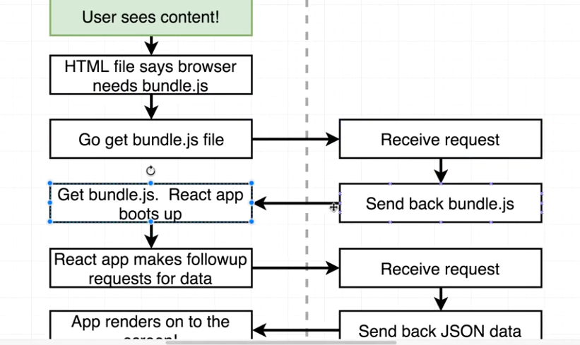

#### Saga
For saga need to define a saga file where instead of using promise to make request use yield and assign it to a variable. Then, in actions file of reducer add a function to trigger action to trigger saga where a listener using takeevery will execute once the action type is detected.Add saga in index.js sagaMiddleware.run(watchComponents);


#### hooks
Hooks can be used to replace classes/containers and using only components/functions we can change data/states lifecyle hooks/methods to cause rerendering. 
```
	const [value_name, function_name]= useState('')
	<input value={value_name} onChange={event=>{function_name(event.target.value)}};/>
```
However, if we use object states then we need to use inner function to assign previousState as well since unlike in container/stateful class here only the specific states are updated without keeping others intact.


UseEffect runs after every render cycle, so can be considered equivalent to componentDidMount but only when second parameter is empty array. We can also use an array of hook state on whose value the reredering depends as well. If not it may rerender foreover as it tries to detect changes and update state concurrently over and over.

When passing a setStateFunction to children we may require to surround the handler function with useCallback else it may result in infinite looping. For example for search filtering, when using <Search> in <Ingredients> and executing handler


Search.js

	const {onValueType}=props;
	const [state_name,function]=useState('');
	
	
	  useEffect(() => {
		[perform side effects, http requests]
		onValueType(ingredients_para);
		}, [enteredFilter, onLoadIngredients]);
Ingredients.js
	
	<Search onValueType={this.handler}/>
	const handler=useCallback(ingredients_para)=>{
	setUserIngre(ingredients_para));},[]);
UseState, useEffect, useReducer are all hooks
useMemo can also be used to avoid unnecessary rendering

useSelector and useDispatch are reducers

### useReducer
```
const FORM_INPUT_UPDATE = 'FORM_INPUT_UPDATE';

const formReducer = (state, action) => {
  if (action.type === FORM_INPUT_UPDATE) {
    const updatedValues = {
      ...state.inputValues,
      [action.input]: action.value
    };
    const updatedValidities = {
      ...state.inputValidities,
      [action.input]: action.isValid
    };
    let updatedFormIsValid = true;
    for (const key in updatedValidities) {
      updatedFormIsValid = updatedFormIsValid && updatedValidities[key];
    }
    return {
      formIsValid: updatedFormIsValid,
      inputValidities: updatedValidities,
      inputValues: updatedValues
    };
  }
  return state;
};


#inside main function initialize


  const [formState, dispatchFormState] = useReducer(formReducer, {
    inputValues: {
      title: editedProduct ? editedProduct.title : '',
      imageUrl: editedProduct ? editedProduct.imageUrl : '',
      description: editedProduct ? editedProduct.description : '',
      price: ''
    },
    inputValidities: {
      title: editedProduct ? true : false,
      imageUrl: editedProduct ? true : false,
      description: editedProduct ? true : false,
      price: editedProduct ? true : false
    },
    formIsValid: editedProduct ? true : false
  });
  
  #dispatch as
    const inputChangeHandler = useCallback(
    (inputIdentifier, inputValue, inputValidity) => {
      dispatchFormState({
        type: FORM_INPUT_UPDATE,
        value: inputValue,
        isValid: inputValidity,
        input: inputIdentifier
      });
    },
    [dispatchFormState]
  );
```
useReducer can be helpful when we need to use many hooks in a component such that every component is grouped together for code clarity and also when we have to handle them more, like in validation.

Another example:
```
const INPUT_CHANGE = 'INPUT_CHANGE';
const INPUT_BLUR = 'INPUT_BLUR';

const inputReducer = (state, action) => {
    switch (action.type) {
        case INPUT_CHANGE:
            return {
                ...state,
                value: action.value,
                isValid: action.isValid
            };
        case INPUT_BLUR:
            return {
                ...state,
                touched: true
            };
        default:
            return state;
    }
};

const Input = props => {
    const [inputState, dispatch] = useReducer(inputReducer, {
        value: props.initialValue ? props.initialValue : '',
        isValid: props.initiallyValid,
        touched: false
    });

    const { onInputChange, id } = props;

    useEffect(() => {
        if (inputState.touched) {
            onInputChange(id, inputState.value, inputState.isValid);
        }
    }, [inputState, onInputChange, id]);

    const textChangeHandler = text => {
        const emailRegex = /^(([^<>()\[\]\\.,;:\s@"]+(\.[^<>()\[\]\\.,;:\s@"]+)*)|(".+"))@((\[[0-9]{1,3}\.[0-9]{1,3}\.[0-9]{1,3}\.[0-9]{1,3}\])|(([a-zA-Z\-0-9]+\.)+[a-zA-Z]{2,}))$/;
        let isValid = true;
        if (props.required && text.trim().length === 0) {
            isValid = false;
        }
        if (props.email && !emailRegex.test(text.toLowerCase())) {
            isValid = false;
        }
        if (props.min != null && +text < props.min) {
            isValid = false;
        }
        if (props.max != null && +text > props.max) {
            isValid = false;
        }
        if (props.minLength != null && text.length < props.minLength) {
            isValid = false;
        }
        dispatch({ type: INPUT_CHANGE, value: text, isValid: isValid });
    };

    const lostFocusHandler = () => {
        dispatch({ type: INPUT_BLUR });
    };
```

### Server Side Rendering with Next JS
In conventional react approach browser fetches index file which contains link to script and again fetches the bundle and finally fetches data from backend for rendering into the frontend. So, there are 3 levels of fetching operation, which slows performance.

Conventional Approach
----
----


Server side rendering
----
----




Server Side rendering

### Routing in Next js
Routing in Next js is quite different from react router. It uses directory structure and looks for displays in "pages" folder, where '/' is routed to index.js(jsx)

```
import Link from'next/Link';
import Router from 'next/router';

<Link href="/auth"><a>Auth</a></Link>
<button onClick={()=>Router.push('/auth'} > Go to Auth </button>

```

### Styling in Next JS
```
<div>
	<h1> sodfndf</h1>
	<style jsx>{`
		div {
			border: 1px solid #eee;
			box-shadow: 0 2p 3px #ccc;
			padding: 20px;
			text-align: center;
			}
		`}
	</style>
	</div>
```

### getInitialProps (A special lifecycle)
It is a special lifecycle useful when fetching initial data from server and render. Convert the functional component into a class component and use
```
static getInitialProps(context){
	const promise = new Promise((resolve, reject) => {
		setTimeout(() => {
			resolve ({ appName: "Super App"});
			}, 1000);
			});
			return promise;
	}
```
Or you can use async await
```
static async getInitialProps(context){
	await ...
```
For functional component you can use:
const authIndexPage = (props) =>{}
authIndexPage.getInitialProps= context = >{}	
```
