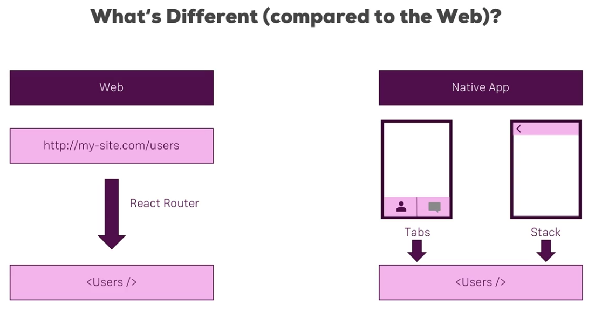

### Navigation


use <b> react-native-navigation </b> which is maintained by wix.
```
npm install --save react-native-navigation@1
```
Perform necessary steps for adding third party library. Refer to the pdf from the course and not official documentation. After adding react-native-navigation for older systems need to add two files <b>index.android.js</b> and <b>index.ios.js</b> with the contents <strike>same as <b> index.js </b>  </strike>&nbsp; only to import App.js.

* Create a screens directory in src
* IN App.js do two things
	* Register screens 
	* Start an application for react native navigation
	
App.js example
<a>https://wix.github.io/react-native-navigation/#/docs/top-level-api-migration?id=startsinglescreenappparams-gt-setrootstack</a>
```
import { Navigation } from 'react-native-navigation';
import AuthScreen from './src/screens/Auth/Auth';

#Register screen
Navigation.registerComponent("awesome-places.AuthScreen",()=>AuthScreen);

# Start the app, refer documentation for prams and more details
Navigation.startSingleScreenApp({
	screen: {
	    screen: "awesome-places.AuthScreen",
	    title: "Login"
	    }
	    })
	    
``` 
The startSingleScreenApp has been migrated to setRoot in newer versions
```
Navigation.setRoot({
	root:{
	stack:{
	children: [{
            component: {
              name: 'awesome-places.AuthScreen',
              passProps: {
                text: 'This is tab 1'
              }
            }
          }]}}})
```

#### For Tab based App
Create a new component js file eg. startMainTabs.js
```
import {Navigation} from 'react-native-navigation';

const startTabs =() ={ 
Navigation.startTabBasedApp({
	tabs: [
	 	{
	 		screen:" "awesome-places.FindPlaceScreen",
	 		label: "Find Place",
	 		title: "Find Place"
	 		}, ...
	 	}]
	 	})
	 }
export default startTabs;

```
Call this function on pressing a button. Also register all the screens
```
import FindPlaceScreen from './screens/FindPlaceScreen'; #importing jsx component
Navigation.registerComponent("awesome-places.FindPlaceScreen", () => FindPlaceScreen);
```