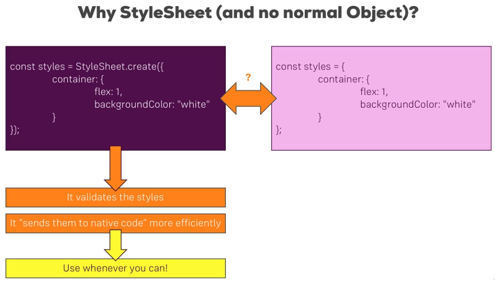

### Why StyleSheet



#### React Native Styling
Ref: https://github.com/vhpoet/react-native-styling-cheat-sheet
Components that can be styled are:

* Image
* ScrollView
* text
* TextInput
* View
Styling uses camel casing and incase you need to see supported styling put incorrect styling and the error will show you what you need.

### Synthetic Cascading of Styles
You can create a custom component with its own styling and on creation add/override/combine more custom styles.
<Input styles={[styles.inputStyle,props.styles,{fontSize:4}]} {...props}/>

### Platform API for different UI in Android/IOS
```
import {Platform} from 'react-native';

if(Platform.OS == 'android') {
	return (
	 	<TouchableNativeFeedback ...
	 	)
	 	}
	 	return (<TouchableOpacity .../>)
```