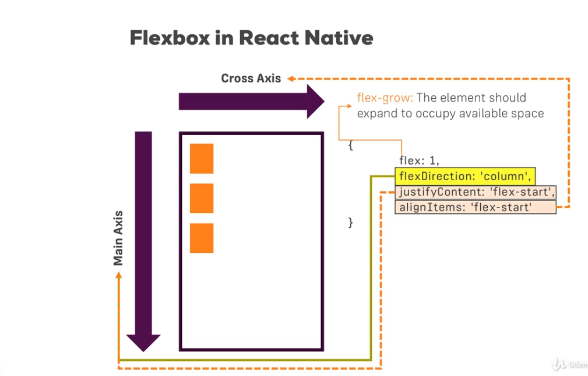
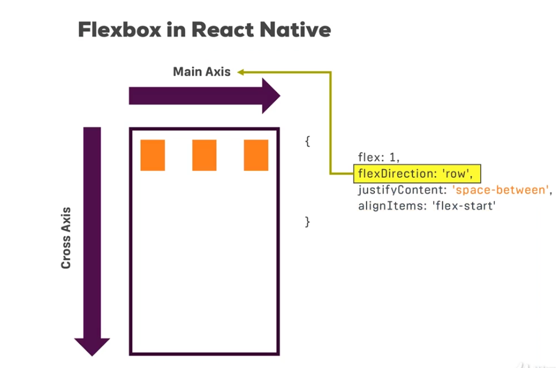
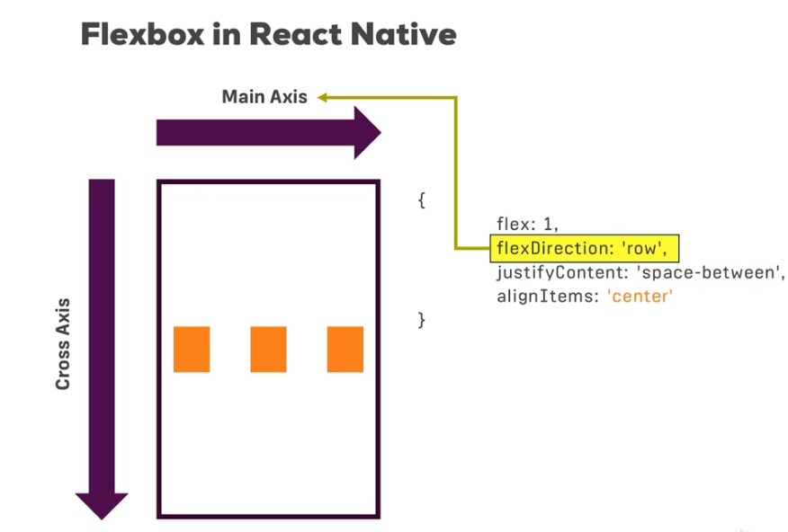
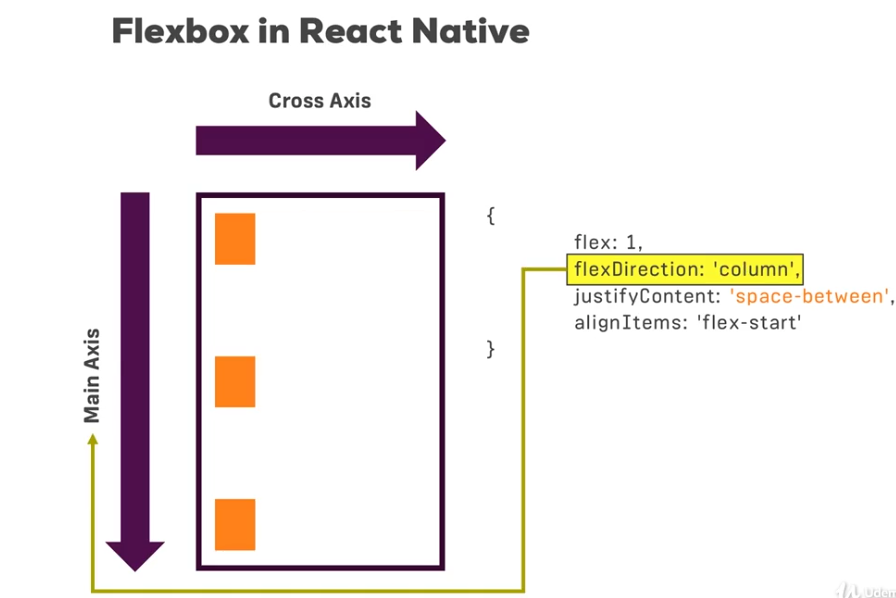

### Creating React App
```
npx create-react-native-app app_name
```
### Using natve cli(Recommended)
```
npm install -g react-native-cli
react-native init app_name
```
### To run app
Add the following to package.json in scripts

```
"ios":"react-native run-ios",
"android":"react-native run-android"
```
And use for both ways of installation

``` 
npm run android/ios
```

---

---

### Components Used
ref: <a> https://reactnative.dev/docs/intro-react-native-components</a>

<table>
<tr>
<th>Component in React
</th>
<th>
Component in React-Native
</th>
<th>
Handler function
</th>

<tr>
<td>div</td>
<td> View</td>
<td></td>
</tr>

<tr>
<td> p, span</td>
<td>Text</td>
<td></td>
</tr>

<tr>
<td> input</td>
<td>TextInput</td>
<td> onChangeText</td>
</tr>

</tr>
</table>
---

---

### Flexbox









---

---

### Creating Styles

Create styles using StyleSheet
```
const styles= StyleSheet.create({
	container: {
	flex:1,
	backgroundColor:"#fff",
	alignItems:"center",
	justifyContent: "center"
}})
```
Apply them as 
``` 
<View style = {styles.container}>
```

---

---

### Installing Libraries

```
npm install react-native-vector-Icons --save
```

##### Open Linking Libraries on Android
* Open <b>android/settings.gradle</b> file in root and add
	```
	    include ':react-native-vector-icons'  
	```
```	   
	    project(':react-native-vector-icons').projectDir = new File(rootProject.projectDir, '../node_modules/react-native-vector-icons/android')  
```
    
 * Add the following dependency in <b>android/app/build.gradle</b>
```
     implementation project(':react-native-vector-icons')
  
```
  
  * In the MainApplication java file add the following:
  
```
  import com.oblador.vectoricons.VectoriconsPackage;
  ...  
@Override  
  protected List<ReactPackage> getPackages() {  
    return Arrays.<ReactPackage>asList(  
      new MainReactPackage(),  
      new VectorIconsPackage()  
    );  
  }
    
```
  
  * In <b>'android/app/build.gradle'</b> add the following dependency for all
  
   ```
   apply from: "../../node_modules/react-native-vector-icons/fonts.gradle"
   ```
   
  *  For only some
  ```
      project.ext.vectoricons = [  
        iconFontNames: ['Ionicons.ttf'] // Name of the font files you want to copy  
    ]
  ```
  ```      
        apply from: "../../node_modules/react-native-vector-icons/fonts.gradle"  
  ```  
  